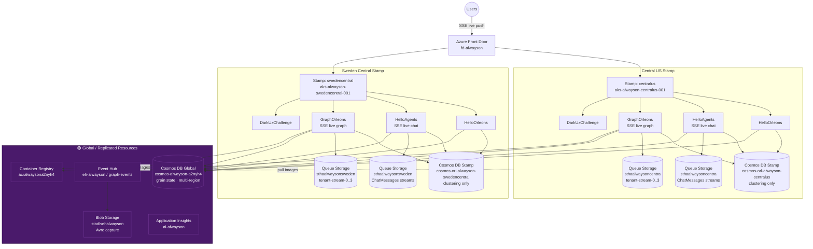
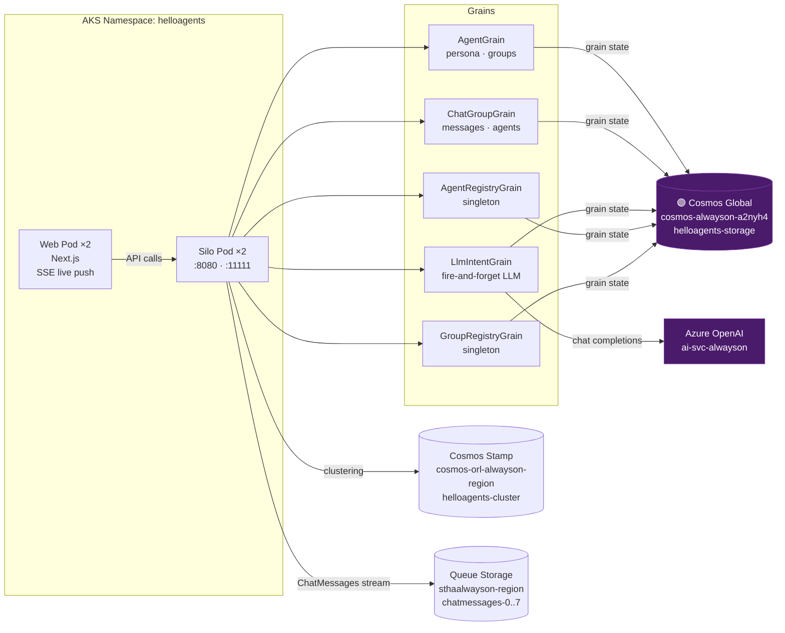
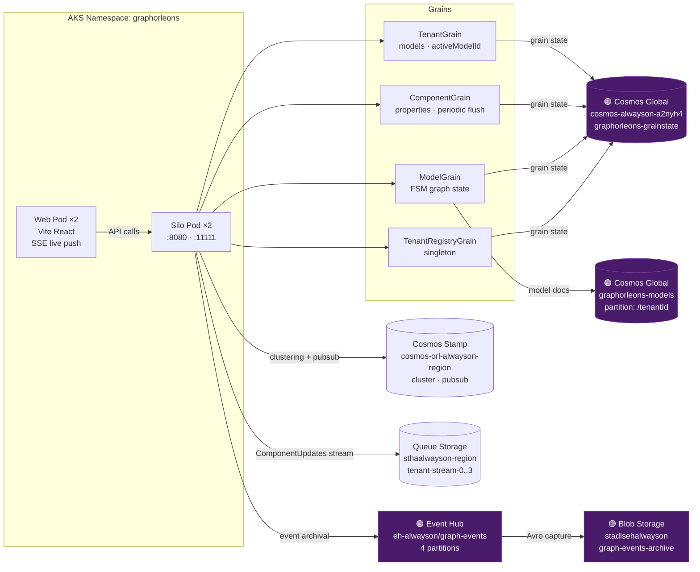
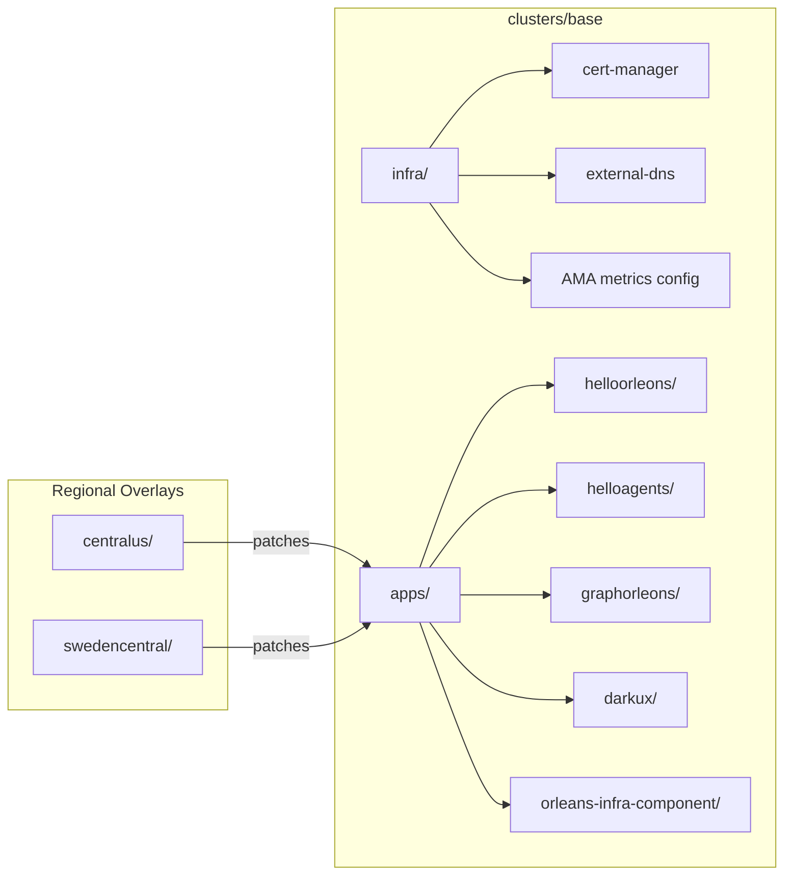

# AlwaysOn v2 — Project Walkthrough

> Multi-region active-active Orleans reference architecture on AKS with Cosmos DB, Aspire local dev, and health model observability.

---

## Live Applications

| App | URL | Description |
|-----|-----|-------------|
| **HelloOrleons** | [hello.alwayson.actor](https://hello.alwayson.actor) | Simple Orleans counter — minimal silo example |
| **HelloAgents** | [agents.alwayson.actor](https://agents.alwayson.actor) | Multi-agent chat with Azure OpenAI + Orleans streaming |
| **GraphOrleons** | [events.alwayson.actor](https://events.alwayson.actor) | Event-driven graph/component model with Event Hub archival |
| **DarkUxChallenge** | [darkux.alwayson.actor](https://darkux.alwayson.actor) | Accessibility-first UX challenge SPA |

---

## Architecture Overview



---

## Application Architectures

### HelloAgents

> Source: [`src/HelloAgents/`](../src/HelloAgents/) · Live: [agents.alwayson.actor](https://agents.alwayson.actor)



| Component | Detail | Source |
|-----------|--------|--------|
| **Grains** | `AgentGrain` · `ChatGroupGrain` · `LlmIntentGrain` · `AgentRegistryGrain` · `GroupRegistryGrain` | [`Grains/`](../src/HelloAgents/HelloAgents.Api/Grains/) · [`Domain.cs`](../src/HelloAgents/HelloAgents.Api/Domain.cs) |
| **Grain State** | 🟣 Global Cosmos → `helloagents` / `helloagents-storage` | [`Config.cs:15`](../src/HelloAgents/HelloAgents.Api/Config.cs) |
| **Clustering** | Stamp Cosmos → `helloagents-cluster` | [`Config.cs:16`](../src/HelloAgents/HelloAgents.Api/Config.cs) |
| **Streaming** | `AzureQueueStreams("ChatMessages")` → Queue Storage | [`Program.cs:31`](../src/HelloAgents/HelloAgents.Api/Program.cs) |
| **AI** | 🟣 Azure OpenAI via `LlmIntentGrain` streaming | [`LlmIntentGrain.cs:237`](../src/HelloAgents/HelloAgents.Api/Grains/LlmIntentGrain.cs) |
| **SSE** | `/api/groups/{id}/stream` — `text/event-stream` live push | [`Endpoints.cs:212`](../src/HelloAgents/HelloAgents.Api/Endpoints.cs) |
| **Frontend** | Next.js SPA · port 4200 locally | [`HelloAgents.Web/`](../src/HelloAgents/HelloAgents.Web/) |
| **Pods** | 2× silo (`:8080` + `:11111`) + 2× web | [`clusters/base/apps/helloagents/`](../clusters/base/apps/helloagents/) |

### GraphOrleons

> Source: [`src/GraphOrleons/`](../src/GraphOrleons/) · Live: [events.alwayson.actor](https://events.alwayson.actor)



| Component | Detail | Source |
|-----------|--------|--------|
| **Grains** | `TenantGrain` · `ComponentGrain` (periodic flush) · `ModelGrain` (FSM) · `TenantRegistryGrain` | [`GraphOrleons.Api/`](../src/GraphOrleons/GraphOrleons.Api/) |
| **Grain State** | 🟣 Global Cosmos → `graphorleons` / `graphorleons-grainstate` | [`ResourceNames.cs`](../src/GraphOrleons/GraphOrleons.AppHost/ResourceNames.cs) |
| **Models Store** | 🟣 Global Cosmos → `graphorleons-models` (partition: `/tenantId`) | [`AppHost.cs:14`](../src/GraphOrleons/GraphOrleons.AppHost/AppHost.cs) |
| **Clustering** | Stamp Cosmos → `graphorleons-cluster` + `graphorleons-pubsub` | [`ResourceNames.cs`](../src/GraphOrleons/GraphOrleons.AppHost/ResourceNames.cs) |
| **Streaming** | `AzureQueueStreams("ComponentUpdates")` → `tenant-stream-{0..3}` | [`Program.cs:49,62`](../src/GraphOrleons/GraphOrleons.Api/Program.cs) · [`Domain.cs:111`](../src/GraphOrleons/GraphOrleons.Api/Domain.cs) |
| **Event Archival** | 🟣 `EventHubEventArchive` → `eh-alwayson/graph-events` | [`EventHubEventArchive.cs`](../src/GraphOrleons/GraphOrleons.Api/EventHubEventArchive.cs) |
| **Capture** | 🟣 Avro → Blob `stadlsehalwayson/graph-events-archive` (UserAssigned MI) | `az eventhubs eventhub show --namespace-name eh-alwayson -g rg-alwayson-global -n graph-events --query captureDescription` |
| **SSE** | `/api/tenants/{tenantId}/stream` — `text/event-stream` live push | [`Endpoints.cs:110`](../src/GraphOrleons/GraphOrleons.Api/Endpoints.cs) |
| **FSM** | `ModelStateMachine.Apply()` — pure function state transitions | [`ModelStateMachine.cs`](../src/GraphOrleons/GraphOrleons.Api/ModelStateMachine.cs) |
| **Frontend** | Vite React SPA · port 4300 locally | [`GraphOrleons.Web/`](../src/GraphOrleons/GraphOrleons.Web/) |
| **Pods** | 2× silo + 2× web | [`clusters/base/apps/graphorleons/`](../clusters/base/apps/graphorleons/) |

---

## ADR Overview

> Full ADRs: [`docs/adr/`](adr/) (excerpt)

| # | Decision | Summary |
|---|----------|---------|
| [0001](adr/0001-deployment-strategy-DI.md) | Deployment Strategy — Flux | Per-cluster Flux for distributed resilient deployments |
| [0002](adr/0002-multi-stamp-architecture-DI.md) | Multi-Stamp Architecture | Active-active regional stamps for fault isolation |
| [0003](adr/0003-application-framework-DI.md) | Application Framework — Orleans | Virtual actor model for per-entity concurrency |
| [0005](adr/0005-architecture-pattern-DI.md) | Architecture Pattern — Event-Driven | Delayed/batched writes, Event Hub archival |
| [0006](adr/0006-database-choice-DI.md) | Database — Cosmos DB | Global distribution + Orleans persistence |
| [0007](adr/0007-messaging-platform-DI.md) | Messaging — Event Hubs | Event-driven with Cosmos streams |
| [0033](adr/0033-coding-principles-DI.md) | Coding Principles | Grokking Simplicity & A Philosophy of Software Design |
| [0034](adr/0034-module-design-DI.md) | Module Design | Full business functionality, no hosting concerns |
| [0041](adr/0041-global-application-frontdoor-ingress-DI.md) | Front Door Ingress | Multi-silo global ingress with session affinity |
| [0062](adr/0062-orleans-cosmos-gateway-mode-sigsegv-DI.md) | Cosmos Gateway Mode | Prevents RNTBD SIGSEGV on .NET 10 |

---

## Flux / GitOps Configuration



- **Base** ([`clusters/base/`](../clusters/base/)) — shared manifests for all regions
- **Regional overlays** ([`clusters/centralus/`](../clusters/centralus/), [`clusters/swedencentral/`](../clusters/swedencentral/)) — stamp-specific env vars
- **Image automation** — Flux scans ACR for `{timestamp}-{hash}` tags, auto-updates deployment images (e.g. [`helloagents/image-automation.yaml`](../clusters/base/apps/helloagents/image-automation.yaml))
- **Orleans infra** — shared headless service + RBAC ([`orleans-infra-component/`](../clusters/base/apps/orleans-infra-component/))

---

## Grafana Dashboards & Health Model

### Dashboards

- Per-app dashboards: `helloorleons`, `helloagents`, `graphorleons`, `darkux`
- Generated from [`scripts/grafana/`](../scripts/grafana/) — `npm run build && npm run generate`
- Panels: Front Door metrics, Cosmos DB, pod restarts/OOM/CPU/memory, gateway latency

### Health Model Signals (43 total) — [`scripts/healthmodel/signals.ts`](../scripts/healthmodel/signals.ts) → [`infra/healthmodel/healthmodel.bicep`](../infra/healthmodel/healthmodel.bicep)

| Category | Signals |
|----------|---------|
| **Pod** | Restarts, OOMKilled, CrashLoopBackOff, CPU pressure, CPU throttling, memory pressure, node conditions |
| **AKS** | Failed pods per cluster |
| **Front Door** | 5XX %, 4XX count, origin latency, total latency |
| **Cosmos DB** | Availability %, client errors, normalized RU %, throttled (429) |
| **AI Services** | Availability, latency, server errors, content blocked |
| **Storage Queues** | Availability, E2E latency, transaction errors |
| **Blob Storage** | Availability, E2E latency, transaction errors |
| **Event Hubs** | Throttled, server errors, capture backlog, replication lag |

### Health Models on Azure

| Model | CLI Watch Command |
|-------|-------------------|
| `hm-alwayson` | `az healthmodel watch --model-name hm-alwayson -g rg-alwayson-global` |
| `hm-helloagents` | `az healthmodel watch --model-name hm-helloagents -g rg-alwayson-global` |
| `hm-helloorleons` | `az healthmodel watch --model-name hm-helloorleons -g rg-alwayson-global` |
| `hm-graphorleons` | `az healthmodel watch --model-name hm-graphorleons -g rg-alwayson-global` |
| `hm-darkux` | `az healthmodel watch --model-name hm-darkux -g rg-alwayson-global` |

---

## Testing

| Type | Framework | Apps | How to Run | Source |
|------|-----------|------|------------|--------|
| **Unit / Integration** | TUnit + Aspire.Hosting.Testing | All 4 | `cd src/<App> && dotnet test` | e.g. [`HelloAgents.Tests/`](../src/HelloAgents/HelloAgents.Tests/) |
| **E2E (Browser)** | Playwright | All 4 | `cd src/<App>/<App>.E2E && npm ci && npx playwright test` | e.g. [`HelloAgents.E2E/`](../src/HelloAgents/HelloAgents.E2E/) |
| **Load** | Locust | All 4 | `cd src/<App>/<App>.LoadTest && locust -f locustfile.py` | e.g. [`HelloAgents.LoadTest/`](../src/HelloAgents/HelloAgents.LoadTest/) |
| **Accessibility** | axe-core/playwright | DarkUxChallenge | Integrated in E2E suite | [`DarkUxChallenge.E2E/`](../src/DarkUxChallenge/DarkUxChallenge.E2E/) |
| **Health Model** | pytest | az-healthmodel | `cd src/az-healthmodel && pytest azext_healthmodel/tests/ -v` | [`az-healthmodel/tests/`](../src/az-healthmodel/azext_healthmodel/tests/) |

### CI Test Strategy

- Unit tests: **3× retry** on failure (Cosmos emulator flakiness)
- E2E: **2 retries** in CI, run via Aspire orchestrator
- Results: TRX reports published, Playwright HTML artifacts (5-day retention)

---

## CI/CD — [GitHub Actions](../.github/workflows/)

| Workflow | Trigger | What it Does |
|----------|---------|-------------|
| [`helloorleons-cicd.yml`](../.github/workflows/helloorleons-cicd.yml) | `src/HelloOrleons/**` push | Build → TUnit tests → Docker buildx bake → Push ACR → Verify Flux deploy |
| [`helloagents-cicd.yml`](../.github/workflows/helloagents-cicd.yml) | `src/HelloAgents/**` push | Build → TUnit + Playwright E2E → Docker → ACR → Verify deploy |
| [`graphorleons-cicd.yml`](../.github/workflows/graphorleons-cicd.yml) | `src/GraphOrleons/**` push | Build → TUnit + Playwright E2E → Docker → ACR → Verify deploy |
| [`darkux-cicd.yml`](../.github/workflows/darkux-cicd.yml) | `src/DarkUxChallenge/**` push | Build → TUnit + Playwright E2E → Docker → ACR → Verify deploy |
| [`azure-dev.yml`](../.github/workflows/azure-dev.yml) | `infra/**` push / daily schedule | Bicep deploy (provision + configure) |
| [`app-build-push.yml`](../.github/workflows/app-build-push.yml) | Reusable | Multi-arch container build, ACR push, K8s manifest update |
| [`app-e2e-aspire.yml`](../.github/workflows/app-e2e-aspire.yml) | Reusable | Playwright E2E via Aspire CLI orchestrator |
| [`app-verify-deploy.yml`](../.github/workflows/app-verify-deploy.yml) | Reusable | Verify Flux rollout + production smoke tests |

---

## AlwaysOn.Orleans Library

> [`src/AlwaysOn.Orleans/`](../src/AlwaysOn.Orleans/)

### What it Solves

- **Aspire JSON camelCase conflicts** — Aspire DI uses camelCase, Orleans expects PascalCase ([ADR-0059](adr/0059-orleans-cosmos-aspire-known-issues-DI.md))
- **Explicit provider config** — no Aspire auto-config (causes "Could not find Clustering" errors) ([ADR-0058](adr/0058-orleans-explicit-provider-config-DI.md))
- **Gateway mode for .NET 10** — prevents RNTBD SIGSEGV crashes ([ADR-0062](adr/0062-orleans-cosmos-gateway-mode-sigsegv-DI.md) · [`CosmosClientFactory.cs:20`](../src/AlwaysOn.Orleans/CosmosClientFactory.cs))
- **Dual Cosmos endpoints** — separates regional clustering from global grain state ([`OrleansHostingExtensions.cs:48-49`](../src/AlwaysOn.Orleans/OrleansHostingExtensions.cs))
- **K8s + Emulator support** — conditional resource creation, dev certificate handling ([`OrleansHostingExtensions.cs:55`](../src/AlwaysOn.Orleans/OrleansHostingExtensions.cs))

### Usage ([`OrleansHostingExtensions.cs:18`](../src/AlwaysOn.Orleans/OrleansHostingExtensions.cs))

```csharp
builder.AddAlwaysOnOrleans(silo =>
{
    silo.AddAzureQueueStreams("ChatMessages", ...);
    silo.AddDashboard();
});
```

### Configuration ([`OrleansCosmosOptions.cs`](../src/AlwaysOn.Orleans/OrleansCosmosOptions.cs) · env vars)

```bash
# Grain state (global, multi-region replicated)
AlwaysOn__GrainStorage__Endpoint=AccountEndpoint=https://cosmos-alwayson-a2nyh4.documents.azure.com:443/
AlwaysOn__GrainStorage__Database=helloagents
AlwaysOn__GrainStorage__Container=helloagents-storage

# Clustering (per-stamp, no replication)
AlwaysOn__Clustering__Endpoint=AccountEndpoint=https://cosmos-orl-alwayson-centralus.documents.azure.com:443/
AlwaysOn__Clustering__Container=helloagents-cluster

# Optional: PubSub (for streaming apps)
AlwaysOn__PubSub__Container=graphorleons-pubsub
```

### Key Design Decisions

- **Gateway mode always** — [`CosmosClientFactory.cs:20`](../src/AlwaysOn.Orleans/CosmosClientFactory.cs): `ConnectionMode.Gateway`
- **K8s auto-detection** — [`OrleansHostingExtensions.cs:55`](../src/AlwaysOn.Orleans/OrleansHostingExtensions.cs): checks `KUBERNETES_SERVICE_HOST`
- **DefaultAzureCredential** — [`CosmosClientFactory.cs:36`](../src/AlwaysOn.Orleans/CosmosClientFactory.cs): Managed Identity in K8s, CLI/emulator locally
- **Strict validation** — [`OrleansHostingExtensions.cs:42`](../src/AlwaysOn.Orleans/OrleansHostingExtensions.cs): `ArgumentException.ThrowIfNullOrEmpty` if clustering endpoint missing

---

## CLI Examples & Verification

### Local Development (Aspire)

```bash
# Start HelloAgents locally
cd src/HelloAgents
dotnet run --project HelloAgents.AppHost

# Start GraphOrleons locally
cd src/GraphOrleons
dotnet run --project GraphOrleons.AppHost

# Run unit tests
cd src/HelloAgents
dotnet test HelloAgents.Tests

# Run E2E tests
cd src/HelloAgents/HelloAgents.E2E
npm ci && npx playwright install --with-deps chromium
npm test

# Run load tests
cd src/HelloAgents/HelloAgents.LoadTest
locust -f locustfile.py --host=https://agents.alwayson.actor
```

### Kubernetes / AKS

```bash
# Get credentials
az aks get-credentials -g rg-alwayson-centralus-001 -n aks-alwayson-centralus-001

# Check silo pod health
kubectl -n helloagents get pods -o wide
kubectl -n graphorleons get pods -o wide
kubectl -n helloorleons get pods -o wide

# Check silo logs for errors
kubectl -n helloagents logs deployment/helloagents --tail=50 | grep -iE "error|fail|warn"

# Force-restart frozen pods (Flux-safe — no annotation changes)
kubectl -n helloagents delete pods --all

# Check Orleans membership table refresh
kubectl -n helloagents logs deployment/helloagents --tail=100 | grep -i membership
```

### Azure Monitor & Metrics

```bash
# Cosmos DB RU consumption (last 6h)
az monitor metrics list \
  --resource "/subscriptions/b2af20ad-98fa-4aa7-94c3-059663641d9f/resourceGroups/rg-alwayson-global/providers/Microsoft.DocumentDB/databaseAccounts/cosmos-alwayson-a2nyh4" \
  --metric "NormalizedRUConsumption" --interval PT1H \
  --query "value[0].timeseries[0].data[-6:].{time:timeStamp, max:maximum}" -o table

# Event Hub incoming messages (last 24h)
az monitor metrics list \
  --resource "/subscriptions/b2af20ad-98fa-4aa7-94c3-059663641d9f/resourceGroups/rg-alwayson-global/providers/Microsoft.EventHub/namespaces/eh-alwayson" \
  --metric "IncomingMessages" --interval PT6H \
  --query "value[0].timeseries[0].data[].{time:timeStamp, total:total}" -o table

# Front Door request count
az monitor metrics list \
  --resource "/subscriptions/b2af20ad-98fa-4aa7-94c3-059663641d9f/resourceGroups/rg-alwayson-global/providers/Microsoft.Cdn/profiles/fd-alwayson" \
  --metric "RequestCount" --interval PT1H \
  --query "value[0].timeseries[0].data[-6:].{time:timeStamp, total:total}" -o table
```

### Grafana Dashboard Generator

```bash
cd scripts/grafana
npm install && npm run build && npm run generate
# Output: docs/grafana/*.json
```

### Health Model Generator

```bash
cd scripts/healthmodel
npm install
npx ts-node generate.ts
# Output: infra/healthmodel/healthmodel.bicep
```

---

## Azure Portal Links

| Resource | Portal Link |
|----------|-------------|
| **Subscription** | [ME-MngEnvMCAP462928-anbossar-1](https://portal.azure.com/#@/resource/subscriptions/b2af20ad-98fa-4aa7-94c3-059663641d9f/overview) |
| **Application Insights** | [ai-alwayson](https://portal.azure.com/#@/resource/subscriptions/b2af20ad-98fa-4aa7-94c3-059663641d9f/resourceGroups/rg-alwayson-global/providers/Microsoft.Insights/components/ai-alwayson/overview) |
| **Front Door** | [fd-alwayson](https://portal.azure.com/#@/resource/subscriptions/b2af20ad-98fa-4aa7-94c3-059663641d9f/resourceGroups/rg-alwayson-global/providers/Microsoft.Cdn/profiles/fd-alwayson/overview) |
| **Event Hub** | [eh-alwayson](https://portal.azure.com/#@/resource/subscriptions/b2af20ad-98fa-4aa7-94c3-059663641d9f/resourceGroups/rg-alwayson-global/providers/Microsoft.EventHub/namespaces/eh-alwayson/overview) |
| **Cosmos DB (Global)** | [cosmos-alwayson-a2nyh4](https://portal.azure.com/#@/resource/subscriptions/b2af20ad-98fa-4aa7-94c3-059663641d9f/resourceGroups/rg-alwayson-global/providers/Microsoft.DocumentDB/databaseAccounts/cosmos-alwayson-a2nyh4/overview) |
| **Cosmos DB (CentralUS)** | [cosmos-orl-alwayson-centralus](https://portal.azure.com/#@/resource/subscriptions/b2af20ad-98fa-4aa7-94c3-059663641d9f/resourceGroups/rg-alwayson-centralus-001/providers/Microsoft.DocumentDB/databaseAccounts/cosmos-orl-alwayson-centralus/overview) |
| **Cosmos DB (Sweden)** | [cosmos-orl-alwayson-swedencentral](https://portal.azure.com/#@/resource/subscriptions/b2af20ad-98fa-4aa7-94c3-059663641d9f/resourceGroups/rg-alwayson-swedencentral-001/providers/Microsoft.DocumentDB/databaseAccounts/cosmos-orl-alwayson-swedencentral/overview) |
| **AKS (CentralUS)** | [aks-alwayson-centralus-001](https://portal.azure.com/#@/resource/subscriptions/b2af20ad-98fa-4aa7-94c3-059663641d9f/resourceGroups/rg-alwayson-centralus-001/providers/Microsoft.ContainerService/managedClusters/aks-alwayson-centralus-001/overview) |
| **AKS (Sweden)** | [aks-alwayson-swedencentral-001](https://portal.azure.com/#@/resource/subscriptions/b2af20ad-98fa-4aa7-94c3-059663641d9f/resourceGroups/rg-alwayson-swedencentral-001/providers/Microsoft.ContainerService/managedClusters/aks-alwayson-swedencentral-001/overview) |
| **Monitor (CentralUS)** | [amw-alwayson-centralus](https://portal.azure.com/#@/resource/subscriptions/b2af20ad-98fa-4aa7-94c3-059663641d9f/resourceGroups/rg-alwayson-centralus/providers/Microsoft.Monitor/accounts/amw-alwayson-centralus/overview) |
| **Monitor (Sweden)** | [amw-alwayson-swedencentral](https://portal.azure.com/#@/resource/subscriptions/b2af20ad-98fa-4aa7-94c3-059663641d9f/resourceGroups/rg-alwayson-swedencentral/providers/Microsoft.Monitor/accounts/amw-alwayson-swedencentral/overview) |

---

## Health Model — Live Viewer

> Requires: `az extension add --source src/az-healthmodel/dist/*.whl`

```bash
# Watch live health (TUI mode — interactive terminal dashboard)
az healthmodel watch --model-name hm-alwayson -g rg-alwayson-global

# Watch specific app
az healthmodel watch --model-name hm-helloagents -g rg-alwayson-global
az healthmodel watch --model-name hm-graphorleons -g rg-alwayson-global

# Export health model as SVG
az healthmodel export --model-name hm-alwayson -g rg-alwayson-global -f hm-alwayson.svg

# Plain text mode (for CI/scripts)
az healthmodel watch --model-name hm-alwayson -g rg-alwayson-global --plain

# List all health models
az healthmodel list -g rg-alwayson-global -o table
```

---

## Lessons Learned

> See [LESSONS.md](../LESSONS.md) for the full list of lessons extracted from production incidents and git history.
