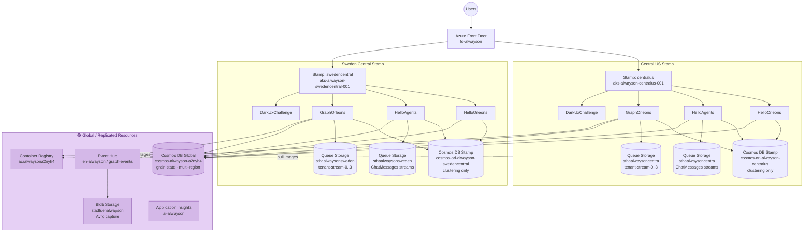
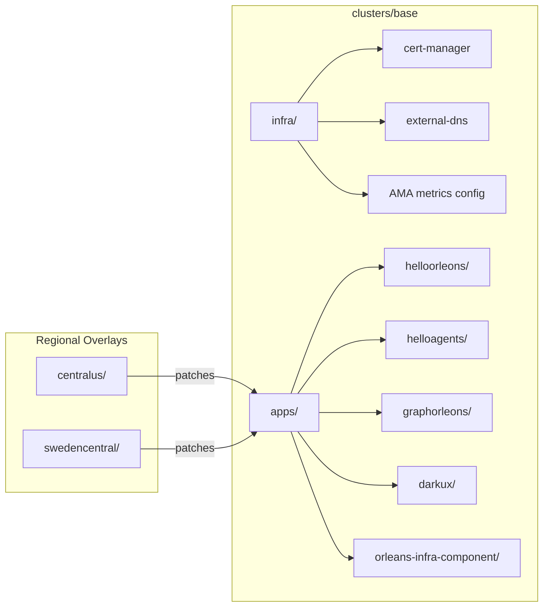

# AlwaysOn v2 — Project Walkthrough

> Multi-region active-active Orleans reference architecture on AKS with Cosmos DB, Aspire local dev, and health model observability.

---

## Live Applications

| App | URL | Description |
|-----|-----|-------------|
| **HelloOrleons** | [hello.alwayson.actor](https://hello.alwayson.actor) | Simple Orleans counter — minimal silo example |
| **HelloAgents** | [agents.alwayson.actor](https://agents.alwayson.actor) | Multi-agent chat with Azure OpenAI + Orleans streaming |
| **GraphOrleons** | [events.alwayson.actor](https://events.alwayson.actor) | Event-driven graph/component model with Event Hub archival |
| **DarkUxChallenge** | [darkux.alwayson.actor](https://darkux.alwayson.actor) | Accessibility-first UX challenge SPA |

---

## Architecture Overview



---

## Application Architectures

### HelloAgents

> [Architecture diagram (DrawIO)](diagrams/helloagents-architecture.drawio)

| Component | Detail |
|-----------|--------|
| **Grains** | `AgentGrain` (persona, groups) · `ChatGroupGrain` (messages) · `LlmIntentGrain` (fire-and-forget LLM) · `AgentRegistryGrain` · `GroupRegistryGrain` |
| **Grain State** | Global Cosmos: `cosmos-alwayson-a2nyh4` → `helloagents` / `helloagents-storage` |
| **Clustering** | Stamp Cosmos: `cosmos-orl-alwayson-{region}` → `helloagents-cluster` |
| **Streaming** | `AzureQueueStreams("ChatMessages")` → Queue Storage (`sthaalwayson{region}`) |
| **AI** | Azure OpenAI (`ai-svc-alwayson`) — chat completions via `LlmIntentGrain` |
| **Frontend** | Next.js SPA → `NEXT_PUBLIC_API_URL` |
| **Pods** | 2× silo (`:8080` + `:11111`) + 2× web |

### GraphOrleons

> [Architecture diagram (DrawIO)](diagrams/graphorleons-architecture.drawio)

| Component | Detail |
|-----------|--------|
| **Grains** | `TenantGrain` (models) · `ComponentGrain` (properties, periodic flush) · `ModelGrain` (FSM graph state) · `TenantRegistryGrain` |
| **Grain State** | Global Cosmos: `cosmos-alwayson-a2nyh4` → `graphorleons` / `graphorleons-grainstate` |
| **Models Store** | Global Cosmos: `cosmos-alwayson-a2nyh4` → `graphorleons` / `graphorleons-models` (partition: `/tenantId`) |
| **Clustering** | Stamp Cosmos: `cosmos-orl-alwayson-{region}` → `graphorleons-cluster` + `graphorleons-pubsub` |
| **Streaming** | `AzureQueueStreams("ComponentUpdates")` → Queue Storage (`tenant-stream-{0..3}`) |
| **Event Archival** | `EventHubEventArchive` → Event Hub `eh-alwayson/graph-events` (4 partitions) |
| **Capture** | Event Hub Capture → Blob `stadlsehalwayson/graph-events-archive` (Avro, 5min/300MB, UserAssigned MI) |
| **Frontend** | Vite React SPA → `VITE_API_URL` |
| **Pods** | 2× silo + 2× web |

---

## ADR Overview

> Full ADRs: [`docs/adr/`](adr/)

| # | Decision | Summary |
|---|----------|---------|
| 0001 | Compute Platform — AKS | Full K8s control, regional fault isolation |
| 0001 | Deployment Strategy — Flux | Per-cluster Flux for distributed resilient deployments |
| 0002 | Multi-Stamp Architecture | Active-active regional stamps for fault isolation |
| 0003 | Application Framework — Orleans | Virtual actor model for per-entity concurrency |
| 0004 | Programming Language — C# / .NET 10 | First-class Orleans support |
| 0005 | Architecture Pattern — Event-Driven | Delayed/batched writes, Event Hub archival |
| 0006 | Database — Cosmos DB | Global distribution + Orleans persistence |
| 0007 | Messaging — Event Hubs | Event-driven with Cosmos streams |
| 0010 | Observability — Azure Monitor + Prometheus + Grafana | Unified observability stack |
| 0011 | IaC — Bicep | Azure-native infrastructure as code |
| 0012 | CI/CD — GitHub Actions | Build/test/deploy workflows |
| 0021 | Disaster Recovery | Multi-region failover with RTO/RPO targets |
| 0024 | Data Access Patterns | Cosmos DB patterns in Orleans grains |
| 0025 | Deployment Strategy | Blue-green/canary via Gateway API routing |
| 0032 | Cluster Bootstrapping | Bicep-based Flux provisioning |
| 0033 | Coding Principles | Grokking Simplicity & A Philosophy of Software Design |
| 0034 | Module Design | Full business functionality, no hosting concerns |
| 0035 | Simplified Hexagonal Architecture | Clean ports & adapters |
| 0036 | File Organization | Combine what belongs together |
| 0038 | Idempotent FSMs | FSM-based state verification for resilience |
| 0039 | Matrix Testing | Behavior tests across all port implementations |
| 0041 | Front Door Ingress | Multi-silo global ingress with session affinity |
| 0043 | Accessibility-First E2E Selectors | ARIA/semantic selectors for Playwright |
| 0053 | OpenTelemetry & Azure Monitor | Direct OTel exporters (not via Grafana agent) |
| 0054 | Cosmos Emulator HTTPS | Dev certificate trust for Aspire 13.2 |
| 0058 | Explicit Orleans Config | No Aspire auto-config (conflicts with Orleans) |
| 0059 | Orleans/Cosmos/Aspire Issues | Known integration issue compendium |
| 0060 | Console Log Level | Warning+ to console, Information via OTel |
| 0061 | Event Archive Strategy | Event Hub for compliance archival |
| 0062 | Cosmos Gateway Mode | Prevents RNTBD SIGSEGV on .NET 10 |

---

## Flux / GitOps Configuration



- **Base** (`clusters/base/`) — shared manifests for all regions
- **Regional overlays** — stamp-specific env vars (Cosmos endpoints, storage accounts, namespaces)
- **Image automation** — Flux scans ACR for `{timestamp}-{hash}` tags, auto-updates deployment images
- **Orleans infra** — shared headless service + RBAC for K8s hosting (`orleans-infra-component/`)

---

## Grafana Dashboards & Health Model

### Dashboards

- Per-app dashboards: `helloorleons`, `helloagents`, `graphorleons`, `darkux`
- Generated from [`scripts/grafana/`](../scripts/grafana/) — `npm run build && npm run generate`
- Panels: Front Door metrics, Cosmos DB, pod restarts/OOM/CPU/memory, gateway latency

### Health Model Signals (43 total)

| Category | Signals |
|----------|---------|
| **Pod** | Restarts, OOMKilled, CrashLoopBackOff, CPU pressure, CPU throttling, memory pressure, node conditions |
| **AKS** | Failed pods per cluster |
| **Front Door** | 5XX %, 4XX count, origin latency, total latency |
| **Cosmos DB** | Availability %, client errors, normalized RU %, throttled (429) |
| **AI Services** | Availability, latency, server errors, content blocked |
| **Storage Queues** | Availability, E2E latency, transaction errors |
| **Blob Storage** | Availability, E2E latency, transaction errors |
| **Event Hubs** | Throttled, server errors, capture backlog, replication lag |

### Health Models on Azure

| Model | CLI Watch Command |
|-------|-------------------|
| `hm-alwayson` | `az healthmodel watch --model-name hm-alwayson -g rg-alwayson-global` |
| `hm-helloagents` | `az healthmodel watch --model-name hm-helloagents -g rg-alwayson-global` |
| `hm-helloorleons` | `az healthmodel watch --model-name hm-helloorleons -g rg-alwayson-global` |
| `hm-graphorleons` | `az healthmodel watch --model-name hm-graphorleons -g rg-alwayson-global` |
| `hm-darkux` | `az healthmodel watch --model-name hm-darkux -g rg-alwayson-global` |

---

## Testing

| Type | Framework | Apps | How to Run |
|------|-----------|------|------------|
| **Unit / Integration** | TUnit + Aspire.Hosting.Testing | All 4 | `cd src/<App> && dotnet test` |
| **E2E (Browser)** | Playwright | All 4 | `cd src/<App>/<App>.E2E && npm ci && npx playwright test` |
| **Load** | Locust | All 4 | `cd src/<App>/<App>.LoadTest && locust -f locustfile.py` |
| **Accessibility** | axe-core/playwright | DarkUxChallenge | Integrated in E2E suite |
| **Health Model** | pytest | az-healthmodel | `cd src/az-healthmodel && pytest azext_healthmodel/tests/ -v` |

### CI Test Strategy

- Unit tests: **3× retry** on failure (Cosmos emulator flakiness)
- E2E: **2 retries** in CI, run via Aspire orchestrator
- Results: TRX reports published, Playwright HTML artifacts (5-day retention)

---

## CI/CD — GitHub Actions

| Workflow | Trigger | What it Does |
|----------|---------|-------------|
| `helloorleons-cicd.yml` | `src/HelloOrleons/**` push | Build → TUnit tests → Docker buildx bake → Push ACR → Verify Flux deploy |
| `helloagents-cicd.yml` | `src/HelloAgents/**` push | Build → TUnit + Playwright E2E → Docker → ACR → Verify deploy |
| `graphorleons-cicd.yml` | `src/GraphOrleons/**` push | Build → TUnit + Playwright E2E → Docker → ACR → Verify deploy |
| `darkux-cicd.yml` | `src/DarkUxChallenge/**` push | Build → TUnit + Playwright E2E → Docker → ACR → Verify deploy |
| `azure-dev.yml` | `infra/**` push / daily schedule | Bicep deploy (provision + configure) |
| `app-build-push.yml` | Reusable | Multi-arch container build, ACR push, K8s manifest update |
| `app-e2e-aspire.yml` | Reusable | Playwright E2E via Aspire CLI orchestrator |
| `app-verify-deploy.yml` | Reusable | Verify Flux rollout + production smoke tests |

---

## AlwaysOn.Orleans Library

> [`src/AlwaysOn.Orleans/`](../src/AlwaysOn.Orleans/)

### What it Solves

- **Aspire JSON camelCase conflicts** — Aspire DI uses camelCase, Orleans expects PascalCase
- **Explicit provider config** — no Aspire auto-config (causes "Could not find Clustering" errors)
- **Gateway mode for .NET 10** — prevents RNTBD SIGSEGV crashes (ADR-0062)
- **Dual Cosmos endpoints** — separates regional clustering from global grain state
- **K8s + Emulator support** — conditional resource creation, dev certificate handling

### Usage

```csharp
builder.AddAlwaysOnOrleans(silo =>
{
    silo.AddAzureQueueStreams("ChatMessages", ...);
    silo.AddDashboard();
});
```

### Configuration (env vars)

```bash
# Grain state (global, multi-region replicated)
AlwaysOn__GrainStorage__Endpoint=AccountEndpoint=https://cosmos-alwayson-a2nyh4.documents.azure.com:443/
AlwaysOn__GrainStorage__Database=helloagents
AlwaysOn__GrainStorage__Container=helloagents-storage

# Clustering (per-stamp, no replication)
AlwaysOn__Clustering__Endpoint=AccountEndpoint=https://cosmos-orl-alwayson-centralus.documents.azure.com:443/
AlwaysOn__Clustering__Container=helloagents-cluster

# Optional: PubSub (for streaming apps)
AlwaysOn__PubSub__Container=graphorleons-pubsub
```

### Key Design Decisions

- **Gateway mode always** — `ConnectionMode.Gateway` for all Cosmos clients
- **K8s auto-detection** — checks `KUBERNETES_SERVICE_HOST` env var
- **DefaultAzureCredential** — Managed Identity in K8s, CLI/emulator locally
- **Graceful fallback** — `TryGetEndpoint()` returns null if stamp Cosmos isn't provisioned yet

---

## CLI Examples & Verification

### Local Development (Aspire)

```bash
# Start HelloAgents locally
cd src/HelloAgents
dotnet run --project HelloAgents.AppHost

# Start GraphOrleons locally
cd src/GraphOrleons
dotnet run --project GraphOrleons.AppHost

# Run unit tests
cd src/HelloAgents
dotnet test HelloAgents.Tests

# Run E2E tests
cd src/HelloAgents/HelloAgents.E2E
npm ci && npx playwright install --with-deps chromium
npm test

# Run load tests
cd src/HelloAgents/HelloAgents.LoadTest
locust -f locustfile.py --host=https://agents.alwayson.actor
```

### Kubernetes / AKS

```bash
# Get credentials
az aks get-credentials -g rg-alwayson-centralus-001 -n aks-alwayson-centralus-001

# Check silo pod health
kubectl -n helloagents get pods -o wide
kubectl -n graphorleons get pods -o wide
kubectl -n helloorleons get pods -o wide

# Check silo logs for errors
kubectl -n helloagents logs deployment/helloagents --tail=50 | grep -iE "error|fail|warn"

# Force-restart frozen pods (Flux-safe — no annotation changes)
kubectl -n helloagents delete pods --all

# Check Orleans membership table refresh
kubectl -n helloagents logs deployment/helloagents --tail=100 | grep -i membership
```

### Azure Monitor & Metrics

```bash
# Cosmos DB RU consumption (last 6h)
az monitor metrics list \
  --resource "/subscriptions/b2af20ad-98fa-4aa7-94c3-059663641d9f/resourceGroups/rg-alwayson-global/providers/Microsoft.DocumentDB/databaseAccounts/cosmos-alwayson-a2nyh4" \
  --metric "NormalizedRUConsumption" --interval PT1H \
  --query "value[0].timeseries[0].data[-6:].{time:timeStamp, max:maximum}" -o table

# Event Hub incoming messages (last 24h)
az monitor metrics list \
  --resource "/subscriptions/b2af20ad-98fa-4aa7-94c3-059663641d9f/resourceGroups/rg-alwayson-global/providers/Microsoft.EventHub/namespaces/eh-alwayson" \
  --metric "IncomingMessages" --interval PT6H \
  --query "value[0].timeseries[0].data[].{time:timeStamp, total:total}" -o table

# Front Door request count
az monitor metrics list \
  --resource "/subscriptions/b2af20ad-98fa-4aa7-94c3-059663641d9f/resourceGroups/rg-alwayson-global/providers/Microsoft.Cdn/profiles/fd-alwayson" \
  --metric "RequestCount" --interval PT1H \
  --query "value[0].timeseries[0].data[-6:].{time:timeStamp, total:total}" -o table
```

### Grafana Dashboard Generator

```bash
cd scripts/grafana
npm install && npm run build && npm run generate
# Output: docs/grafana/*.json
```

### Health Model Generator

```bash
cd scripts/healthmodel
npm install
npx ts-node generate.ts
# Output: infra/healthmodel/healthmodel.bicep
```

---

## Azure Portal Links

| Resource | Portal Link |
|----------|-------------|
| **Subscription** | [ME-MngEnvMCAP462928-anbossar-1](https://portal.azure.com/#@/resource/subscriptions/b2af20ad-98fa-4aa7-94c3-059663641d9f/overview) |
| **Application Insights** | [ai-alwayson](https://portal.azure.com/#@/resource/subscriptions/b2af20ad-98fa-4aa7-94c3-059663641d9f/resourceGroups/rg-alwayson-global/providers/Microsoft.Insights/components/ai-alwayson/overview) |
| **Front Door** | [fd-alwayson](https://portal.azure.com/#@/resource/subscriptions/b2af20ad-98fa-4aa7-94c3-059663641d9f/resourceGroups/rg-alwayson-global/providers/Microsoft.Cdn/profiles/fd-alwayson/overview) |
| **Event Hub** | [eh-alwayson](https://portal.azure.com/#@/resource/subscriptions/b2af20ad-98fa-4aa7-94c3-059663641d9f/resourceGroups/rg-alwayson-global/providers/Microsoft.EventHub/namespaces/eh-alwayson/overview) |
| **Cosmos DB (Global)** | [cosmos-alwayson-a2nyh4](https://portal.azure.com/#@/resource/subscriptions/b2af20ad-98fa-4aa7-94c3-059663641d9f/resourceGroups/rg-alwayson-global/providers/Microsoft.DocumentDB/databaseAccounts/cosmos-alwayson-a2nyh4/overview) |
| **Cosmos DB (CentralUS)** | [cosmos-orl-alwayson-centralus](https://portal.azure.com/#@/resource/subscriptions/b2af20ad-98fa-4aa7-94c3-059663641d9f/resourceGroups/rg-alwayson-centralus-001/providers/Microsoft.DocumentDB/databaseAccounts/cosmos-orl-alwayson-centralus/overview) |
| **Cosmos DB (Sweden)** | [cosmos-orl-alwayson-swedencentral](https://portal.azure.com/#@/resource/subscriptions/b2af20ad-98fa-4aa7-94c3-059663641d9f/resourceGroups/rg-alwayson-swedencentral-001/providers/Microsoft.DocumentDB/databaseAccounts/cosmos-orl-alwayson-swedencentral/overview) |
| **AKS (CentralUS)** | [aks-alwayson-centralus-001](https://portal.azure.com/#@/resource/subscriptions/b2af20ad-98fa-4aa7-94c3-059663641d9f/resourceGroups/rg-alwayson-centralus-001/providers/Microsoft.ContainerService/managedClusters/aks-alwayson-centralus-001/overview) |
| **AKS (Sweden)** | [aks-alwayson-swedencentral-001](https://portal.azure.com/#@/resource/subscriptions/b2af20ad-98fa-4aa7-94c3-059663641d9f/resourceGroups/rg-alwayson-swedencentral-001/providers/Microsoft.ContainerService/managedClusters/aks-alwayson-swedencentral-001/overview) |
| **Monitor (CentralUS)** | [amw-alwayson-centralus](https://portal.azure.com/#@/resource/subscriptions/b2af20ad-98fa-4aa7-94c3-059663641d9f/resourceGroups/rg-alwayson-centralus/providers/Microsoft.Monitor/accounts/amw-alwayson-centralus/overview) |
| **Monitor (Sweden)** | [amw-alwayson-swedencentral](https://portal.azure.com/#@/resource/subscriptions/b2af20ad-98fa-4aa7-94c3-059663641d9f/resourceGroups/rg-alwayson-swedencentral/providers/Microsoft.Monitor/accounts/amw-alwayson-swedencentral/overview) |

---

## Health Model — Live Viewer

> Requires: `az extension add --source src/az-healthmodel/dist/*.whl`

```bash
# Watch live health (TUI mode — interactive terminal dashboard)
az healthmodel watch --model-name hm-alwayson -g rg-alwayson-global

# Watch specific app
az healthmodel watch --model-name hm-helloagents -g rg-alwayson-global
az healthmodel watch --model-name hm-graphorleons -g rg-alwayson-global

# Export health model as SVG
az healthmodel export --model-name hm-alwayson -g rg-alwayson-global -f hm-alwayson.svg

# Plain text mode (for CI/scripts)
az healthmodel watch --model-name hm-alwayson -g rg-alwayson-global --plain

# List all health models
az healthmodel list -g rg-alwayson-global -o table
```

---

## Lessons Learned

> See [LESSONS.md](../LESSONS.md) for the full list of lessons extracted from production incidents and git history.
