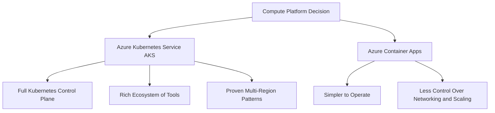

# ADR-0001: Compute Platform – Azure Kubernetes Service (AKS)

## Status

Accepted (Pre-defined)

## Diagram

## Context

The Player Progression API requires a compute platform that supports containerized workloads, horizontal scaling, multi-region deployment, and fine-grained orchestration. The platform must handle 10,000+ TPS and support 99.99% availability across 3+ Azure regions.

## Decision

Use **Azure Kubernetes Service (AKS)** as the compute platform.

This is a pre-defined decision for the AlwaysOn v2 learning framework.

## Alternatives Considered

- **Azure Container Apps** – Simpler to operate but less control over networking, scaling policies, and Orleans silo membership. Limited multi-region active-active support compared to AKS.

## Consequences

- **Positive**: Full Kubernetes control plane; rich ecosystem of tools (Helm, Kustomize, Istio); proven multi-region patterns; native support for `Microsoft.Orleans.Hosting.Kubernetes`.
- **Positive**: Independent regional stamp deployment model for fault isolation.
- **Negative**: Higher operational complexity; requires Kubernetes expertise; cluster upgrades and node pool management are the team's responsibility.
- **Negative**: Cost overhead for control plane and system node pools.

## References

- [AKS Best Practices](https://learn.microsoft.com/azure/aks/best-practices)
- [Mission-Critical AKS Reference Architecture](https://learn.microsoft.com/azure/architecture/reference-architectures/containers/aks-mission-critical/mission-critical-intro)
- [Orleans Kubernetes Hosting](https://learn.microsoft.com/dotnet/orleans/deployment/kubernetes)
