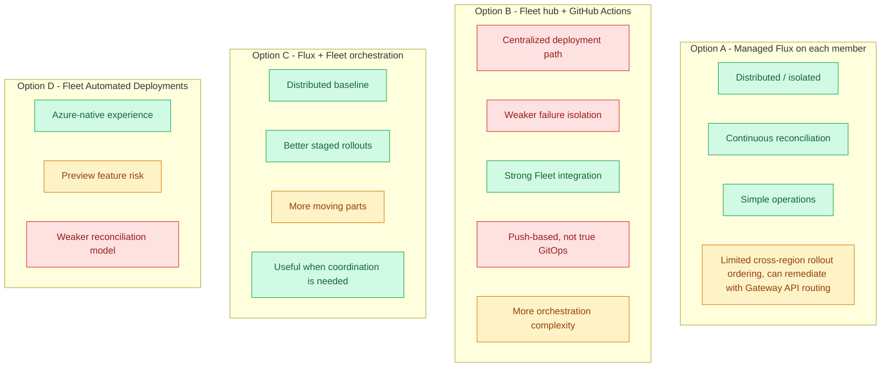

# ADR-0001: How to deploy workloads to regional AKS clusters

- **Status**: ACCEPTED
- **Date**: 2026-03-15

## Context

We have a multi-region AKS infrastructure with:
- A **Fleet hub cluster** managed by Azure, but guard-rail restricted and therefore not suitable as the place where workload controllers live
- **Regional AKS member clusters** that run the actual platform and application workloads
- A Git repository containing infrastructure and application manifests or helm charts
- A requirement for **continuous reconciliation**, but also for a **distributed and extremely robust** deployment path
- the desire to support blue-green and canary deployment patterns
- we want to be able to deploy beta versions, blue-green and canary

## Constraints Discovered

1. **Fleet hub cannot run workload controllers**. Guard-rail webhooks block normal workload resources outside system namespaces.
2. **The deployment path itself must be distributed**. Losing one cluster, one pipeline run, or the Fleet hub must not stop every region from reconciling.
3. **A GitHub outage must not become an application outage**. It may block new changes, but it should not take down already-running regions.
4. **Production robustness matters more than central orchestration elegance**. A simpler per-cluster pull model is preferable to a more fragile central push model.

## Options

### Diagram of Options




### Option A: Azure-managed Flux on each member cluster (current implementation)

**How it works**: each AKS member cluster gets its own Azure-managed Flux extension and Flux configuration as part of stamp provisioning. Each cluster independently pulls from Git and reconciles its own desired state.

```
Git repo ──pull──▶ Managed Flux (swedencentral)
         ──pull──▶ Managed Flux (germanywestcentral)
```

**What is actually nice about this approach**:
- Flux is installed as part of infrastructure provisioning, not by separately logging into each cluster and bootstrapping controllers by hand.
- Azure manages the Flux extension lifecycle and minor upgrades.
- The GitOps controller lives with the workload cluster that needs it.
- Fleet is not required in the steady-state deployment path.

| Aspect | Assessment |
|---|---|
| Distribution / failure isolation | ✅ Strong. Each region has its own reconciler and does not depend on a central hub to keep running. |
| Operational simplicity | ✅ Strong. One Bicep deployment installs Flux and its configuration together with the cluster. |
| Managed lifecycle | ✅ Strong. Azure owns extension installation and upgrades. |
| Continuous reconciliation | ✅ Strong. Each cluster keeps reconciling directly from Git. |
| GitHub outage behavior | ✅ Good failure mode. Existing workloads keep running on last applied state; only new convergence is blocked until GitHub returns. |
| Fleet dependency | ✅ None for baseline operation. This is a feature, not a gap. |
| Scaling (add region) | ✅ Good. A new stamp gets Flux automatically when the stamp is provisioned. |
| Coordinated cross-region rollouts | ⚠️ Limited. Ordering across regions is not built in. But can be remediated with Gateway API routing. |

### Option B: Fleet hub envelopes + GitHub Actions CI

**How it works**: GitHub Actions pushes manifests to the Fleet hub, and Fleet propagates them to member clusters.

```
Git repo ──push──▶ GitHub Actions ──kubectl──▶ Fleet hub ──CRP──▶ Members
```

| Aspect | Assessment |
|---|---|
| Distribution / failure isolation | ❌ Weaker. Introduces a more central deployment path and a stronger dependency on CI plus hub availability. |
| Continuous reconciliation | ❌ Push-based, not true GitOps reconciliation. |
| Fleet integration | ✅ Strong. Uses Fleet for what it was built for. |
| GitHub outage behavior | ⚠️ Similar exposure for new rollouts, but with extra CI coupling. |
| Simplicity | ⚠️ Moderate. Fewer in-cluster controllers, but more central orchestration machinery. |

### Option C: Managed Flux on members + Fleet CRPs for orchestration

**How it works**: keep managed Flux on each member cluster for steady-state reconciliation, and add Fleet only for staged multi-cluster rollout ordering, overrides, or placement policies.

```
Git repo ──pull──▶ Managed Flux (per member)
         ──push──▶ Optional Fleet orchestration layer
```

| Aspect | Assessment |
|---|---|
| Baseline robustness | ✅ Same strong distributed baseline as Option A. |
| Coordinated rollout capability | ✅ Better than Option A if we later need staged rollouts. |
| Complexity | ⚠️ Higher than Option A because there are now two control mechanisms. |
| Need today | ⚠️ Not required for the baseline architecture to be robust. |

### Option D: Fleet Automated Deployments (preview)

**How it works**: Azure-native Fleet feature that connects GitHub to Fleet and generates pipeline support automatically.

| Aspect | Assessment |
|---|---|
| Azure-native experience | ✅ Attractive |
| Production readiness | ⚠️ Preview is not a good foundation for the core deployment path |
| Continuous reconciliation | ❌ Still weaker than per-cluster Flux |

## Decision Criteria

| Criteria | Weight | Notes |
|---|---|---|
| Survives central control-plane failure | High | The deployment mechanism must remain distributed. |
| GitHub outage degrades safely | High | No rollout is acceptable; no outage is mandatory. |
| Continuous drift reconciliation | High | Production reliability requirement. |
| Simplicity / operational overhead | High | Lower moving-part count is a reliability advantage. |
| Production readiness | High | No preview dependency in the core path. |
| Works across regions | High | Multi-region is the norm, not an edge case. |
| Fleet-native coordination | Medium | Useful, but optional compared to baseline robustness. |

## Decision

Choose **Option A** as the baseline strategy: **Azure-managed Flux installed directly on every regional AKS member cluster**.

Fleet is explicitly **not** required for the baseline deployment path. That is an advantage because it keeps the reconciliation loop close to the workloads and removes an unnecessary central dependency.

If later we need coordinated staged rollouts across regions, we can add Fleet as an orchestration layer on top of this baseline without changing the core principle.

## Why This Is The Right Argument

This is the strongest argument for the current design:

1. **It is distributed by default.** Every region owns its own reconciliation loop. There is no single deployment hub that must stay healthy for all clusters to converge.
2. **It fails well when GitHub is unavailable.** GitHub being down blocks new desired-state fetches, but it does not take down the already-applied workloads. The clusters keep running the last known good state.
3. **It removes unnecessary bootstrap toil.** Flux is installed and configured by Azure resources in Bicep, not by imperative per-cluster setup steps in the normal path.
4. **It uses the managed Azure experience where it helps most.** Azure handles extension lifecycle, which reduces controller drift and day-2 maintenance burden.
5. **It keeps Fleet optional.** Fleet is useful for orchestration, not necessary for correctness. That is the right separation of concerns.
6. **Blue/Green** and **Canary** deployments are still possible with this approach by using e.g. Gateway API.

## GitHub Outage Analysis

If GitHub is down:
- Existing workloads, Services, Ingress, and already-applied Kubernetes objects keep running.

What does stop during a GitHub outage:
- New deployments and manifest changes cannot be pulled.
- we would need to fallback to another git source.

Maybe this is acceptable?

