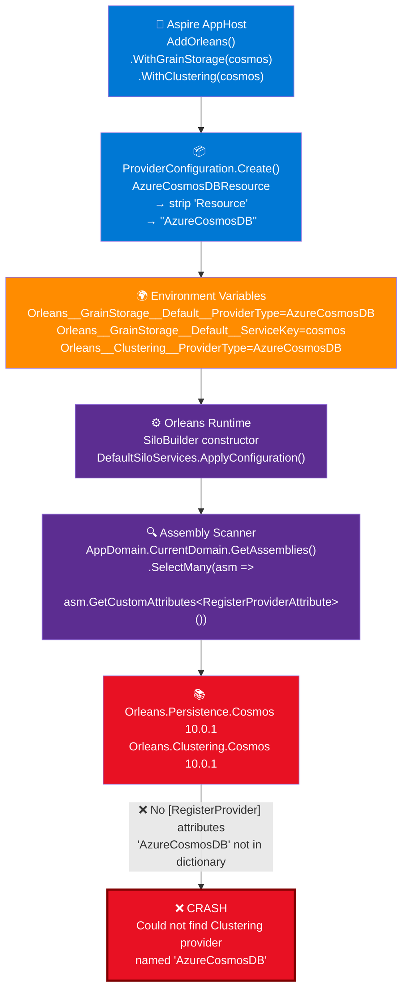
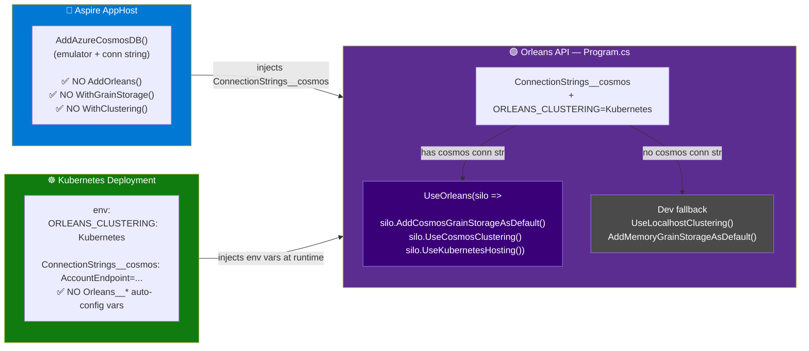

# ADR-0058: Explicit Orleans Provider Configuration over Aspire Auto-Config

## Status

Accepted

## Context

HelloOrleons uses Orleans 10.0.1 with Cosmos DB for grain storage and clustering.
The initial implementation used the Aspire Orleans integration (`AddOrleans().WithClustering(cosmos).WithGrainStorage("Default", cosmos)`) which injects environment variables like `Orleans__GrainStorage__Default__ProviderType=AzureCosmosDB` for Orleans to auto-discover providers.

This **does not work** with Orleans 10.0.1. At startup, Orleans crashes with:

```
System.InvalidOperationException: Could not find GrainStorage provider named 'AzureCosmosDB'.
This can indicate that either the 'Microsoft.Orleans.Sdk' or the provider's package are
not referenced by your application.
```

### Root Cause Chain

1. **Aspire** calls `ProviderConfiguration.Create(resourceBuilder)` which derives the provider type from the resource class name: `AzureCosmosDBResource` → strips `Resource` → `"AzureCosmosDB"`.

2. **Aspire** injects env vars: `Orleans__GrainStorage__Default__ProviderType=AzureCosmosDB` and `Orleans__GrainStorage__Default__ServiceKey=cosmos`.

3. **Orleans** `DefaultSiloServices.ApplyConfiguration()` reads these env vars via `IConfiguration` and looks up `"AzureCosmosDB"` in a dictionary of known provider types.

4. **Orleans** builds this dictionary by scanning all loaded assemblies for `[RegisterProvider]` attributes: `AppDomain.CurrentDomain.GetAssemblies().SelectMany(asm => asm.GetCustomAttributes<RegisterProviderAttribute>())`.

5. **The `Orleans.Persistence.Cosmos` and `Orleans.Clustering.Cosmos` assemblies do not have `[RegisterProvider]` attributes** in version 10.0.1. The provider type `"AzureCosmosDB"` is never registered → lookup fails → crash.



### Why Assembly.Load doesn't help

We tried `Assembly.Load("Orleans.Persistence.Cosmos")` before `UseOrleans()` — the assemblies load but they simply **don't contain** `[RegisterProvider("AzureCosmosDB", ...)]` attributes. This is a known gap tracked in [dotnet/orleans#9730](https://github.com/dotnet/orleans/issues/9730) (source generator should scan for these at build time, still in draft as of April 2026).

## Decision

Use **explicit provider registration** via `silo.AddCosmosGrainStorageAsDefault()` and `silo.UseCosmosClustering()` instead of Aspire's `AddOrleans().WithGrainStorage()` auto-configuration.

This means:
- **Remove** `Aspire.Hosting.Orleans` from the AppHost
- **Remove** `AddOrleans()` / `WithClustering()` / `WithGrainStorage()` from AppHost
- **Keep** `AddAzureCosmosDB()` in AppHost for the emulator and connection string injection
- **Add** explicit `silo.AddCosmosGrainStorageAsDefault()` and `silo.UseCosmosClustering()` in the API's `UseOrleans` block
- **Fallback** to `UseLocalhostClustering()` + `AddMemoryGrainStorageAsDefault()` when no Cosmos connection string is present

This is consistent with the HelloAgents project which already uses this pattern successfully.



## Alternatives Considered

- **Aspire auto-config** (`AddOrleans().WithGrainStorage()`) – Broken with Orleans 10.0.1 due to missing `[RegisterProvider]` attributes. May work in future Orleans versions once [dotnet/orleans#9730](https://github.com/dotnet/orleans/issues/9730) is resolved.
- **Assembly.Load workaround** – Load `Orleans.Persistence.Cosmos` / `Orleans.Clustering.Cosmos` manually before `UseOrleans()`. Doesn't help because the assemblies lack the attribute.
- **Keyed CosmosClient registration** – Register `AddKeyedSingleton<CosmosClient>("cosmos")` for Orleans to resolve via `ServiceKey`. Fails for the same reason: no `[RegisterProvider]` to map provider type to builder.

## Consequences

- **Positive**: Orleans starts correctly with Cosmos DB emulator and production endpoints.
- **Positive**: Consistent with HelloAgents pattern — single proven approach across projects.
- **Positive**: No dependency on Aspire Orleans integration package in AppHost.
- **Negative**: Database/container names are hardcoded in the API project rather than centralized in the AppHost. Acceptable since they must match the Cosmos containers created by Aspire anyway.
- **Negative**: When Orleans adds source-generated `[RegisterProvider]` support, we'll need to revisit to potentially simplify back to Aspire auto-config.

## References

- [dotnet/orleans#9730](https://github.com/dotnet/orleans/issues/9730) — Source Generator should scan for RegisterProvider attributes at build time (open, draft PR)
- [dotnet/orleans#9731](https://github.com/dotnet/orleans/pull/9731) — Draft PR: Generate RegisterProvider metadata at build time via source generator
- [Aspire ProviderConfiguration.cs](https://github.com/dotnet/aspire/blob/main/src/Aspire.Hosting.Orleans/ProviderConfiguration.cs) — How Aspire derives provider type name from resource class
- [Aspire OrleansServiceExtensions.cs](https://github.com/dotnet/aspire/blob/main/src/Aspire.Hosting.Orleans/OrleansServiceExtensions.cs) — WithGrainStorage / WithClustering implementation
- [Orleans DefaultSiloServices.cs](https://github.com/dotnet/orleans/blob/main/src/Orleans.Runtime/Hosting/DefaultSiloServices.cs) — Assembly scanning that fails to find providers
- [Orleans Cosmos DB grain persistence docs](https://learn.microsoft.com/en-us/dotnet/orleans/grains/grain-persistence/azure-cosmos-db) — Official explicit configuration API
- ADR-0056: HelloOrleons write-behind high performance (original design)
