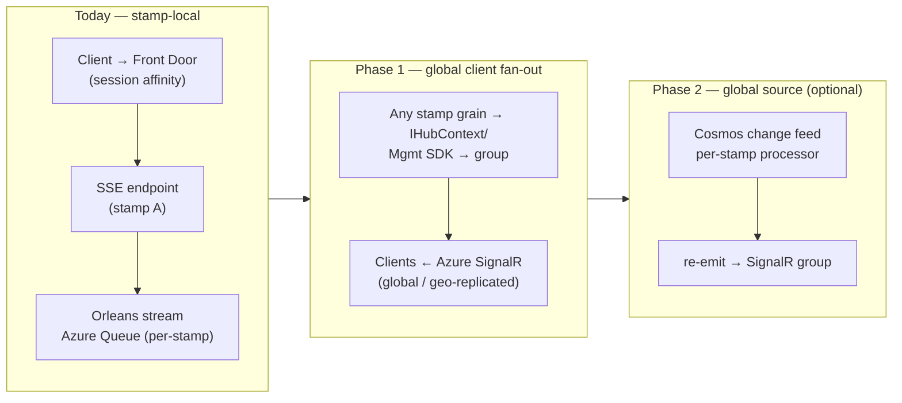

# ADR-0063: Cross-Stamp / Cross-Region Live Streaming

**Status:** Proposed (decision input — not yet decided or implemented)

## Context

Real-time updates are **stamp-local**. A client opens an SSE connection, Front Door
routes it to one stamp, and that endpoint subscribes to an Orleans stream backed by that
stamp's storage. Events published by grains in a *different* stamp never reach the client
live. Because Cosmos DB is global and multi-region, the data is durably stored — so a
page **refresh** shows it, but it is not **live**.

Confirmed in code (root cause):

- Streams use the **Azure Queue stream provider** over a **per-stamp** storage account:
  - `src/HelloAgents/HelloAgents.Api/Program.cs:45` — `silo.AddAzureQueueStreams("ChatMessages", …)`
  - `src/GraphOrleons/GraphOrleons.Api/Program.cs:49` — `silo.AddAzureQueueStreams("ComponentUpdates", …)` (queues `tenant-stream-0..3`)
- Client transport is **Server-Sent Events**; an HTTP endpoint subscribes to a grain stream and writes `text/event-stream`:
  - `src/HelloAgents/HelloAgents.Api/Endpoints.cs:223` (SSE) + explicit `stream.SubscribeAsync(…)` at `:239`
  - `src/GraphOrleons/GraphOrleons.Api/Endpoints.cs:117` (SSE) + `stream.SubscribeAsync(…)` at `:164`
- All subscriptions are **explicit** (`stream.SubscribeAsync`). There are **zero**
  `[ImplicitStreamSubscription]` usages in the codebase.

Each stamp's pulling agents only read that stamp's storage queues, so a subscriber in
stamp A never observes an event published in stamp B. Front Door **session affinity**
(ADR-0002) keeps one user pinned to one stamp, which masks the problem for a single user —
but multi-user collaboration (a shared chat group / shared graph whose participants land
on different stamps) is still broken live.

> **Direct answer to "does Orleans support cross-stamp streams?"**
> **No — not natively.** Orleans streams are scoped to a single cluster, and Orleans'
> old (3.x) multi-cluster / geo-distributed feature was **not carried forward** into the
> 7.0 rewrite — it does not exist in Orleans 7/8/9/10 (an Epic to reintroduce cross-cluster
> support is open upstream, `dotnet/orleans#7485`). Cross-stamp delivery must be built on a
> shared external service. A shared Event Hub *can* fan out to multiple clusters, but only
> under strict conditions that this codebase does not currently meet (see Option B).

### Why Orleans streams are cluster-scoped (verified against `dotnet/orleans` source)

| Mechanism | Effect | Source |
|---|---|---|
| `PubSubRendezvousGrain` (explicit subs) is a normal grain → lives in one cluster's grain directory | Stamp A's pulling agents look up stamp A's pub-sub grain; stamp B's explicit subscriptions are invisible | `src/Orleans.Streaming/PubSub/GrainBasedPubSubRuntime.cs` |
| Pulling-agent balancer uses `ISiloStatusOracle` (local-cluster membership only) | Queue/partition ownership is distributed only among local silos | `src/Orleans.Streaming/QueueBalancer/DeploymentBasedQueueBalancer.cs` |
| `ImplicitStreamSubscriberTable` is per-silo, built from local assembly scan | Each cluster resolves implicit subscribers independently | `src/Orleans.Streaming/PubSub/ImplicitStreamSubscriberTable.cs` |

## Decision

**Recommended (primary): introduce Azure SignalR Service as a global fan-out backplane at
the client/edge layer**, and keep Orleans streams stamp-local. This decouples client
fan-out from the Orleans cluster boundary entirely and is the smallest change that fixes
the actual symptom (SSE client on stamp A must see stamp B events).

The decision is presented for sign-off, with a phased path that reuses already-provisioned
infrastructure (the global Premium Event Hub from ADR-0061, and global Cosmos DB).

### Decision criteria

- **Correctness for multi-user collaboration** across stamps (the actual bug).
- **Blast radius / app refactor cost** (explicit→implicit subscription rewrite is large).
- **Latency** target for "live" (sub-second preferred).
- **Reuse of existing infra** vs. new services.
- **Operational complexity** and **cost** at active-active scale.

## Options Considered

### Option A — Azure SignalR Service as a global backplane ✅ recommended

Clients connect to **Azure SignalR Service** (globally, via its own DNS / geo-replication),
not to a stamp pod. Any stamp publishes to a group/user through the Management SDK or
`IHubContext`, and SignalR delivers to every client in that group regardless of which stamp
they negotiated with. The per-stamp SSE endpoints are replaced (or fronted) by a SignalR hub.

- **Pros:** Removes the "which server holds the connection" problem — the service holds all
  connections and group membership centrally; *"switching to SignalR Service will remove the
  need to manage back planes"*. No change to Orleans' explicit-subscription model. Premium
  **geo-replication** gives a single DNS, cross-region message sync, and automatic failover
  (≤8 replicas); alternatively the multi-endpoint SDK routes per region. Scales to 1M
  connections (Premium_P2); P99 latency < 1s under 70% load.
- **Cons:** New managed service + cost (per unit: 1,000 connections / 4 MBps). Requires
  replumbing the client edge from raw SSE to SignalR (or a thin SSE→SignalR bridge). Grains
  must call out to SignalR (REST/Management SDK) on publish.
- **Fit:** Best fit — the app is entirely explicit subscriptions + SSE, so a client-layer
  backplane avoids an Orleans refactor.
- **Sources:** [SignalR overview](https://learn.microsoft.com/en-us/azure/azure-signalr/signalr-overview),
  [Management SDK](https://learn.microsoft.com/en-us/azure/azure-signalr/signalr-howto-use-management-sdk),
  [geo-replication](https://learn.microsoft.com/en-us/azure/azure-signalr/howto-enable-geo-replication),
  [performance](https://learn.microsoft.com/en-us/azure/azure-signalr/signalr-concept-performance).

### Option B — Shared global Event Hub as the Orleans stream provider

Replace `AddAzureQueueStreams` with `AddEventHubStreams` pointed at the **shared, global,
geo-replicated** Event Hub (already provisioned, ADR-0061). Orleans then fans out events
across clusters natively. **Works only under all of these conditions:**

1. **One Event Hub consumer group per stamp** (Premium allows 100). Orleans' EH provider
   uses a non-exclusive `PartitionReceiver`, so clusters don't fight for partitions — but a
   shared consumer group would intermix offsets.
2. **A distinct `ServiceId` per stamp.** EH checkpoints are namespaced by `ServiceId`; a
   shared `ServiceId` means one cluster advances the offset past events another hasn't
   processed → **missed events**. ⚠️ This repo does **not** currently set `ServiceId`
   (it defaults to `"default"` in every stamp) — this must be fixed first.
3. **Implicit subscriptions only.** Explicit `SubscribeAsync` does **not** cross clusters
   (its `PubSubRendezvousGrain` is cluster-local). This repo uses explicit subscriptions
   everywhere → a non-trivial rewrite to `[ImplicitStreamSubscription]` is required.
4. **Frozen EH partition count** (the stream→partition hash ring breaks if it changes), and
   **idempotent** grain handlers (every stamp receives every event — fan-out = duplicate
   delivery by design).
5. **The namespace must actually be Premium/Dedicated** for geo-replication and the 100
   consumer-group headroom. This is parameter-dependent (`eventHubsSku` in
   `infra/global.bicep`, default `Premium`) — confirm the deployed SKU before relying on it.

- **Pros:** Native Orleans streams across stamps; reuses the existing Event Hub; no new
  client-edge service.
- **Cons:** Largest app refactor (explicit→implicit), `ServiceId` change, idempotency
  requirements, partition-count lock-in. **Does not by itself solve the client/SSE fan-out**
  — it makes grains see cross-stamp events; the SSE endpoint still serves one stamp's clients.
- **Caveat on "Event Hub with multiple regions":** Event Hubs **geo-replication** is a DR
  feature, **not** active-active consumer fan-out — the single hostname always points to the
  **primary**; *"you can't read or write on the secondary regions"* (hot standby). So all
  stamps consume from the one namespace (cross-region reads to the primary region). True
  active/active EH consumption needs **Event Hubs federation** or per-region hubs.
- **Sources:** [Orleans stream providers](https://learn.microsoft.com/en-us/dotnet/orleans/streaming/stream-providers),
  [EH geo-replication](https://learn.microsoft.com/en-us/azure/event-hubs/geo-replication),
  [EH quotas](https://learn.microsoft.com/en-us/azure/event-hubs/event-hubs-quotas).

### Option C — Cosmos DB change-feed fan-out (strong infra-reuse alternative)

Each stamp runs a **change-feed processor** on the global Cosmos container (its own lease
container + `processorName`), receives the full feed from its **local region replica**, and
re-emits changes into that stamp's local Orleans stream / SSE clients. Cosmos is the single
global source of truth — which is exactly why a refresh already shows the data.

- **Pros:** Reuses existing global Cosmos; single source of truth; each stamp reads locally
  (no cross-region egress on reads); multiple independent consumers each get the full feed.
  No new messaging service.
- **Cons:** Near-real-time, not instant — the processor polls (default ~5 s, tunable lower),
  so latency is higher than a push backplane. Ordering is guaranteed **per partition key**
  only. Adds RU cost (monitored-container reads + lease container) × N stamps. Couples the
  live path to the DB write model. Captures inserts/updates (deletes need all-versions mode +
  continuous backup).
- **Fit:** Good "make refresh-only become near-live" upgrade with minimal new infra; pairs
  well with Option A (change feed as the cross-stamp source, SignalR as the client fan-out).
- **Sources:** [change feed](https://learn.microsoft.com/en-us/azure/cosmos-db/change-feed),
  [change-feed processor](https://learn.microsoft.com/en-us/azure/cosmos-db/change-feed-processor),
  [design patterns](https://learn.microsoft.com/en-us/azure/cosmos-db/change-feed-design-patterns).

### Option D — Event Grid namespace (MQTT broker / pull delivery)

A global Event Grid namespace as the pub/sub bus; stamps publish app events, and clients (or
stamp bridges) subscribe via MQTT or pull delivery for one-to-many broadcast.

- **Pros:** Fully managed pub/sub; MQTT broker supports one-to-many client fan-out and
  persistent sessions; pull delivery for backend consumers.
- **Cons:** Most divergent from the current .NET/Orleans/SSE stack; namespace topics carry
  only your own app events; 512 KB MQTT message cap; another service to operate. Best when an
  MQTT/device-style fan-out is desired rather than a SignalR/web model.
- **Sources:** [Event Grid overview](https://learn.microsoft.com/en-us/azure/event-grid/overview),
  [MQTT broker](https://learn.microsoft.com/en-us/azure/event-grid/mqtt-overview),
  [pull delivery](https://learn.microsoft.com/en-us/azure/event-grid/pull-delivery-overview).

### Option E — Status quo: Front Door session affinity (current partial mitigation)

Keep streams stamp-local; rely on session affinity (ADR-0002) to pin a user to one stamp.

- **Pros:** No change.
- **Cons:** Only works for a **single** user's own events. Cross-user, cross-stamp
  collaboration stays broken live; a stamp failover drops the live view until reconnect.

## Recommended path (phased, reuses existing infra)

- **Phase 1 (primary):** Adopt **Azure SignalR Service** (Option A) for the client edge.
  Grains/endpoints publish to SignalR groups; clients connect globally. Fixes the live
  multi-user, cross-stamp symptom with no Orleans refactor.
- **Phase 2 (optional, if a durable global source is wanted):** Add **Cosmos change-feed**
  processors (Option C) per stamp to drive the SignalR publishes from the single source of
  truth, so even events written directly to Cosmos (not via a grain) fan out live.
- **Defer Option B** unless native cross-cluster Orleans streams are specifically wanted; it
  carries the largest refactor (explicit→implicit, `ServiceId` per stamp, idempotency) and
  still doesn't solve the client/SSE layer on its own.

## Consequences

- **Positive:** Live cross-stamp updates for multi-user scenarios; client fan-out decoupled
  from cluster boundaries; reuses global Cosmos (and optionally the existing Event Hub).
- **Positive:** No Orleans subscription-model rewrite on the recommended path.
- **Negative:** New managed service (SignalR) + cost; client edge moves from raw SSE to
  SignalR; grains gain an outbound publish dependency.
- **Negative (if Option B is later chosen):** explicit→implicit subscription refactor,
  mandatory per-stamp `ServiceId`, idempotent handlers, frozen EH partition count.
- **Follow-ups:** set a distinct `ServiceId` per stamp regardless of option (cheap, avoids
  future EH/checkpoint foot-guns); decide whether session affinity stays once SignalR lands.

## Links

- ADR-0002 Multi-Stamp Architecture (session affinity) · ADR-0007 Messaging Platform
  (Storage Queues in-stamp, Event Hub multi-region) · ADR-0061 Event Archive (geo-replicated
  Event Hub as the durable multi-region log) · ADR-0058 Explicit Orleans Provider Config.
- [Orleans overview / versions](https://learn.microsoft.com/en-us/dotnet/orleans/overview)
- [Orleans stream providers](https://learn.microsoft.com/en-us/dotnet/orleans/streaming/stream-providers)
- [Azure SignalR Service overview](https://learn.microsoft.com/en-us/azure/azure-signalr/signalr-overview)
- [Event Hubs geo-replication](https://learn.microsoft.com/en-us/azure/event-hubs/geo-replication)
- [Cosmos DB change feed](https://learn.microsoft.com/en-us/azure/cosmos-db/change-feed)
- [Event Grid overview](https://learn.microsoft.com/en-us/azure/event-grid/overview)
- Research notes (citations): `~/.minime/raw/abossard/always-on-v2/cross-stamp-streaming-research-2026-06-26.md`
