# Blockchain Analytics Platform — Orleans Architecture

> Production-ready architecture for a distributed blockchain forensics and analytics platform built on Microsoft Orleans virtual actors.

---

## Table of Contents

1. [System Overview](#1-system-overview)
2. [Grain Design](#2-grain-design)
3. [Data Flow](#3-data-flow)
4. [Graph Analysis Engine](#4-graph-analysis-engine)
5. [Scam Detection Pipeline](#5-scam-detection-pipeline)
6. [Persistence Strategy](#6-persistence-strategy)
7. [Streaming Architecture](#7-streaming-architecture)
8. [Multi-Chain Support](#8-multi-chain-support)
9. [API Design](#9-api-design)
10. [Scaling Strategy](#10-scaling-strategy)
11. [Security Considerations](#11-security-considerations)
12. [Deployment Architecture](#12-deployment-architecture)
13. [AI Agent Workflow Engine](#13-ai-agent-workflow-engine)

---

## 1. System Overview

### Design Philosophy

The platform models every blockchain entity (wallet, transaction, contract, block) as an Orleans grain — a virtual actor with identity, state, and single-threaded execution. This maps naturally to blockchain data:

- **One wallet = one `WalletGrain`** — accumulates balance, risk score, transaction history in-memory
- **One transaction = one `TransactionGrain`** — immutable once confirmed, perfect for activation/deactivation lifecycle
- **One contract = one `ContractGrain`** — holds ABI, decompiled source, classification

The graph of wallet-to-wallet relationships emerges organically from grain-to-grain calls, enabling distributed graph traversal without a centralized graph database.

### Key Architectural Decisions

| Decision | Choice | Rationale |
|---|---|---|
| Compute | Orleans on AKS | Virtual actors map 1:1 to blockchain entities |
| Graph traversal | Grain-to-grain calls | No centralized bottleneck, scales with cluster |
| Block ingestion | Orleans Streams | Back-pressure, partitioned by chain |
| Scam detection | Pipeline of StatelessWorker grains | Horizontally scalable scoring |
| Hot data | Redis (balances, risk scores) | Sub-ms reads for API layer |
| Warm data | Azure Cosmos DB | Transaction history, wallet profiles |
| Cold data | PostgreSQL + TimescaleDB | Analytics, aggregations, reporting |
| Graph queries | Neo4j / Apache AGE | Complex multi-hop relationship queries |
| ML inference | ONNX Runtime sidecar | In-process scoring, no network hop |

### High-Level Architecture

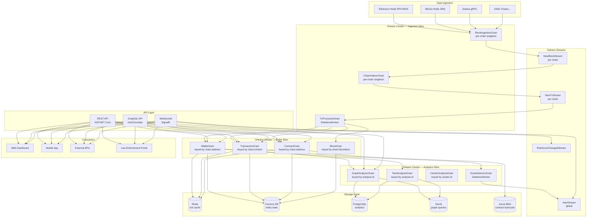

---

## 2. Grain Design

### Grain Taxonomy

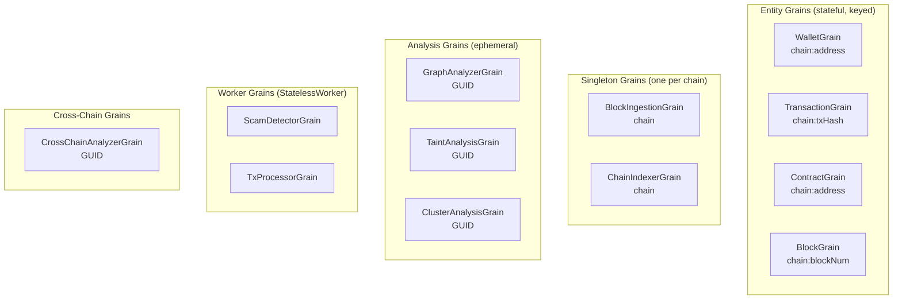

### 2.1 WalletGrain

**Key:** `{chain}:{address}` (e.g. `"eth:0xdead..."`)
**Purpose:** Fundamental unit — each blockchain address maps to exactly one grain.

**State:**

| Property | Type | Description |
|---|---|---|
| Chain | string | Blockchain identifier (eth, btc, sol) |
| Address | string | On-chain address |
| Type | enum | EOA, Contract, Multisig, Unknown |
| FirstSeen | DateTimeOffset | First observed transaction |
| LastSeen | DateTimeOffset | Most recent activity |
| IncomingTxCount | long | Total inbound transactions |
| OutgoingTxCount | long | Total outbound transactions |
| LatestBalance | WalletBalance | Native + token balances |
| Risk | RiskAssessment | Score (0.0–1.0), level, factors, timestamp |
| Labels | Set\<WalletLabel\> | Tags like "exchange:binance", "scam:rugpull", "sanctions:ofac" |
| RecentTxHashes | List\<string\> | Bounded ring buffer (last 1000) |
| Relationships | Dictionary\<string, WalletRelationship\> | Counterparty → relationship strength, type, tx count |

**Operations:**

| Operation | Behavior |
|---|---|
| `GetProfile()` | Return wallet profile from in-memory state |
| `GetBalance()` | Return latest balance snapshot |
| `GetRiskScore()` | Return current risk assessment |
| `GetTransactionHistory(page, size, filter)` | Recent from ring buffer; older from PostgreSQL |
| `GetRelatedWallets(depth, type)` | Return relationships; if depth > 1, fan out to neighbor WalletGrains (capped at 50 per hop, max depth 4) |
| `GetLabels()` | Return all tags |
| `RecordIncomingTransaction(tx)` | Increment count, update LastSeen, add to ring buffer, update relationship graph, notify observers. Trigger risk recalculation if high-value. |
| `RecordOutgoingTransaction(tx)` | Same as incoming, for outbound direction |
| `UpdateBalance(snapshot)` | Set latest balance |
| `AddLabel(label)` | Add tag with source and confidence |
| `RequestRiskRecalculation()` | Call ScamDetectorGrain, update risk state |
| `SubscribeToActivity(observer)` | Register for real-time wallet events |

**Write-behind strategy:** Dirty state flushed to Cosmos DB every 30 seconds via grain timer (not on every change). Final persist on deactivation.

**Supporting DTOs:**

| DTO | Fields |
|---|---|
| WalletBalance | NativeBalance (string, avoids precision loss), Tokens (list of contract+symbol+balance+decimals), AsOf |
| RiskAssessment | Score (0.0–1.0), Level (Low/Medium/High/Critical), Factors (list of category+weight+description), CalculatedAt |
| WalletLabel | Tag, Source (chainalysis/manual/ml-classifier), Confidence (0–1), AddedAt |
| WalletRelationship | TargetAddress, Type (Transfer/ContractInteraction/TokenSwap/Funding/Clustering), Strength (0–1), TxCount, TotalValue |

### 2.2 TransactionGrain

**Key:** `{chain}:{txHash}` (e.g. `"eth:0x7cf..."`)
**Purpose:** Immutable record of a confirmed on-chain transaction.

**State:**

| Property | Type | Description |
|---|---|---|
| Indexed | bool | Whether this tx has been processed |
| Details | TransactionDetails | Full tx data (see below) |
| Inputs | List\<TransactionInput\> | Input addresses and values |
| Outputs | List\<TransactionOutput\> | Output addresses and values |
| Trace | TraceResult? | Internal calls and event logs |

**TransactionDetails fields:**

| Field | Type | Description |
|---|---|---|
| Chain | string | Blockchain |
| TxHash | string | Transaction hash |
| BlockNumber | long | Block containing this tx |
| TxIndex | int | Position within block |
| FromAddress | string | Sender |
| ToAddress | string | Receiver |
| Value | string | Amount (as string for precision) |
| GasUsed / GasPrice | string | Gas metrics |
| Status | enum | Success, Failed, Pending |
| Timestamp | DateTimeOffset | Block timestamp |
| ContractAddress | string? | Non-null if contract creation |
| InputData | string | Calldata |
| RiskScore | double | Inherited risk score |
| Tags | List\<string\> | Applied tags |

**Operations:**

| Operation | Behavior |
|---|---|
| `GetDetails()` | Return transaction details |
| `GetRiskScore()` | Return risk score |
| `GetInputs()` / `GetOutputs()` | Return inputs/outputs |
| `GetInternalTrace()` | Return trace result (internal calls, event logs) |
| `Index(rawTx)` | **Idempotent** — parse raw tx, persist, fan out to sender WalletGrain (RecordOutgoing) and receiver WalletGrain (RecordIncoming). If contract creation → activate ContractGrain. |

### 2.3 ContractGrain

**Key:** `{chain}:{contractAddress}` (e.g. `"eth:0xDEF..."`)
**Purpose:** Represents a deployed smart contract.

**State:**

| Property | Type | Description |
|---|---|---|
| Chain | string | Blockchain |
| Address | string | Contract address |
| DeployerAddress | string | Who deployed it |
| DeployTxHash | string | Deployment transaction |
| DeployedAt | DateTimeOffset | Deployment time |
| Classification | ContractClassification | Type, standards, scam probability, red flags |
| InteractionCount | long | Total interactions |
| UniqueInteractors | long | Unique wallet count |
| IsVerified | bool | Source code verified |
| IsProxy | bool | Proxy pattern detected |
| Abi | string? | ABI JSON |
| Bytecode | string? | Contract bytecode reference |

**ContractClassification:**

| Field | Type | Description |
|---|---|---|
| Type | enum | Unknown, Token, NFT, DEX, Lending, Bridge, Mixer, Staking, Governance, Proxy, Multisig, MaliciousHoneypot, MaliciousRugPull, MaliciousPhishing |
| Standards | string[] | ERC-20, ERC-721, ERC-1155, etc. |
| ScamProbability | double | 0.0–1.0 |
| RedFlags | string[] | "hidden-mint", "honeypot", "fee-manipulation", etc. |
| Protocol | string? | "uniswap-v3", "aave-v3", etc. |

**Operations:**

| Operation | Behavior |
|---|---|
| `GetInfo()` | Return contract info |
| `GetClassification()` | Return classification and red flags |
| `GetAbi()` | Return ABI JSON |
| `GetDecompiledSource()` | Return decompiled source |
| `GetTopInteractors(count)` | Return top interacting wallets |
| `IndexDeployment(deployment)` | Record deployer, tx hash, timestamp, bytecode |
| `RecordInteraction(wallet, method, timestamp)` | Increment interaction counters |
| `UpdateAbi(abi)` | Set ABI (from Etherscan or manual upload) |
| `Classify()` | Run classification heuristics |

### 2.4 BlockIngestionGrain

**Key:** `{chain}` (e.g. `"eth"`, `"btc"`, `"sol"`) — singleton per chain
**Purpose:** Connects to a blockchain node and streams new blocks.

**State:**

| Property | Type | Description |
|---|---|---|
| LatestIngested | long | Last block number ingested |
| ChainHead | long | Current chain head |
| AutoStart | bool | Resume on silo restart |
| BlocksPerSecond | double | Ingestion throughput |
| LastBlockTimestamp | DateTimeOffset | When last block was processed |

**Operations:**

| Operation | Behavior |
|---|---|
| `Start()` | Begin polling loop via grain timer (every 500ms) |
| `Stop()` | Stop polling |
| `GetStatus()` | Return IngestionStatus (chain, latest, head, gap, running, bps) |
| `SetTargetBlock(blockNumber)` | Reset ingestion pointer |
| `BackfillRange(from, to)` | Replay historical block range |

**Implementation:** Uses a chain-specific `IBlockchainNodeClient` (Ethereum JSON-RPC, Bitcoin ZMQ, Solana gRPC). Publishes each block to `NewBlock/{chain}` stream.

### 2.5 ChainIndexerGrain

**Key:** `{chain}` — singleton per chain
**Purpose:** Subscribes to `NewBlockStream`, decomposes blocks into transactions, publishes each to `NewTxStream`.

Uses `[ImplicitStreamSubscription("NewBlock")]` to auto-subscribe.

| Operation | Behavior |
|---|---|
| `GetIndexingStats()` | Return blocks indexed, txs indexed, contracts discovered |

**For each block received:** Iterates through transactions and publishes each to `NewTx/{chain}` stream. Persists progress every 100 blocks.

### 2.6 ScamDetectorGrain

**Key:** integer (StatelessWorker — multiple activations per silo)
**Purpose:** Horizontally scaled scam/fraud scoring. Combines heuristic rules + ONNX ML model inference.

**Operations:**

| Operation | Behavior |
|---|---|
| `ScoreWallet(request)` | Run scoring pipeline → return RiskAssessment |
| `ScoreTransaction(request)` | Score tx based on sender/receiver risk + heuristics |
| `ClassifyContract(request)` | Analyze bytecode + ABI for red flags |
| `DetectPatterns(request)` | Check for specific scam patterns |

**Wallet Scoring Pipeline (5 rules):**

| Rule | Weight | Logic |
|---|---|---|
| Sanctions check | 1.0 | Check against OFAC/EU sanctions list |
| Known labels | varies | Existing "scam:" or "sanctions:" tags weighted by confidence |
| Taint from relationships | 0.4 | >5 relationships to high-risk wallets |
| Behavioral heuristics | 0.6 | Low tx count + many counterparties = distribution wallet |
| ML model | 0.4 | ONNX Runtime XGBoost/LightGBM model on 67 features |

**Score aggregation:** `totalScore = Σ(factors × 0.3) + mlScore × 0.4`, clamped to [0, 1]

| Score Range | Risk Level |
|---|---|
| < 0.25 | Low |
| 0.25 – 0.50 | Medium |
| 0.50 – 0.75 | High |
| > 0.75 | Critical |

### 2.7 GraphAnalyzerGrain

**Key:** GUID (one per analysis run)
**Purpose:** Executes graph analysis tasks: path finding, cluster detection, flow tracing.

**Operations:**

| Operation | Behavior |
|---|---|
| `FindPaths(query)` | BFS across WalletGrains to find paths between two addresses (max depth 6, max 10 paths, fan-out capped at 20/hop) |
| `TraceFlow(query)` | Build directed subgraph of money movement from a source through N hops |
| `BuildNeighborhood(query)` | Build subgraph within N-hop radius of a center wallet (max 500 nodes) |
| `DetectCommunities(query)` | Label propagation algorithm on a collected subgraph (10 iterations) |
| `GetStatus()` | Return Queued/Running/Completed/Failed |

**Path finding:** BFS using queue. For each node: call `WalletGrain.GetRelatedWallets(1)` → add edges to frontier → continue until target found or depth exceeded.

**Community detection:** 1) BuildNeighborhood collects subgraph 2) In-memory label propagation on adjacency list 3) Return clusters with member addresses.

### 2.8 TaintAnalysisGrain

**Key:** GUID (one per analysis run)
**Purpose:** Propagates "taint" from known-bad wallets through the transaction graph.

**Taint Models:**

| Model | Behavior |
|---|---|
| **Poison** | Binary — any contact with tainted address → fully tainted |
| **Haircut** | Proportional — taint splits based on relationship strength |
| **FIFO** | First-in-first-out — taint follows temporal order |

**Operations:**

| Operation | Behavior |
|---|---|
| `RunTaintAnalysis(request)` | Initialize sources with taint=1.0. BFS frontier: propagate taint via WalletGrain relationships according to chosen model. Stop at maxHops or minTaintThreshold. |
| `CheckTaint(chain, address)` | Lookup taint score for a specific address in results |
| `GetStatus()` | Return analysis progress |

**Result:** TaintedAddresses count, HopsTraversed, Top 100 tainted addresses with scores.

### 2.9 ClusterAnalysisGrain

**Key:** GUID (cluster ID)
**Purpose:** Groups wallets likely controlled by the same entity.

**Clustering Heuristics:**

| Heuristic | Chain | Logic |
|---|---|---|
| CommonInputOwnership | Bitcoin | Inputs in same tx → same owner |
| FundingTree | Ethereum | Wallets funded by same source |
| BehavioralSimilarity | Any | Timing, amounts, contract interactions |
| Combined | Any | All heuristics combined |

**Operations:**

| Operation | Behavior |
|---|---|
| `RunClustering(request)` | Apply heuristic starting from seed address, collect up to maxAddresses |
| `MergeClusters(otherClusterId)` | Merge two clusters when evidence links them |
| `GetCluster()` | Return ClusterResult (ID, chain, address count, risk, entity name, balance) |
| `GetMembers()` | Return all member addresses |

### 2.10 CrossChainAnalyzerGrain

**Key:** GUID (one per analysis)
**Purpose:** Trace funds across chain boundaries (e.g., ETH → Polygon via bridge contract).

**Operations:**

| Operation | Behavior |
|---|---|
| `TraceCrossChainFlow(query)` | Follow value through bridge contracts across source and target chains, collecting CrossChainHops |
| `LinkCrossChainWallets(walletKeys)` | Link wallets across chains believed to belong to same entity |

**CrossChainHop fields:** FromChain, FromAddress, ToChain, ToAddress, BridgeContract, Value

---

## 3. Data Flow

### 3.1 Block Ingestion Pipeline

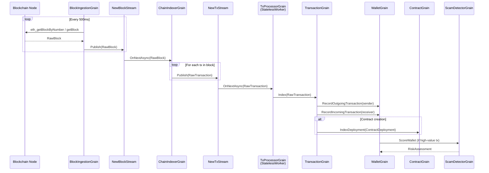

### 3.2 Investigation Query Flow

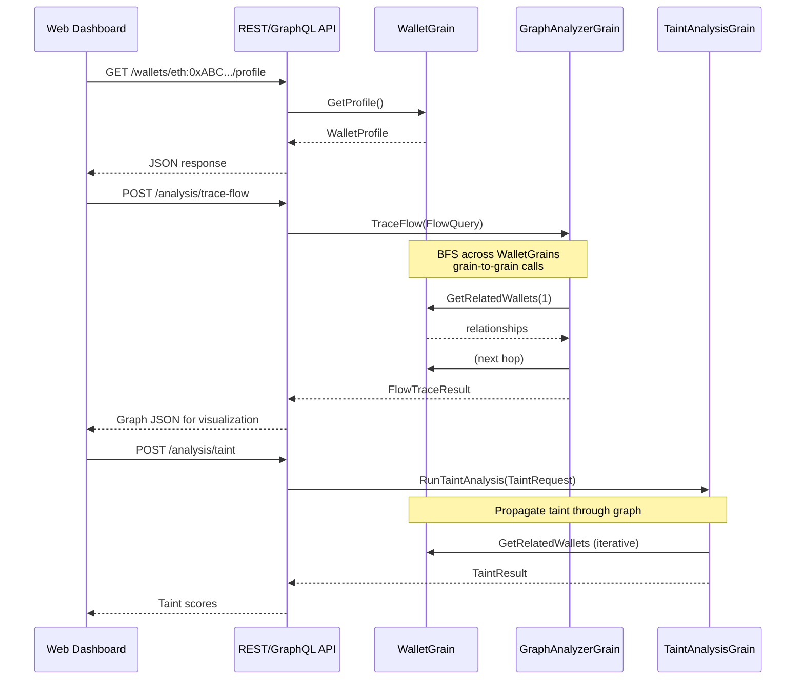

### 3.3 Alert Generation Flow

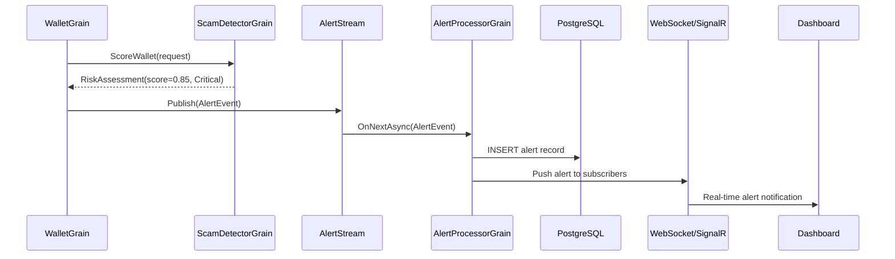

---

## 4. Graph Analysis Engine

### Core Insight: The Graph IS the Grain Network

In a traditional system, you'd build the graph in a graph database then query it. In Orleans, **the graph already exists** as the network of grain relationships. Each `WalletGrain` holds its own adjacency list (`Relationships` dictionary). Graph traversal = grain-to-grain calls.

### Graph Operations Mapped to Grains

| Graph Operation | Implementation | Grain |
|---|---|---|
| BFS/DFS traversal | `GetRelatedWallets(depth)` | WalletGrain |
| Path finding | `FindPaths(source, target)` | GraphAnalyzerGrain |
| Flow tracing | `TraceFlow(source, maxDepth)` | GraphAnalyzerGrain |
| Community detection | Label propagation on subgraph | GraphAnalyzerGrain |
| Taint propagation | BFS with decay function | TaintAnalysisGrain |
| Clustering | Union-Find on co-spend/funding | ClusterAnalysisGrain |

### Why This Works

1. **Natural partitioning** — each wallet's edges live with the wallet. No cross-partition graph queries.
2. **Hot wallets stay in memory** — frequently queried exchange wallets remain activated, no cold-start penalty.
3. **Fan-out control** — cap neighbors per hop to prevent explosion (20-30 per level).
4. **Parallel traversal** — independent branches can be explored concurrently via `Task.WhenAll`.

### When to Use Neo4j Instead

For queries like "find all shortest paths between 50 addresses simultaneously" or "run PageRank on 1M nodes," export the subgraph to Neo4j and query there:

1. `GraphAnalyzerGrain` collects the subgraph via grain calls
2. Exports nodes + edges to Neo4j batch insert
3. Runs Cypher / GDS algorithms
4. Returns results to the grain

---

## 5. Scam Detection Pipeline

### Architecture

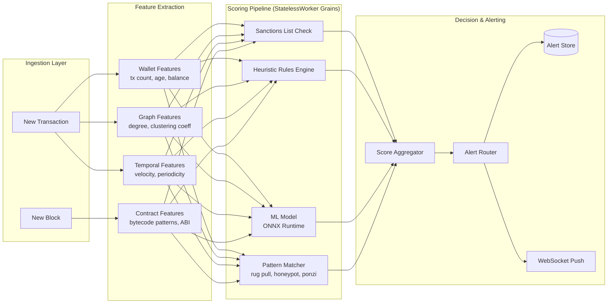

### Scam Pattern Definitions

| Pattern | Heuristic Signals | ML Features |
|---|---|---|
| **Rug Pull** | New token + large liquidity removal within 72h | Liquidity ratio delta, holder concentration |
| **Honeypot** | Buy succeeds, sell reverts; hidden fee functions | Contract bytecode similarity to known honeypots |
| **Ponzi** | Returns paid from new deposits, not revenue | Inflow/outflow ratio, depositor growth curve |
| **Phishing Drainer** | Approval tx → immediate drain; fake dApp | Approval count spike, known drainer contract signatures |
| **Pig Butchering** | Slow escalation of deposits over weeks → large final deposit → exit | Deposit cadence, victim wallet age, social graph isolation |
| **Wash Trading** | Circular trades between controlled wallets | Volume/unique-trader ratio, self-referential graph cycles |
| **Layering** | Rapid sequential transfers through fresh wallets | Hop count, wallet lifespan, value preservation ratio |
| **Mixer Usage** | Deposit to known mixer → withdrawal from mixer | Address proximity to Tornado Cash / Railgun contracts |

### ML Model Pipeline

- **Training data:** Historically confirmed scam addresses (TRM Labs, Chainabuse reports, OFAC designations)
- **Features:** 47 wallet-level + 12 graph-level + 8 temporal = 67 total features
- **Inference:** ONNX Runtime in-process, <1ms per wallet score
- **Retraining:** Weekly batch on labeled data, deployed as new ONNX model file

### Contract Classification Heuristics

| Signal | Indicator |
|---|---|
| ERC-20 transfer selector in bytecode | Token contract |
| ERC-721 safeTransferFrom selector | NFT contract |
| `selfdestruct` in bytecode | Self-destruct capability (red flag) |
| Low unique interactors + high activity | Possible bot/scam (red flag) |
| `mint` without `maxSupply` in ABI | Unbounded mint (red flag) |
| `pause` / `blacklist` in ABI | Centralized control (red flag) |

---

## 6. Persistence Strategy

### Storage Tiering

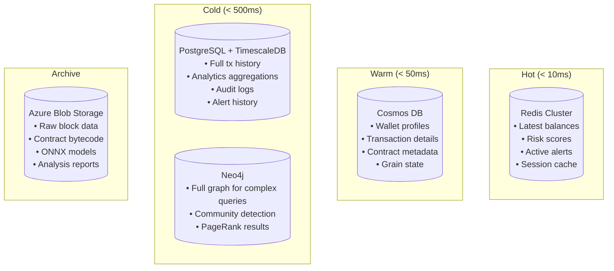

### Orleans Storage Provider Mapping

| Grain | State Store | Reason |
|---|---|---|
| WalletGrain | Cosmos DB | Schemaless, per-wallet partition, global distribution |
| TransactionGrain | Cosmos DB | Immutable docs, partition by chain:txHash |
| ContractGrain | Cosmos DB | Contract metadata as documents |
| BlockIngestionGrain | Cosmos DB | Checkpoint state |
| ChainIndexerGrain | Cosmos DB | Indexing progress |
| ScamDetectorGrain | (stateless) | No persistent state |
| GraphAnalyzerGrain | In-memory only | Ephemeral analysis, results returned to caller |
| TaintAnalysisGrain | In-memory only | Ephemeral analysis |
| ClusterAnalysisGrain | Cosmos DB | Clusters persist across sessions |

### Cosmos DB Partition Strategy

| Container | Partition Key | Content |
|---|---|---|
| `wallets` | `/chain` | Wallet profiles, balances, relationships |
| `transactions` | `/chain` | Transaction details, inputs/outputs |
| `contracts` | `/chain` | Contract info, classification, ABI |
| `grain-state` | `/grainType` | Orleans IPersistentState snapshots |

> **Why Cosmos DB:** Per-wallet partitioning aligns with grain key, giving O(1) point reads. Hierarchical partition keys (`chain` → `address`) keep partitions balanced. TTL for auto-expiring transient analysis state.

### Write-Behind Caching

| Trigger | Behavior |
|---|---|
| Every 30s (timer) | `WriteStateAsync()` if dirty flag set |
| On deactivation | Final `WriteStateAsync()` |
| High-value transaction | Immediate `WriteStateAsync()` |

Reduces Cosmos DB RU consumption by ~10-50x compared to write-through.

---

## 7. Streaming Architecture

### Stream Topology

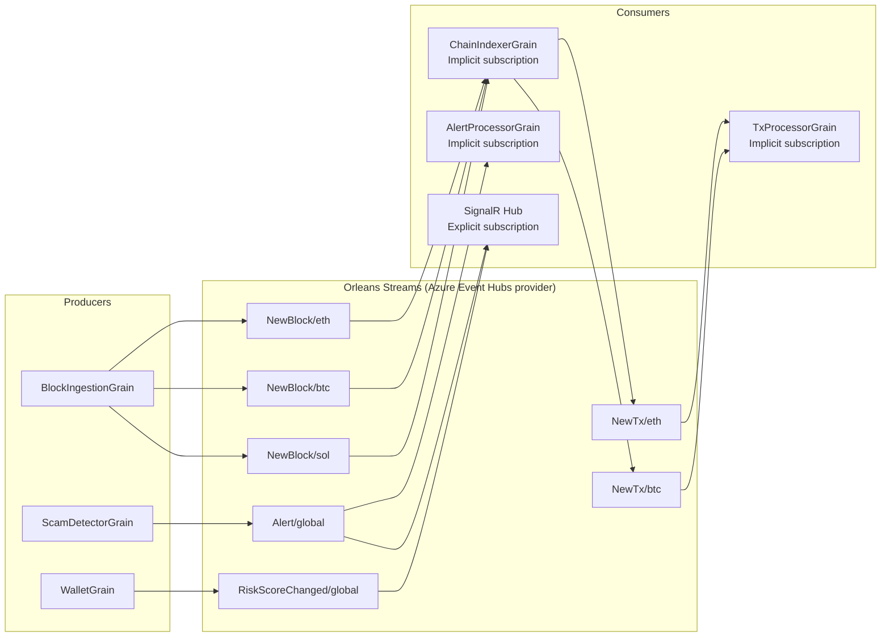

### Back-Pressure & Flow Control

| Mechanism | Purpose |
|---|---|
| Event Hubs partitions | Natural back-pressure (consumer groups lag behind if slow) |
| StatelessWorker for TxProcessor | Automatic horizontal scaling on each silo |
| Grain timer for block ingestion | Self-throttles based on processing speed |
| Bounded fan-out in graph grains | Prevents cascade of grain activations |

---

## 8. Multi-Chain Support

### Chain Abstraction Layer

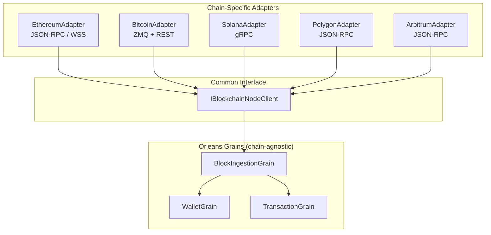

### Chain-Prefixed Grain Keys

Every grain key starts with the chain identifier:

| Grain | Key Format | Examples |
|---|---|---|
| WalletGrain | `{chain}:{address}` | `eth:0xABC...`, `btc:bc1q...`, `sol:7xKX...` |
| TransactionGrain | `{chain}:{txHash}` | `eth:0x7cf...`, `btc:abc123...` |
| ContractGrain | `{chain}:{address}` | `eth:0xDEF...`, `sol:TokenkegQ...` |
| BlockIngestionGrain | `{chain}` | `eth`, `btc`, `sol` |

This enables:
- Same wallet on different chains = different grain instances
- Cross-chain analysis aggregates data from multiple grains
- Chain-specific logic lives in the adapter; grains remain generic

### IBlockchainNodeClient Interface

| Operation | Description |
|---|---|
| `GetLatestBlockNumberAsync()` | Current chain head block number |
| `GetBlockAsync(blockNumber)` | Fetch full block with transactions |
| `GetBalanceAsync(address)` | Fetch native balance |

Each chain adapter implements this interface with chain-specific RPC calls.

---

## 9. API Design

### REST API Endpoints

**Wallets:**

| Method | Path | Returns |
|---|---|---|
| GET | `/api/v1/wallets/{chain}:{address}` | WalletProfile |
| GET | `/api/v1/wallets/{chain}:{address}/balance` | WalletBalance |
| GET | `/api/v1/wallets/{chain}:{address}/risk` | RiskAssessment |
| GET | `/api/v1/wallets/{chain}:{address}/transactions?page&size` | Paged transactions |
| GET | `/api/v1/wallets/{chain}:{address}/relationships?depth` | WalletRelationship[] |
| GET | `/api/v1/wallets/{chain}:{address}/labels` | WalletLabel[] |
| POST | `/api/v1/wallets/{chain}:{address}/labels` | Add label |

**Transactions:**

| Method | Path | Returns |
|---|---|---|
| GET | `/api/v1/transactions/{chain}:{txHash}` | TransactionDetails |
| GET | `/api/v1/transactions/{chain}:{txHash}/risk` | TransactionRiskResult |
| GET | `/api/v1/transactions/{chain}:{txHash}/trace` | TraceResult |

**Contracts:**

| Method | Path | Returns |
|---|---|---|
| GET | `/api/v1/contracts/{chain}:{address}` | ContractInfo |
| GET | `/api/v1/contracts/{chain}:{address}/classification` | ContractClassification |
| GET | `/api/v1/contracts/{chain}:{address}/abi` | ABI JSON |
| GET | `/api/v1/contracts/{chain}:{address}/decompiled` | Decompiled source |

**Analysis:**

| Method | Path | Returns |
|---|---|---|
| POST | `/api/v1/analysis/find-paths` | GraphPathResult |
| POST | `/api/v1/analysis/trace-flow` | FlowTraceResult |
| POST | `/api/v1/analysis/neighborhood` | SubgraphResult |
| POST | `/api/v1/analysis/communities` | CommunityResult |
| POST | `/api/v1/analysis/taint` | TaintResult |
| POST | `/api/v1/analysis/cluster` | ClusterResult |
| POST | `/api/v1/analysis/cross-chain` | CrossChainFlowResult |

**Scam Detection:**

| Method | Path | Returns |
|---|---|---|
| POST | `/api/v1/scam/score-wallet` | RiskAssessment |
| POST | `/api/v1/scam/score-transaction` | TransactionRiskResult |
| POST | `/api/v1/scam/classify-contract` | ContractClassification |
| POST | `/api/v1/scam/detect-patterns` | ScamPattern[] |

**System:**

| Method | Path | Returns |
|---|---|---|
| GET | `/api/v1/chains` | Chain[] |
| GET | `/api/v1/chains/{chain}/ingestion-status` | IngestionStatus |
| GET | `/api/v1/chains/{chain}/indexing-stats` | IndexingStats |
| GET | `/api/v1/alerts?page&severity` | Paged alerts |

**WebSocket:**

| Path | Payload |
|---|---|
| `/ws/alerts` | Real-time alert stream |
| `/ws/wallets/{chain}:{address}` | Real-time wallet activity |

### GraphQL Schema (HotChocolate)

**Queries:**
- `wallet(chain, address)` → WalletProfile
- `transaction(chain, txHash)` → TransactionDetails
- `contract(chain, address)` → ContractInfo

**Subscriptions:**
- `onAlert` → AlertEvent (real-time)
- `onWalletActivity(chain, address)` → TransactionRecord (real-time)

---

## 10. Scaling Strategy

### Silo Topology

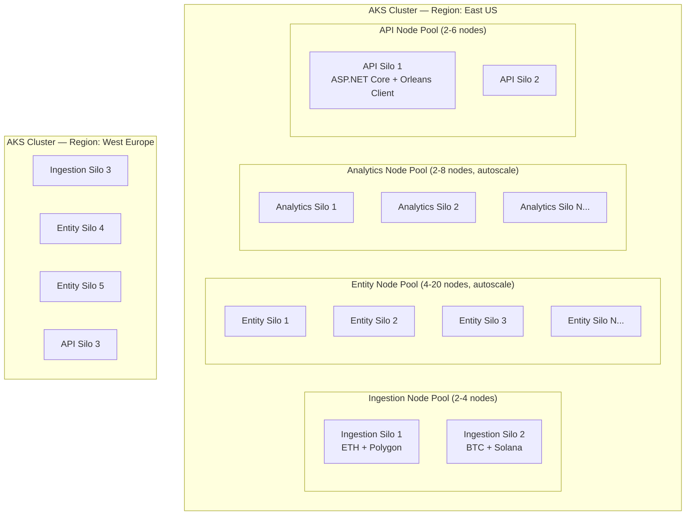

### Grain Placement Strategy

| Grain Type | Placement | Rationale |
|---|---|---|
| WalletGrain | RandomPlacement (default) | Even distribution across entity silos |
| TransactionGrain | RandomPlacement | Immutable, no locality benefit |
| ContractGrain | RandomPlacement | Even distribution |
| BlockIngestionGrain | PreferLocalPlacement | Pin to ingestion silo pool |
| ChainIndexerGrain | PreferLocalPlacement | Co-locate with ingestion |
| ScamDetectorGrain | StatelessWorker | Every silo, auto-scaled |
| GraphAnalyzerGrain | ActivationCountBasedPlacement | Route to least-loaded analytics silo |
| TaintAnalysisGrain | ActivationCountBasedPlacement | CPU-intensive, load-balance |

### Autoscaling Triggers

| Metric | Scale Out | Scale In |
|---|---|---|
| Entity silos CPU | > 70% for 5 min | < 30% for 15 min |
| Grain activation count | > 500K per silo | < 100K per silo |
| Ingestion gap (head - indexed) | > 100 blocks | < 10 blocks |
| API response p99 | > 500ms | < 100ms |
| Event Hubs consumer lag | > 10K events | < 100 events |

### Grain Lifecycle & Memory Management

| Grain | Deactivation Policy |
|---|---|
| Exchange wallets (Binance, etc.) | Never deactivate (constant traffic) |
| Active investigation wallets | 30 min idle timeout |
| TransactionGrains | Short-lived — activate for indexing, query a few times, deactivate |
| Analysis grains | Immediate after returning result (one-shot) |
| Ingestion/Indexer singletons | Always active |

### AKS Node Pool Configuration

| Node Pool | VM Size | Purpose |
|---|---|---|
| ingestion | D4s_v5 (4 vCPU, 16 GB) | Network-heavy blockchain node connections |
| entity | E8s_v5 (8 vCPU, 64 GB) | Memory-heavy for grain state (WalletGrain relationships) |
| analytics | F8s_v2 (8 vCPU, 16 GB) | CPU-heavy graph traversal and ML inference |
| api | D4s_v5 (4 vCPU, 16 GB) | API + Orleans co-hosted silo |

---

## 11. Security Considerations

### Data Protection

| Concern | Mitigation |
|---|---|
| **Data at rest** | Cosmos DB encryption (service-managed keys), Azure Blob SSE |
| **Data in transit** | TLS 1.3 for all inter-silo, silo-to-storage, API-to-client |
| **PII in wallet labels** | Labels referencing real-world identity encrypted with Azure Key Vault CMK |
| **API authentication** | Azure AD / Entra ID OAuth 2.0 bearer tokens |
| **API authorization** | RBAC: Analyst (read), Investigator (read+analyze), Admin (full) |
| **Rate limiting** | Per-tenant request quotas; expensive analysis ops gated by role |
| **Audit logging** | All analysis requests logged to immutable append-only PostgreSQL table |
| **Silo-to-silo** | mTLS for inter-silo communication |

### Sensitive Data Handling

| Data | Policy |
|---|---|
| Sanctions list data | Cached in-memory, refreshed hourly from OFAC/EU feeds |
| ML model files | Stored in Azure Blob with SAS-based access, loaded at silo startup |
| Alert data | Classified by severity; Critical alerts trigger PagerDuty webhook |
| Cross-chain bridge tracking | Separate access control — only L2 investigators |

---

## 12. Deployment Architecture

### Azure Infrastructure

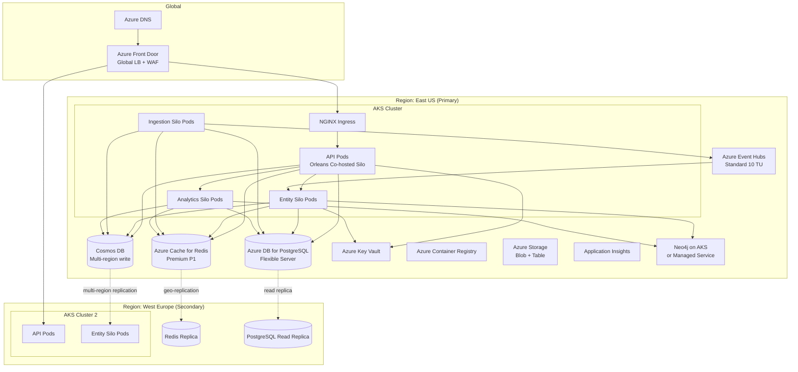

### Estimated Resource Requirements

| Component | SKU | Count | Monthly Cost (est.) |
|---|---|---|---|
| AKS Entity Nodes | E8s_v5 (64GB) | 4–20 | $1,200–$6,000 |
| AKS Analytics Nodes | F8s_v2 | 2–8 | $400–$1,600 |
| AKS Ingestion Nodes | D4s_v5 | 2–4 | $300–$600 |
| AKS API Nodes | D4s_v5 | 2–6 | $300–$900 |
| Cosmos DB | Autoscale 4K–40K RU/s | 1 | $500–$5,000 |
| Azure Cache for Redis | Premium P1 (6GB) | 1 | $280 |
| PostgreSQL Flexible | GP D4s_v3 | 1 | $350 |
| Event Hubs | Standard 10 TU | 1 | $250 |
| Azure Blob Storage | Hot 1TB | 1 | $20 |
| Azure Front Door | Standard | 1 | $50+ |
| **Total (baseline)** | | | **~$3,650/mo** |
| **Total (peak)** | | | **~$15,000/mo** |

---

## 13. AI Agent Workflow Engine

> Deploy persistent, resumable AI agents that autonomously walk through 1B+ on-chain transactions, collect evidence, and produce investigative summaries — with ACID reliability and global scale.

### Problem Statement

Manual blockchain forensics doesn't scale. An investigator tracing a $50M hack across 10 chains, 500 wallets, and 100K transactions needs weeks. AI agents can do this autonomously — but they need:

- **Persistence** — an agent running for hours must survive silo crashes without losing progress
- **Resumability** — pick up exactly where it left off after any failure
- **ACID per step** — each evidence collection step is atomic; no half-written state
- **Global reach** — agents access WalletGrains, TransactionGrains, ContractGrains across the full cluster
- **User-defined workflows** — investigators define custom investigation playbooks (steps, prompts, model configs, tools)
- **Parallel execution** — fan out across the graph, collect evidence concurrently, merge results

### Why Orleans Is Ideal for This

| Requirement | Orleans Solution |
|---|---|
| Persistent agent state | Grain state survives crashes via `WriteStateAsync()` → Cosmos DB |
| Resumable after failure | Reminders wake the agent grain; checkpoint after every step |
| ACID per step | Single-threaded grain execution = atomic state transitions |
| Fan-out across chain data | Grain-to-grain calls to WalletGrain/TransactionGrain |
| Long-running (hours/days) | Grain timers + reminders; no external scheduler needed |
| Horizontal scale | Many agent grains run concurrently across silos |
| User-defined workflows | WorkflowDefinitionGrain stores the playbook; AgentGrain interprets it |

### Architecture Overview

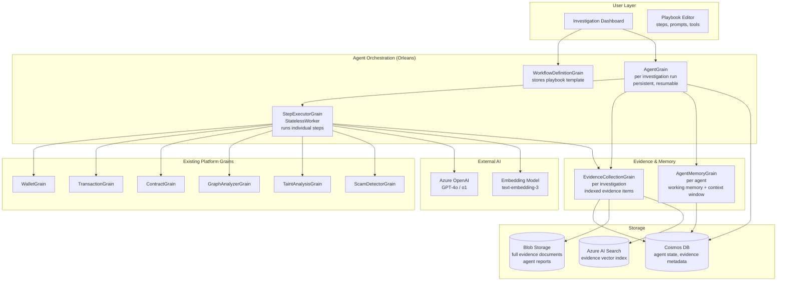

### Grain Design

#### WorkflowDefinitionGrain

**Key:** workflow definition ID (string, e.g. `"playbook:trace-hack-v3"`)
**Purpose:** Stores a reusable investigation playbook that multiple agents can execute.

**State:**

| Property | Type | Description |
|---|---|---|
| Name | string | Human-readable playbook name |
| Description | string | Purpose and scope |
| Version | int | Schema version for evolution |
| Steps | List\<WorkflowStep\> | Ordered step definitions |
| DefaultModelConfig | ModelConfig | Default AI model settings |
| Tools | List\<ToolDefinition\> | Available tools (graph traversal, taint analysis, etc.) |
| CreatedBy | string | Author user ID |
| CreatedAt | DateTimeOffset | Creation timestamp |

**WorkflowStep:**

| Field | Type | Description |
|---|---|---|
| StepId | string | Unique step identifier |
| Type | enum | Query, Analyze, Collect, Branch, FanOut, Summarize, HumanReview |
| Prompt | string | System/user prompt template (with `{{placeholders}}`) |
| ModelConfig | ModelConfig? | Override model for this step (null = use default) |
| Tools | string[] | Which tools this step can invoke |
| MaxIterations | int? | Cap on loops (for iterative steps) |
| TimeoutMinutes | int | Step timeout |
| NextOnSuccess | string? | Next step ID on success |
| NextOnFailure | string? | Next step ID on failure |
| FanOutConfig | FanOutConfig? | For FanOut type: how to partition work |

**ModelConfig:**

| Field | Type | Description |
|---|---|---|
| Provider | string | `"azure-openai"`, `"openai"`, `"local-onnx"` |
| Model | string | `"gpt-4o"`, `"o1"`, `"gpt-4o-mini"` |
| Temperature | double | 0.0–2.0 |
| MaxTokens | int | Response token limit |
| SystemPrompt | string | Base system prompt |

**ToolDefinition:**

| Field | Type | Description |
|---|---|---|
| ToolId | string | Unique tool name |
| Type | enum | GrainCall, GraphTraversal, TaintAnalysis, ScamScore, WebSearch, Custom |
| GrainType | string? | Target grain interface (for GrainCall type) |
| Description | string | For the AI model's tool-use prompt |
| Parameters | Dictionary | JSON schema of parameters |

**Operations:**

| Operation | Behavior |
|---|---|
| `CreateOrUpdate(definition)` | Store/update playbook |
| `GetDefinition()` | Return full definition |
| `Validate()` | Check step graph for cycles, missing refs, invalid tools |
| `GetVersionHistory()` | Return previous versions |

#### AgentGrain

**Key:** investigation run ID (GUID)
**Purpose:** The core orchestrator — one grain per investigation run. Maintains full execution state, checkpoints after every step, and resumes automatically after failures.

**State:**

| Property | Type | Description |
|---|---|---|
| InvestigationId | GUID | Unique run identifier |
| WorkflowDefinitionId | string | Which playbook to execute |
| Status | enum | Created, Running, Paused, WaitingForHuman, Completed, Failed, Cancelled |
| CurrentStepId | string | Currently executing step |
| StepResults | Dictionary\<string, StepResult\> | Completed step outcomes |
| Context | Dictionary\<string, object\> | Accumulated investigation context (passed between steps) |
| EvidenceCollectionId | GUID | Linked evidence collection |
| StartedAt | DateTimeOffset | When run began |
| LastCheckpoint | DateTimeOffset | Last successful state persist |
| TotalStepsCompleted | int | Progress counter |
| TotalTokensUsed | long | Token consumption across all LLM calls |
| ErrorLog | List\<AgentError\> | Errors with retry counts |
| Config | AgentRunConfig | Runtime overrides (max budget, timeout, scope) |

**AgentRunConfig:**

| Field | Type | Description |
|---|---|---|
| MaxBudgetTokens | long | Hard cap on total tokens (e.g., 10M) |
| MaxDurationMinutes | int | Hard cap on total runtime (e.g., 480 = 8 hours) |
| ScopeChains | string[] | Which chains to investigate (e.g., `["eth", "polygon"]`) |
| SeedAddresses | string[] | Starting wallet addresses |
| MaxWalletsToVisit | int | Cap on wallets traversed (e.g., 10,000) |
| ParallelFanOut | int | Max concurrent sub-tasks (e.g., 20) |

**Operations:**

| Operation | Behavior |
|---|---|
| `Start(config)` | Load workflow definition, initialize context with seed addresses, begin first step. Register reminder for heartbeat. |
| `Pause()` | Checkpoint and stop after current step completes |
| `Resume()` | Continue from `CurrentStepId` |
| `Cancel()` | Set status to Cancelled, persist final state |
| `GetStatus()` | Return current status, progress, step results |
| `GetResult()` | Return final investigation result (only when Completed) |
| `ReceiveHumanInput(stepId, input)` | Resume from WaitingForHuman with analyst's input |
| `OnStepCompleted(stepId, result)` | Checkpoint result, advance to next step, check budget/timeout |
| `OnStepFailed(stepId, error)` | Retry (up to 3x with backoff), then advance to failure branch or fail |

**Execution loop (pseudocode):**

1. Load current step from workflow definition
2. Build step context (merge investigation context + previous step results)
3. Call `StepExecutorGrain.Execute(step, context, tools)` 
4. On success → `OnStepCompleted()` → checkpoint → next step
5. On failure → `OnStepFailed()` → retry or branch
6. On budget/timeout exceeded → auto-summarize collected evidence → Complete
7. On HumanReview step → set status to WaitingForHuman → wait for `ReceiveHumanInput()`

**Reliability mechanisms:**

| Mechanism | Purpose |
|---|---|
| Checkpoint after every step | `WriteStateAsync()` — crash-safe |
| Orleans Reminder (every 5 min) | Wakes grain if it was deactivated mid-run; resumes from checkpoint |
| Idempotent step execution | Steps check if result already exists before re-executing |
| Budget guard | Check token count + elapsed time before each step |
| Error log with retry count | 3 retries with exponential backoff per step |

#### StepExecutorGrain

**Key:** integer (StatelessWorker — multiple activations per silo)
**Purpose:** Stateless execution engine for individual workflow steps. Receives a step definition + context, executes it, returns a result.

**Operations:**

| Operation | Behavior |
|---|---|
| `Execute(step, context, tools)` | Dispatch to step type handler → return StepResult |

**Step type handlers:**

| Step Type | Behavior |
|---|---|
| **Query** | Call WalletGrain/TransactionGrain/ContractGrain to retrieve data. Build results into context. |
| **Analyze** | Send context + prompt to AI model. Parse structured response. |
| **Collect** | Store evidence item via EvidenceCollectionGrain. |
| **Branch** | Evaluate condition on context → return next step ID. |
| **FanOut** | Split work across N parallel sub-tasks (e.g., investigate 50 wallets concurrently). Spawn N `StepExecutorGrain` calls via `Task.WhenAll` (capped by `ParallelFanOut`). Merge results. |
| **Summarize** | Retrieve all evidence from EvidenceCollectionGrain. Send to AI model with summarization prompt. Store final report. |
| **HumanReview** | Return WaitingForHuman status. Agent pauses until analyst provides input. |

**Tool execution within Analyze steps:**

When the AI model requests a tool call (function calling / tool-use API):

| Tool Type | Execution |
|---|---|
| GrainCall | Call the specified grain method (e.g., `WalletGrain.GetProfile()`) |
| GraphTraversal | Create `GraphAnalyzerGrain`, call `FindPaths()` or `TraceFlow()` |
| TaintAnalysis | Create `TaintAnalysisGrain`, call `RunTaintAnalysis()` |
| ScamScore | Call `ScamDetectorGrain.ScoreWallet()` |
| EvidenceStore | Write to `EvidenceCollectionGrain` |
| Custom | HTTP call to user-defined external tool endpoint |

#### EvidenceCollectionGrain

**Key:** investigation ID (GUID)
**Purpose:** Indexed collection of all evidence gathered during an investigation. Metadata in grain state (Cosmos DB), large content in Blob Storage.

**State:**

| Property | Type | Description |
|---|---|---|
| InvestigationId | GUID | Parent investigation |
| Items | List\<EvidenceItem\> | Evidence metadata (bounded to last 10,000 items; older overflow to Cosmos query) |
| Tags | Dictionary\<string, int\> | Tag → count index for fast filtering |
| TotalItems | long | Total evidence count |
| SummaryBlobUrl | string? | URL to final summary report (Blob Storage) |

**EvidenceItem:**

| Field | Type | Description |
|---|---|---|
| EvidenceId | string | Unique item ID |
| Type | enum | WalletProfile, TransactionTrace, FlowGraph, TaintResult, ContractAnalysis, AISummary, Screenshot, CustomNote |
| Title | string | Human-readable title |
| Summary | string | ≤ 2 KB summary (stored in grain state) |
| BlobUrl | string? | Full content in Blob Storage (for items > 2 KB) |
| RelatedAddresses | string[] | Linked wallet addresses |
| Tags | string[] | Classification tags |
| Confidence | double | 0.0–1.0 confidence score |
| CollectedAt | DateTimeOffset | When collected |
| StepId | string | Which workflow step produced this |

**Operations:**

| Operation | Behavior |
|---|---|
| `AddEvidence(item)` | Append to collection, update tag index, persist |
| `GetEvidence(filter, page, size)` | Filter by type/tag/address, paginated |
| `GetByAddress(address)` | All evidence related to a specific wallet |
| `GetSummary()` | Return high-level summary (count by type, top tags, key findings) |
| `ExportToBlob()` | Serialize full collection to Blob Storage as JSON |
| `GenerateFinalReport(modelConfig)` | Call AI model to produce narrative report from all evidence |

#### AgentMemoryGrain

**Key:** agent run ID (GUID)
**Purpose:** Manages the AI agent's working memory — maintains a sliding context window for LLM calls, handles RAG retrieval from collected evidence.

**State:**

| Property | Type | Description |
|---|---|---|
| ShortTermMemory | List\<MemoryEntry\> | Recent conversation turns / observations (bounded ring buffer, last 50) |
| KeyFindings | List\<string\> | Distilled key findings (always included in context) |
| EmbeddingIndex | string | Azure AI Search index name for this investigation |

**Operations:**

| Operation | Behavior |
|---|---|
| `AddObservation(entry)` | Append to short-term memory; evict oldest if over limit |
| `AddKeyFinding(finding)` | Promote important observation to persistent key findings |
| `BuildContext(maxTokens)` | Assemble context window: system prompt + key findings + recent memory + RAG results (within token budget) |
| `SearchMemory(query, topK)` | Vector search over evidence via Azure AI Search |
| `Summarize()` | Compress short-term memory into a condensed summary (frees token budget) |

### Workflow Execution Flow

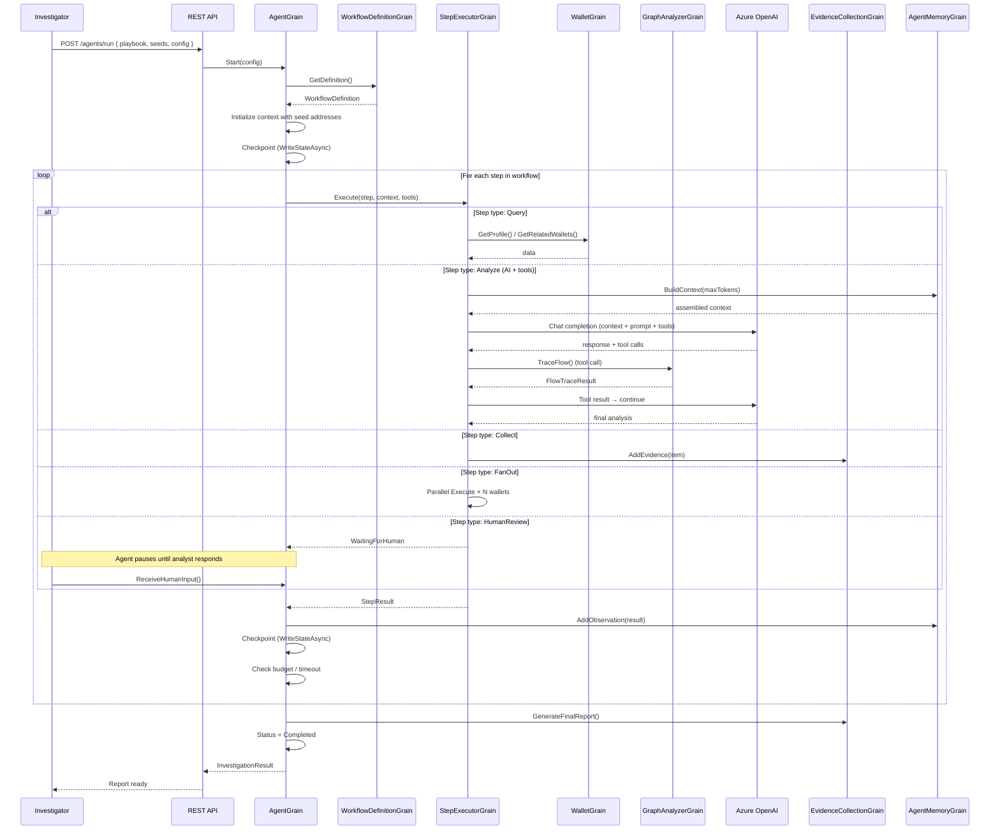

### Example Workflow: "Trace Stolen Funds"

A playbook that an investigator defines to trace hacked funds:

| Step | Type | What It Does |
|---|---|---|
| 1. `seed-profile` | Query | Fetch `WalletGrain.GetProfile()` for each seed address |
| 2. `initial-taint` | Query | Run `TaintAnalysisGrain.RunTaintAnalysis()` from seeds, Haircut model, 6 hops |
| 3. `analyze-taint` | Analyze | AI reviews taint results, identifies high-value paths. Prompt: "Identify the top 10 most suspicious wallets and explain why." |
| 4. `collect-suspects` | Collect | Store AI-identified suspects as evidence items |
| 5. `fan-out-profiles` | FanOut | For each suspect: fetch profile, risk score, transaction history, contract interactions |
| 6. `deep-analysis` | Analyze | AI analyzes each suspect wallet. Uses tools: `ScamScore`, `GraphTraversal`, `EvidenceStore`. Multi-turn with tool calling. |
| 7. `cross-chain-check` | Query | Run `CrossChainAnalyzerGrain.TraceCrossChainFlow()` for bridge transactions |
| 8. `cluster-analysis` | Query | Run `ClusterAnalysisGrain.RunClustering()` on suspect wallets |
| 9. `human-review` | HumanReview | Investigator reviews AI findings, confirms/rejects suspects, adds notes |
| 10. `final-summary` | Summarize | AI generates full narrative report from all evidence. Stored in Blob Storage. |

### FanOut Pattern: Investigating 500 Wallets Concurrently

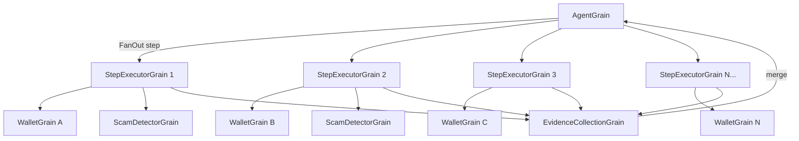

**Fan-out execution:**
1. AgentGrain splits the wallet list into batches (capped by `ParallelFanOut`, e.g., 20)
2. Each batch dispatched to a StepExecutorGrain (StatelessWorker — auto-distributed across silos)
3. Each executor calls WalletGrain, ScamDetectorGrain, etc., stores evidence
4. Results merged back into AgentGrain context
5. Bounded concurrency prevents grain activation explosion

### Persistence & Reliability

**ACID per step:**
- AgentGrain is single-threaded — no concurrent state mutations
- `WriteStateAsync()` after each step = atomic checkpoint to Cosmos DB
- If the silo crashes mid-step, the step's result is lost but context is safe at the previous checkpoint
- On reactivation (via Reminder), the agent re-executes only the failed step (idempotent)

**Evidence storage split:**

| Data | Storage | Size |
|---|---|---|
| Evidence metadata (title, tags, summary) | Cosmos DB (grain state) | < 2 KB per item |
| Full evidence content (flow graphs, reports) | Azure Blob Storage | Unlimited |
| Evidence embeddings (for RAG search) | Azure AI Search vector index | ~1.5 KB per embedding |
| Agent state checkpoint | Cosmos DB | < 50 KB per agent |
| Final investigation report | Blob Storage | 10 KB – 10 MB |

**Long-running durability:**

| Mechanism | Interval | Purpose |
|---|---|---|
| WriteStateAsync checkpoint | After every step | Crash recovery |
| Orleans Reminder | Every 5 minutes | Wake deactivated agent, resume execution |
| Budget/timeout guard | Before each step | Prevent runaway agents |
| Heartbeat stream | Every 30 seconds | UI can show agent is alive and progressing |

### API Endpoints for Agents

| Method | Path | Description |
|---|---|---|
| POST | `/api/v1/playbooks` | Create/update a workflow definition |
| GET | `/api/v1/playbooks` | List available playbooks |
| GET | `/api/v1/playbooks/{id}` | Get playbook definition |
| POST | `/api/v1/agents/run` | Start new investigation (returns agentId) |
| GET | `/api/v1/agents/{id}/status` | Get current status, progress, step results |
| POST | `/api/v1/agents/{id}/pause` | Pause agent |
| POST | `/api/v1/agents/{id}/resume` | Resume agent |
| POST | `/api/v1/agents/{id}/cancel` | Cancel agent |
| POST | `/api/v1/agents/{id}/human-input` | Submit human review input |
| GET | `/api/v1/agents/{id}/result` | Get final report (when completed) |
| GET | `/api/v1/agents/{id}/evidence` | List collected evidence |
| GET | `/api/v1/agents/{id}/evidence/{evidenceId}` | Get single evidence item (with Blob content) |
| WS | `/ws/agents/{id}` | Real-time agent progress stream |

### Scaling Considerations

| Concern | Approach |
|---|---|
| 100 concurrent investigations | 100 AgentGrains, each on a different silo — natural distribution |
| 500 wallets per investigation fan-out | StatelessWorker StepExecutorGrains auto-scale across silos |
| 1B transactions in the index | Agents read from pre-existing WalletGrains/TransactionGrains (already distributed) |
| AI model rate limits | StepExecutorGrain retries with exponential backoff; configurable TPM budget per agent |
| Token budget explosion | Hard cap in AgentRunConfig; auto-summarize and complete if exceeded |
| Large evidence sets | Metadata in Cosmos, content in Blob, search via Azure AI Search vectors |

### Security for Agent Workflows

| Concern | Mitigation |
|---|---|
| Agent scope isolation | AgentRunConfig.ScopeChains limits which chains/addresses the agent can access |
| Custom tool execution | Custom tools run in a sandbox; HTTP calls only to whitelisted domains |
| Token budget | Hard cap prevents runaway LLM costs |
| Human-in-the-loop | HumanReview steps for high-stakes decisions (e.g., filing SARs) |
| Audit trail | Every step result + tool call logged to immutable evidence collection |
| PII handling | Agent prompts strip PII; evidence tagged with sensitivity level |

---

## Technology Stack

| Layer | Technology |
|---|---|
| Runtime | .NET 10, Orleans 10.x |
| Container | AKS, Docker |
| State — hot | Azure Cache for Redis |
| State — warm | Azure Cosmos DB (NoSQL) |
| State — cold | PostgreSQL + TimescaleDB |
| Graph analysis | Neo4j / Apache AGE |
| Streaming | Azure Event Hubs + Orleans Streams |
| ML inference | ONNX Runtime |
| AI agents | Azure OpenAI (GPT-4o, o1), text-embedding-3 |
| Agent evidence | Azure Blob Storage (RA-GZRS) + Azure AI Search (vector) |
| API | ASP.NET Core, HotChocolate GraphQL, SignalR |
| Observability | OpenTelemetry, Application Insights, Grafana |
| CI/CD | GitHub Actions, Azure Container Registry |
| IaC | Bicep / Terraform |
| Secrets | Azure Key Vault |
| Load balancing | Azure Front Door |

---

## References

### System Overview & Design (§1)

- [Orleans Documentation — Microsoft Learn](https://learn.microsoft.com/en-us/dotnet/orleans/)
- [Orleans Virtual Actors in Practice — DevelopersVoice](https://developersvoice.com/blog/dotnet/orleans-virtual-actors-in-practice/)
- [Distributed .NET with Microsoft Orleans (O'Reilly)](https://www.oreilly.com/library/view/distributed-net-with/9781801818971/)

### Grain Design & Entity Modeling (§2)

- [Orleans Grain Identity](https://learn.microsoft.com/en-us/dotnet/orleans/grains/grain-identity)
- [Orleans Grain Persistence](https://learn.microsoft.com/en-us/dotnet/orleans/grains/grain-persistence)
- [Orleans StatelessWorker Grains](https://learn.microsoft.com/en-us/dotnet/orleans/grains/stateless-worker-grains)
- [Orleans Observers](https://learn.microsoft.com/en-us/dotnet/orleans/grains/observers)
- [Orleans Timers & Reminders](https://learn.microsoft.com/en-us/dotnet/orleans/grains/timers-and-reminders)
- [OrleansContrib Design Patterns](https://github.com/OrleansContrib/DesignPatterns)

### Data Flow & Streaming (§3, §7)

- [Orleans Streaming — Microsoft Learn](https://learn.microsoft.com/en-us/dotnet/orleans/streaming/)
- [Orleans Event Hub Stream Provider](https://learn.microsoft.com/en-us/dotnet/orleans/streaming/event-hubs)
- [Orleans Implicit Stream Subscriptions](https://learn.microsoft.com/en-us/dotnet/orleans/streaming/streams-programming-apis#implicit-subscriptions)
- [Azure Event Hubs Documentation](https://learn.microsoft.com/en-us/azure/event-hubs/event-hubs-about)

### Graph Analysis (§4)

- [Neo4j Graph Data Science Documentation](https://neo4j.com/docs/graph-data-science/current/)
- [Neo4j Cypher Query Language](https://neo4j.com/docs/cypher-manual/current/)
- [Apache AGE — Graph Extension for PostgreSQL](https://age.apache.org/)
- [Label Propagation Algorithm — Wikipedia](https://en.wikipedia.org/wiki/Label_propagation_algorithm)
- [Community Detection Algorithms — Neo4j GDS](https://neo4j.com/docs/graph-data-science/current/algorithms/community/)

### Scam Detection & ML (§5)

- [ONNX Runtime — Microsoft](https://onnxruntime.ai/)
- [OFAC Specially Designated Nationals List](https://ofac.treasury.gov/specially-designated-nationals-and-blocked-persons-list-sdn-human-readable-lists)
- [Chainalysis — Blockchain Analytics](https://www.chainalysis.com/)
- [TRM Labs — Blockchain Intelligence](https://www.trmlabs.com/)
- [Chainabuse — Scam Reporting](https://www.chainabuse.com/)
- [Elliptic — Transaction Monitoring](https://www.elliptic.co/)
- [Honeypot Detection in DeFi — SlowMist](https://slowmist.medium.com/)

### Persistence & Storage Tiering (§6)

- [Microsoft.Orleans.Persistence.Cosmos — NuGet](https://www.nuget.org/packages/Microsoft.Orleans.Persistence.Cosmos)
- [Cosmos DB Partition Key Best Practices](https://learn.microsoft.com/en-us/azure/cosmos-db/partitioning-overview)
- [Cosmos DB Hierarchical Partition Keys](https://learn.microsoft.com/en-us/azure/cosmos-db/hierarchical-partition-keys)
- [Azure Cache for Redis Best Practices](https://learn.microsoft.com/en-us/azure/azure-cache-for-redis/cache-best-practices)
- [TimescaleDB — Time-Series on PostgreSQL](https://www.timescale.com/)
- [Azure Blob Storage Tiers](https://learn.microsoft.com/en-us/azure/storage/blobs/access-tiers-overview)

### Multi-Chain Support (§8)

- [Ethereum JSON-RPC Specification](https://ethereum.github.io/execution-apis/api-documentation/)
- [Bitcoin Core RPC Reference](https://developer.bitcoin.org/reference/rpc/)
- [Solana JSON-RPC API](https://solana.com/docs/rpc)
- [Polygon RPC Documentation](https://docs.polygon.technology/)
- [Cross-Chain Bridge Security — Rekt.news](https://rekt.news/)

### API Design (§9)

- [HotChocolate GraphQL for .NET](https://chillicream.com/docs/hotchocolate/)
- [ASP.NET Core Minimal APIs](https://learn.microsoft.com/en-us/aspnet/core/fundamentals/minimal-apis)
- [SignalR Real-Time Notifications](https://learn.microsoft.com/en-us/aspnet/core/signalr/introduction)

### Scaling & Deployment (§10–§12)

- [Orleans Grain Lifecycle & Collection](https://learn.microsoft.com/en-us/dotnet/orleans/grains/grain-lifecycle)
- [Orleans Placement Strategies](https://learn.microsoft.com/en-us/dotnet/orleans/grains/grain-placement)
- [AKS Node Pools](https://learn.microsoft.com/en-us/azure/aks/create-node-pools)
- [AKS Cluster Autoscaler](https://learn.microsoft.com/en-us/azure/aks/cluster-autoscaler)
- [Azure Front Door Documentation](https://learn.microsoft.com/en-us/azure/frontdoor/)
- [Cosmos DB Autoscale](https://learn.microsoft.com/en-us/azure/cosmos-db/provision-throughput-autoscale)
- See also: [Orleans Global Hosting on Azure](orleans/05-global-hosting-on-azure.md)

### Security (§11)

- [Microsoft Entra ID OAuth 2.0](https://learn.microsoft.com/en-us/entra/identity-platform/v2-oauth2-auth-code-flow)
- [Azure Key Vault Customer-Managed Keys](https://learn.microsoft.com/en-us/azure/key-vault/keys/overview-customer-managed-keys)
- [Orleans Silo Security — mTLS](https://learn.microsoft.com/en-us/dotnet/orleans/host/configuration-guide/tls)
- [Cosmos DB Encryption at Rest](https://learn.microsoft.com/en-us/azure/cosmos-db/database-encryption-at-rest)

### AI Agent Workflow Engine (§13)

- [Orleans Timers & Reminders — Microsoft Learn](https://learn.microsoft.com/en-us/dotnet/orleans/grains/timers-and-reminders)
- [Orleans Grain Persistence — Microsoft Learn](https://learn.microsoft.com/en-us/dotnet/orleans/grains/grain-persistence)
- [Orleans StatelessWorker Grains](https://learn.microsoft.com/en-us/dotnet/orleans/grains/stateless-worker-grains)
- [Azure OpenAI Function Calling / Tool Use](https://learn.microsoft.com/en-us/azure/ai-services/openai/how-to/function-calling)
- [Azure OpenAI Assistants API](https://learn.microsoft.com/en-us/azure/ai-services/openai/how-to/assistant)
- [Azure AI Search — Vector Search](https://learn.microsoft.com/en-us/azure/search/vector-search-overview)
- [Semantic Kernel — Orchestration Framework](https://learn.microsoft.com/en-us/semantic-kernel/overview/)
- [AutoGen — Multi-Agent Framework (Microsoft Research)](https://github.com/microsoft/autogen)
- [Azure Blob Storage SAS Tokens](https://learn.microsoft.com/en-us/azure/storage/common/storage-sas-overview)
- [RAG Pattern — Retrieval-Augmented Generation](https://learn.microsoft.com/en-us/azure/search/retrieval-augmented-generation-overview)
- [Saga Pattern for Distributed Workflows — Caitie McCaffrey](https://www.youtube.com/watch?v=xDuwrtwYHu8)
- [Building Reliable AI Agents — Simon Willison](https://simonwillison.net/)
- See also: [Document & AI Storage Patterns](orleans/05-global-hosting-on-azure.md#document--ai-storage-patterns)
