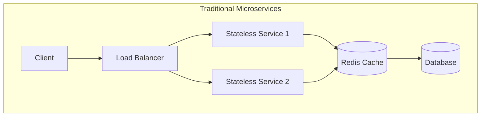
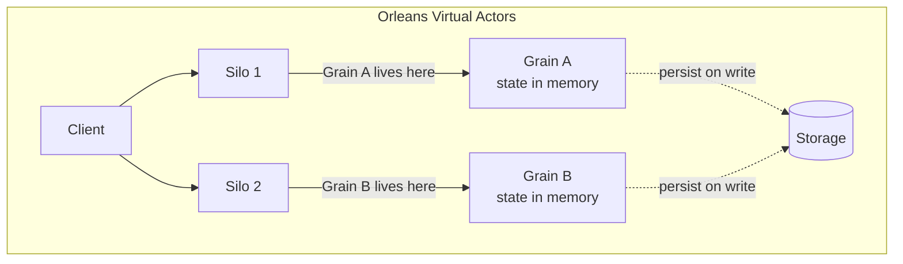

# Part 1 — Principles & Foundations

> Core architecture principles, design philosophy, and comparison with traditional approaches.

---

## Design Philosophy

Orleans was designed at Microsoft Research (2009+) with these core goals:

- **Target the 80% case** — trade optimal performance for universal scalability
- **Scalability is paramount** — trade raw performance for better scaling
- **Availability is paramount** — recovery-oriented computing over fault tolerance
- **API-first design** — if a feature can't be exposed to the developer, don't build it
- **Make it easy to do the right thing** — "fall into the pit of success"
- **Follow the principle of least surprise** — things should behave the way they look

---

## Why Orleans Over Traditional Microservices

| Concern | Traditional Microservices | Orleans |
|---|---|---|
| Caching layer | Separate Redis/Memcached | Built-in (grain state = cache) |
| Message broker | RabbitMQ, Kafka, etc. | Built-in (streams) |
| Job scheduling | Hangfire, Quartz | Built-in (timers, reminders) |
| Concurrency | Locks, semaphores | Single-threaded grains |
| Service discovery | Consul, Eureka | Built-in (membership) |
| State management | External DB per call | In-memory + persistence |

---

## Key Architectural Insight

> "Instead of getting all the data to the webserver and executing the logic there, distributed actor systems execute the logic where the data is. An Actor system makes sure that every data element / actor object lives in only one place (one machine in the cluster), so there is no duplication of data."
> — Maarten Sikkema

---

## Virtual Actor Model

### Core Concepts

- **Grain** — a virtual actor with identity, in-memory state, and single-threaded execution
- **Silo** — a host process running multiple grains; part of a cluster
- **Activation** — a live in-memory instance of a grain on a specific silo
- **Virtual** — grains always "exist" conceptually; activated on first call, deactivated when idle
- **Single-threaded** — each grain processes one request at a time (no locks needed)
- **Location transparent** — callers address grains by ID, not by server location

### Grain Key Types

| Interface | Key Type | Example |
|---|---|---|
| `IGrainWithGuidKey` | Guid | Player ID, Order ID |
| `IGrainWithIntegerKey` | Int64 | Sequence numbers, partitions |
| `IGrainWithStringKey` | string | `"eth:0xABC..."`, user emails |
| `IGrainWithGuidCompoundKey` | Guid + string | Multi-dimensional identity |
| `IGrainWithIntegerCompoundKey` | Int64 + string | Partitioned sequences |

### Timers vs Reminders

| Feature | Timer | Reminder |
|---|---|---|
| Persistence | Volatile (in-memory only) | Durable (survives restarts) |
| Granularity | Milliseconds | Minutes |
| Requires activation | Yes | No (wakes grain up) |
| Use case | Heartbeat checks, polling | Scheduled jobs, expiry checks |

---

## Framework Comparison

| Framework | Strengths | Weaknesses |
|---|---|---|
| **Orleans** | .NET native, built-in persistence/streams/timers, strong ecosystem | No grain indexing, .NET only |
| **Akka.NET** | Supervision hierarchies, mature | More complex API, manual state management |
| **Proto.Actor** | Highest raw throughput | Smaller ecosystem |
| **Dapr** | Technology-agnostic, sidecar model | Sidecar overhead, less integrated |

### Benchmark (2022, Orleans 7)

| Metric | Value |
|---|---|
| Messages/second (hosted client) | ~4,500,000 |
| Max requests/second per grain | ~1,000 |
| Max requests/second per silo | ~10,000 |
| Active grains per silo | ~100,000 |

---

## References

### Design Philosophy & Principles

- [Orleans Documentation — Microsoft Learn](https://learn.microsoft.com/en-us/dotnet/orleans/)
- [Orleans Architecture Principles — Microsoft Learn](https://learn.microsoft.com/en-us/dotnet/orleans/resources/orleans-architecture-principles-and-approach)
- [Orleans Best Practices](https://learn.microsoft.com/en-us/dotnet/orleans/resources/best-practices)
- [Orleans GitHub Repository](https://github.com/dotnet/orleans)
- [Distributed .NET with Microsoft Orleans (O'Reilly)](https://www.oreilly.com/library/view/distributed-net-with/9781801818971/)
- [Why Microsoft Orleans is Important for .NET Developers — Ed Andersen](https://www.edandersen.com/p/why-microsoft-orleans-is-important-for-net-developers)

### Virtual Actor Model & Core Concepts

- [Orleans Grain Identity](https://learn.microsoft.com/en-us/dotnet/orleans/grains/grain-identity)
- [Orleans Grain Lifecycle](https://learn.microsoft.com/en-us/dotnet/orleans/grains/grain-lifecycle)
- [Orleans Timers & Reminders](https://learn.microsoft.com/en-us/dotnet/orleans/grains/timers-and-reminders)
- [Orleans Grain Persistence](https://learn.microsoft.com/en-us/dotnet/orleans/grains/grain-persistence)
- [OrleansContrib/DesignPatterns](https://github.com/OrleansContrib/DesignPatterns)

### Framework Comparison & Benchmarks

- [Comparing .NET Virtual Actor Frameworks — Etteplan](https://www.etteplan.com/about-us/insights/comparing-net-virtual-actor-frameworks/)
- [Akka.NET Documentation](https://getakka.net/articles/intro/what-are-actors.html)
- [Proto.Actor — Ultra-fast distributed actors](https://proto.actor/)
- [Dapr Actors Overview](https://docs.dapr.io/developing-applications/building-blocks/actors/actors-overview/)
- [Microsoft Orleans vs Akka.NET — Chris Klug](https://www.youtube.com/watch?v=nXfzE2SFn5o)
