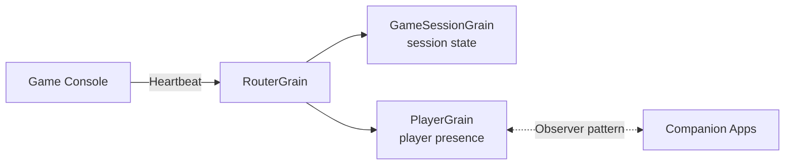
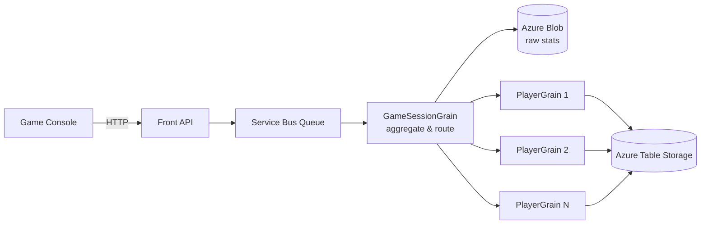

# Part 2 — Case Studies & Production Deployments

> Real-world Orleans deployments, scale numbers, and lessons learned from production.

---

## Halo / Xbox — Gaming at Scale

**Company:** 343 Industries (now Halo Studios) / Microsoft
**Scale:** 11.6M+ unique players, 1.5B+ games played (Halo 4)
**Load:** Several 100,000 requests/second during peak

### Why Orleans Was Chosen

- Required elastic scalability on Azure
- Needed to handle concurrent state for millions of players
- Traditional centralized SQL Server hit vertical scaling limits
- Cloud-native architecture with Azure Table Storage (NoSQL, partitioned) didn't support traditional ACID transactions

### Presence Service

**Grain types:**

| Grain | Key | Responsibilities |
|---|---|---|
| **RouterGrain** | heartbeat ID | Decompresses heartbeats, extracts GameSessionID + PlayerID, routes to correct grain |
| **GameSessionGrain** | session ID | Stores session state (players, score, map, etc.) |
| **PlayerGrain** | player ID | Stores individual player presence state; companions subscribe via Observer pattern |

### Statistics Service

**Grain types:**

| Grain | Key | Responsibilities |
|---|---|---|
| **GameSessionGrain** | session ID | Receives stats via Service Bus, stores payload in Azure Blob, unpacks and routes to PlayerGrains |
| **PlayerGrain** | player ID | Processes stat data, stores state in Azure Table Storage |

### Key Architectural Decisions

- **Idempotent operations** — all grain operations are idempotent for safe replay on failure
- **Forward recovery** (not backward) — failed updates are retried, not rolled back
- **Service Bus as durable log** — incoming stats published to Service Bus before processing
- **Eventual consistency** — acceptable for game stats; latency in consistency tolerated
- **Per-player partitioning** — each player's data in a separate Azure Table Storage partition

### Load Testing: Record, Mutate, Playback (RMP)

1. **Record** actual HTTP game stats requests from front API
2. **Mutate** GameSessionIDs and PlayerIDs with new IDs
3. **Playback** at 1000x multiplied load as Service Bus scheduled messages (100,000 messages per 50-100ms window)

### Lessons Learned

- **"Clients are jerks"** — at launch, all 11M players connected simultaneously causing self-DoS
- **Azure Service Bus limitations** — scheduled messages feature wasn't fully available in all regions
- **Orleans messaging** provides at-most-once delivery — design for idempotency
- **Load test authentically** — use real recorded traffic, not synthetic data

---

## Known Users & Production Deployments

| Company/Product | Use Case | Scale |
|---|---|---|
| **Halo 4 / Halo 5** (343 Industries) | Player stats, presence, matchmaking | 11.6M players |
| **Gears of War** | Game backend services | Millions of players |
| **Xbox Live / PlayFab** | Gaming platform services | Global scale |
| **Skype** | Real-time message processing, user sessions | Hundreds of millions |
| **Azure** | Internal cloud services | Global scale |
| **Halo Waypoint** | Companion app backend | Millions of users |

---

## Financial Services / Trading

### Use Cases in Finance

| Use Case | Grain Design | Why Orleans |
|---|---|---|
| **Transaction processing** | One grain per account | Single-threaded execution eliminates race conditions |
| **Portfolio management** | One grain per portfolio | Real-time P&L in-memory |
| **Trade matching** | StatelessWorker grains | Horizontally scalable parallel order matching |
| **Algorithmic trading** | Per-instrument grains | [Trader](https://github.com/JorgeCandeias/Trader) — open-source framework on Orleans |

### Banking Domain (Event-Sourced)

**CustomerGrain** — keyed by customer ID, event-sourced via JournaledGrain

| State Property | Type | Description |
|---|---|---|
| CustomerId | string | Unique customer identifier |
| PrimaryAccountHolder | Person | Name, address, contact |
| Spouse | Person | Optional co-holder |
| MailingAddress | Address | Current mailing address |
| Accounts | List\<Account\> | Linked bank accounts |

**Domain Events:**

| Event | Fields | Business Rule |
|---|---|---|
| MailingAddressChanged | Address | Update mailing address |
| AccountAdded | Account | Add new account |
| AccountRemoved | AccountNumber | Remove account |
| TransactionPosted | AccountNumber, Amount, OldBalance, NewBalance | Balance check: reject if insufficient funds |

**CQRS Pattern:**
- **Commands** → StatelessWorker grain → routes to CustomerGrain → raises events
- **Queries** → StatelessWorker grain → reads current projected state

---

## References

- [Building Halo 4's Distributed Cloud Services — Caitie McCaffrey / Hoop Somuah](https://www.youtube.com/watch?v=N7aqAjjXz0o)
- [Applying the Saga Pattern — Caitie McCaffrey](https://www.youtube.com/watch?v=xDuwrtwYHu8)
- [How Halo Scaled to 10M+ Players — ByteByteGo](https://blog.bytebytego.com/p/how-halo-on-xbox-scaled-to-10-million)
- [About Halo's Backend — CleverHeap](https://cleverheap.com/posts/about-halo-backend/)
- [Orleans, the technology behind Halo4 and Halo5 — Phil Bernstein Interview](https://www.odbms.org/blog/2016/02/orleans-the-technology-behind-xbox-halo4-and-halo5-interview-with-phil-bernstein/)
- [JorgeCandeias/Trader](https://github.com/JorgeCandeias/Trader) — Algorithmic trading on Orleans
