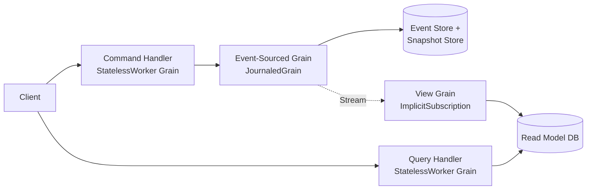
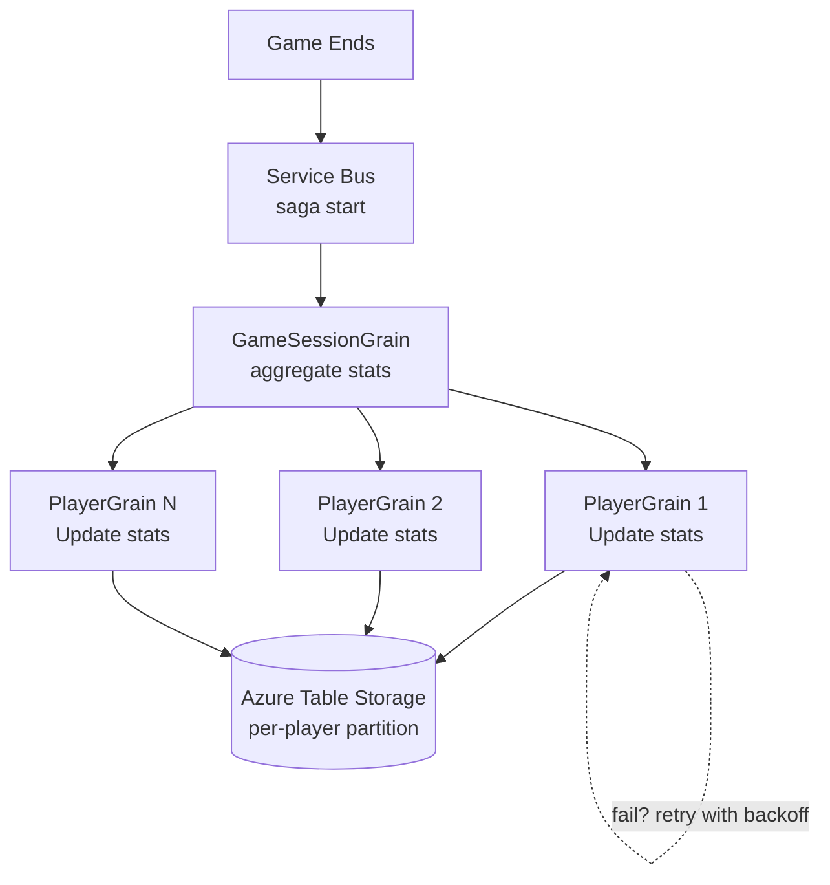
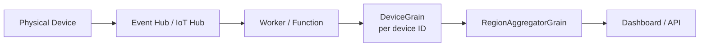
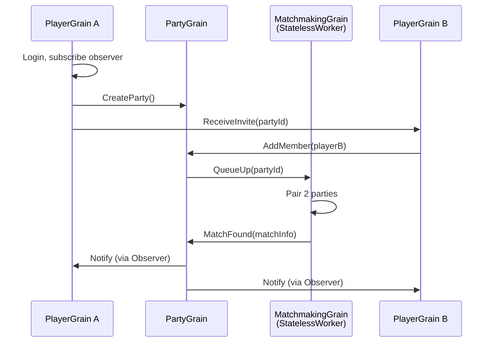
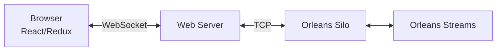
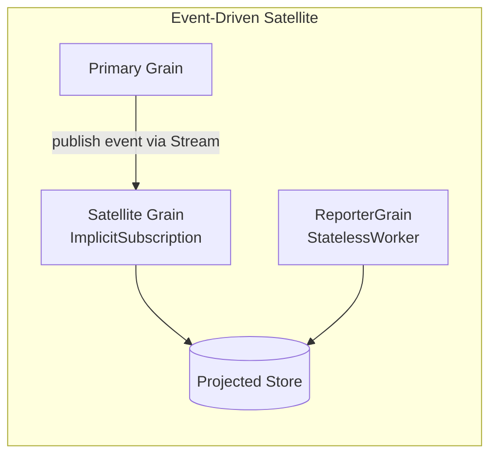
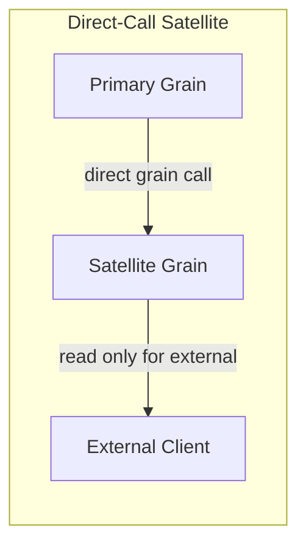

# Part 3 — Design Patterns

> Reusable Orleans patterns with architecture diagrams, grain descriptions, and when-to-use guidance.

---

## OrleansContrib Pattern Catalog

From [OrleansContrib/DesignPatterns](https://github.com/OrleansContrib/DesignPatterns):

| Pattern | Description | When to Use |
|---|---|---|
| **Observer** | Grain publishes state changes to subscribed observers | Real-time notifications to clients |
| **Cadence** | Decouple grain interaction rhythm from external input using timers | Periodic aggregation, polling |
| **Reduce** | Hierarchical aggregation of values across many grains (tree structure) | Dashboards, rollups |
| **Smart Cache** | Orleans as distributed cache in front of storage | Read-heavy, document-oriented data |
| **Dispatcher** | Batch of messages sent in single call, distributed to correct grains internally | High-throughput ingestion |
| **Hub** | Single well-known endpoint channeling events from multiple sources | Subscription management, fan-in |

---

## 1. Smart Cache Pattern

### Problem

Storage is the bottleneck. Traditional cache solutions (Redis, Memcached) introduce cache invalidation complexity and operational overhead.

### Solution

Use Orleans grains as a distributed cache with **immediate consistency** — one instance of each object in memory across the cluster.

### When to Use

- Storage system introduces unacceptable latency
- Storage cannot handle required requests/second
- System is predominantly read-heavy
- System is document-oriented (not query-oriented)

### CacheGrain Design

| Operation | Behavior |
|---|---|
| `Set(value, ttl)` | Store value in grain state, schedule deactivation after TTL |
| `Get()` | Return value from in-memory grain state (no DB call) |
| `Refresh()` | Re-read from backing store |
| `Clear()` | Remove value and deactivate grain |

### Write Strategies

| Strategy | Behavior | Trade-off |
|---|---|---|
| **Write-through** | Every write immediately calls `WriteStateAsync()` | Safe, higher latency |
| **Write-behind** | Timer periodically flushes dirty state to storage | Faster, risk of data loss on crash |

### Scaled-Out Replication

For high-throughput scenarios where a single CacheGrain becomes a bottleneck:

- **StatelessWorker** `LocalCacheGrain` for silo-local read replicas
- Orleans Streams or OrleanSpaces for replication between silos
- Writes to authoritative CacheGrain; reads from local replicas

### IDistributedCache Replacement

Orleans can replace Redis as an ASP.NET Core `IDistributedCache` provider — configure via `AddOrleansDistributedCache()`.

### Pitfalls

- Queries (aggregates, filters, joins) cannot be easily cached — only record-by-record access
- Cache misses introduce activation latency
- Write buffering increases data loss risk on unexpected silo termination

---

## 2. CQRS & Event Sourcing

### Orleans JournaledGrain

Orleans provides `JournaledGrain<TState, TEvent>` for built-in event sourcing.

| Provider | Behavior | Production Ready? |
|---|---|---|
| `StateStorage` | Snapshot only (no event log) | Experimental |
| `LogStorage` | Event log only (full replay on activation) | Experimental |
| `CustomStorage` | Full control: events + snapshots | **Recommended** |

### Architecture

### Key Concepts

- **Domain State** — POCO class with `Apply()` methods for each event type
- **CustomStorage** — `ReadStateFromStorage()` loads snapshot + applies newer events; `ApplyUpdatesToStorage()` persists events
- **Command Handler** — StatelessWorker receives commands, finds the event-sourced grain, raises events
- **View Grain** — subscribes to event stream via `[ImplicitStreamSubscription]`, projects into read model

### Modern Approach (2025 — John Sedlak / Petl)

- Custom `EventSourcedGrain<TState, TEvent>` base class
- Pluggable `ISnapshotStrategy<TView>` for snapshot decisions
- Timed persistence vs. immediate persistence (configurable)
- MongoDB or Cosmos DB as backing store
- `StreamingEventSourcedGrain` propagates events to view grains via Orleans Streams

---

## 3. Saga Pattern — Distributed Workflows

### Problem

Distributed systems can't rely on traditional ACID transactions across partitions.

### Halo Example: 32-Player Stats Update

### Key Decisions

| Decision | Choice | Rationale |
|---|---|---|
| Recovery model | **Forward recovery** | Successfully updated players keep stats (better UX) |
| Idempotency | All operations idempotent | Safe to replay on failure |
| Saga log | Service Bus | Durable record of progress |
| Locking | No distributed locks | Each PlayerGrain owns its own state |

### General Saga Grain Design

| Operation | Behavior |
|---|---|
| `Start(context)` | Begin saga, execute steps sequentially or in parallel |
| `HandleStepCompleted(stepId, result)` | Record completion, proceed to next step |
| `HandleStepFailed(stepId, error)` | Retry with backoff (forward recovery) or compensate (backward recovery) |

---

## 4. IoT / Digital Twin Pattern

### Architecture

Each physical device maps to a `DeviceGrain` — an in-memory representation of the device's current state.

### DeviceGrain Design

| Property | Type | Description |
|---|---|---|
| DeviceId | string | Unique device identifier |
| LastTemperature | double | Most recent temperature reading |
| FirmwareVersion | string | Current firmware version |
| IsOnline | bool | Online status (set false after heartbeat timeout) |
| LastHeartbeat | DateTime | Timestamp of last heartbeat |

| Operation | Behavior |
|---|---|
| `SubmitTelemetry(data)` | Update device state, forward to aggregator |
| `UpdateFirmware(version)` | Update firmware version in state |
| `Heartbeat()` | Reset heartbeat timer, mark online |

**Offline detection:** A grain timer checks every 30 seconds — if no heartbeat for 60 seconds, mark `IsOnline = false`.

### RegionAggregatorGrain Design

| Operation | Behavior |
|---|---|
| `Update(deviceId, telemetry)` | Store latest reading per device, compute regional averages |

### Why Orleans for IoT

- Natural 1:1 mapping between physical devices and grains
- Millions of grains scale automatically across silos
- In-memory state eliminates constant DB reads for device status
- Timers enable heartbeat monitoring without external schedulers
- Streams enable telemetry pipelines

---

## 5. Multiplayer Game Lobby / Matchmaking

### Grain Types

| Grain | Key | Role |
|---|---|---|
| **PlayerGrain** | Guid (player ID) | Login, profile, party management, receive invites |
| **PartyGrain** | Guid (party ID) | Group of players, enqueue for matchmaking |
| **MatchmakingGrain** | Integer (StatelessWorker) | Parallel matchmaking,  pairs parties |

### Flow

### Patterns Used

| Pattern | Purpose |
|---|---|
| **Observer** | Real-time client notifications (player status, invites, match found) |
| **Timer** | Check player readiness periodically |
| **Reminder** | Lobby timeout (auto-close after 10 minutes) |
| **StatelessWorker** | Matchmaking (parallelizable, no state needed) |

---

## 6. Real-Time Backend (Redux + WebSockets)

**Project:** RROD (React, Redux, Orleans, Dotnet Core)
**Author:** Maarten Sikkema

### Architecture

### Key Innovation: Server-Side Redux in Grains

- **Actions** dispatched to grain = CQRS commands
- **Reducer** = pure function transforming grain state
- **State changes** streamed back to clients via WebSocket

### What Orleans Replaces

| Traditional Component | Orleans Replacement |
|---|---|
| Redis cache | Grain state IS the cache |
| Event sourcing DB | Azure Table Storage as event log |
| Message bus | Orleans Streams |
| Job scheduler | Orleans Timers and Reminders |

### Limitation Discovered

Orleans has no built-in way to **search/index** grain data. Recommended additions:
- Elasticsearch / Azure AI Search for faceted search
- PowerBI for reporting

---

## 7. Satellite Pattern — Decoupled State Querying

**Author:** John Sedlak (2024)

### Problem

In Orleans, you cannot tie application state (e.g., "is a player online?") to grain lifecycle. Grains are virtual — they're always conceptually alive.

### Solution

Create **satellite grains** that maintain derived/projected state independently from the primary grain.

### Two Approaches

| Approach | Consistency | Complexity | Use Case |
|---|---|---|---|
| **Event-Driven** | Eventually consistent | Higher (stream setup) | Aggregation, search indexing |
| **Direct-Call** | Immediately consistent | Lower | Simple projected reads |

### Security

- Use **Grain Extensions** to restrict write access to satellite grains
- External clients can only read; internal grains can write via the extension interface

---

## References

- [OrleansContrib Smart Cache Pattern](https://github.com/OrleansContrib/DesignPatterns/blob/master/Smart%20Cache.md)
- [Orleans Smart Cache Pattern — CodeOpinion](https://codeopinion.com/orleans-smart-cache-pattern/)
- [OrleanSpaces Cache Replication — Ledjon Behluli](https://ledjonbehluli.com/posts/orleanspace_cache_replication/)
- [Event Sourcing with Orleans Journaled Grains — McGuireV10](https://mcguirev10.com/2019/12/05/event-sourcing-with-orleans-journaled-grains.html)
- [CQRS & Event Sourcing in Orleans — John Sedlak (2025)](https://johnsedlak.com/blog/2025/04/cqrs-and-event-sourcing-in-orleans)
- [Applying the Saga Pattern — Caitie McCaffrey](https://www.youtube.com/watch?v=xDuwrtwYHu8)
- [How Halo Scaled to 10M+ Players — ByteByteGo](https://blog.bytebytego.com/p/how-halo-on-xbox-scaled-to-10-million)
- [Introducing the Satellite Pattern for Orleans — John Sedlak](https://johnsedlak.com/blog/2024/10/introducing-the-satellite-pattern-for-orleans)
- [Orleans Virtual Actors in Practice — DevelopersVoice](https://developersvoice.com/blog/dotnet/orleans-virtual-actors-in-practice/)
- [RROD — Maarten Sikkema](https://medium.com/@MaartenSikkema/using-dotnet-core-orleans-redux-and-websockets-to-build-a-scalable-realtime-back-end-cd0b65ec6b4d)
- [How to Build Real-World Applications with Orleans — John Azariah & Sergey Bykov (NDC)](https://www.youtube.com/watch?v=7OVU9Mqqzgs)
