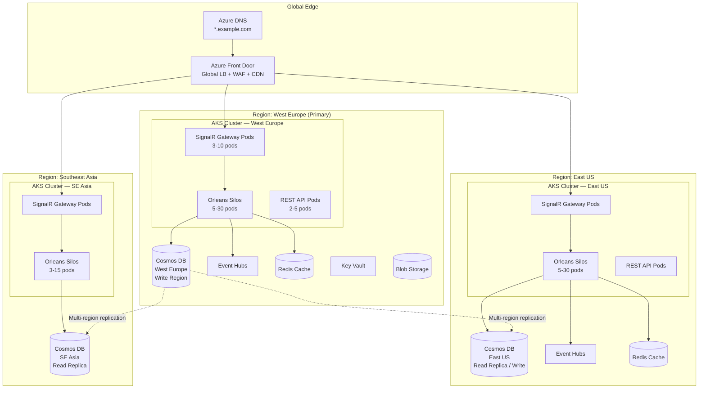
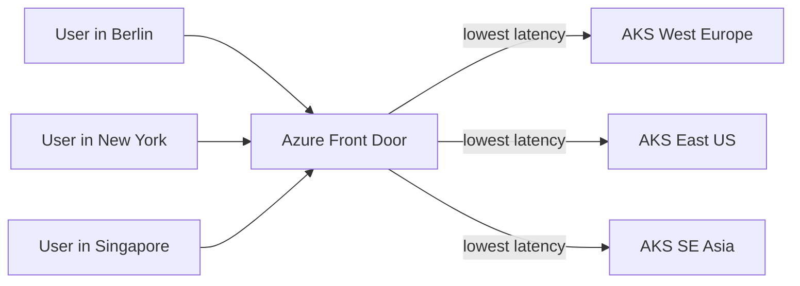
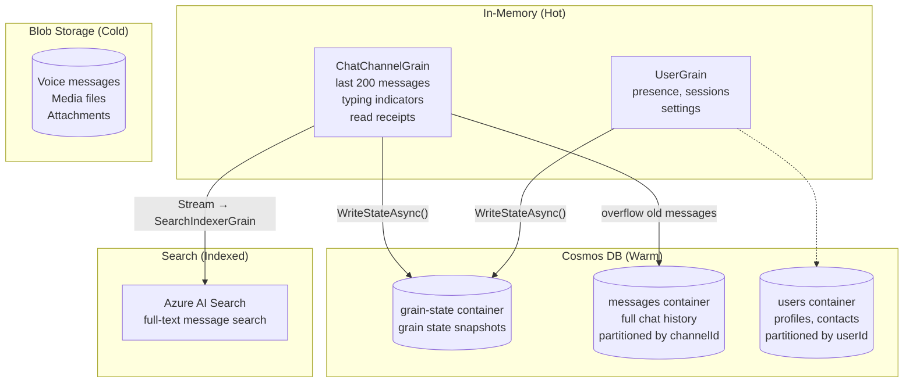
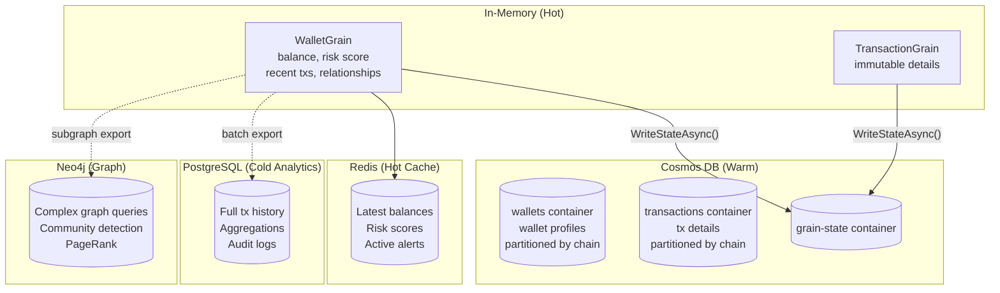
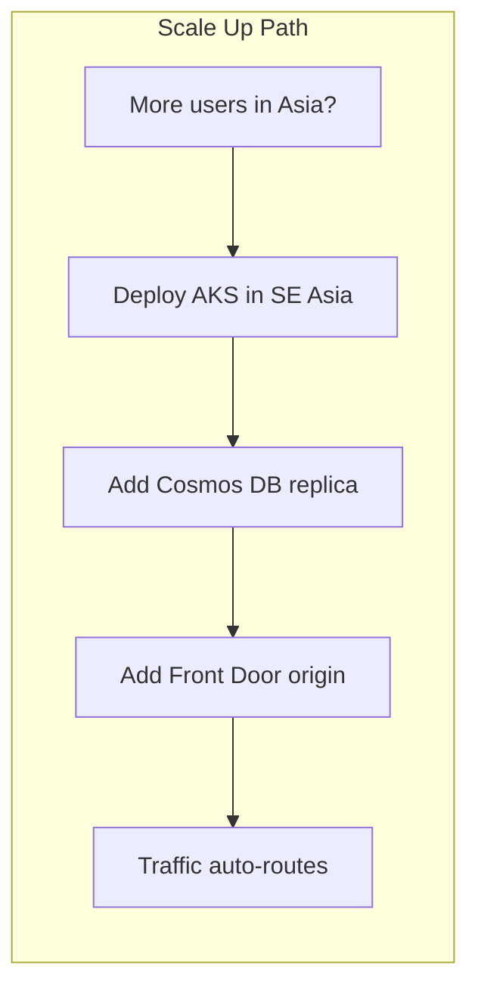
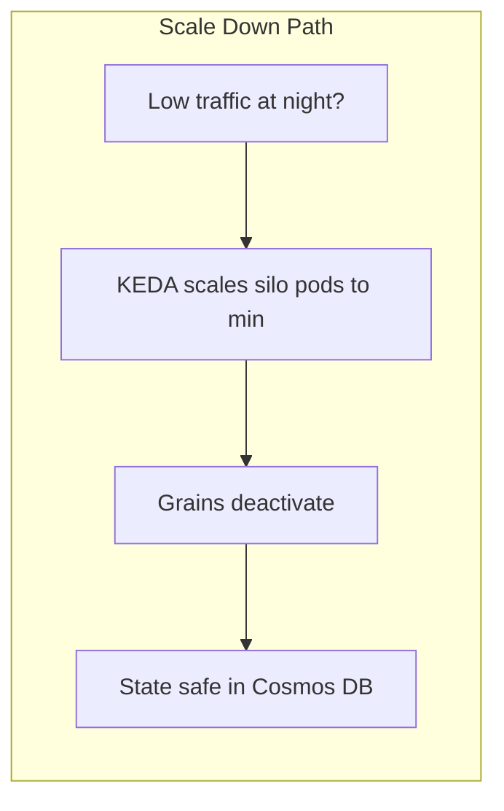

# Part 5 — Global Hosting on Azure

> How to host a global Orleans platform on Azure with multi-region AKS, Front Door, Cosmos DB persistence, and elastic scaling.

---

## Architecture Overview



---

## Key Decision: One Cluster Per Region or Global Cluster?

### Option A: Independent Cluster Per Region (Recommended)

Each Azure region runs its own **independent Orleans cluster** with its own membership table, silo network, and grain activations.

| Aspect | Behavior |
|---|---|
| Cluster membership | Separate per region (e.g., Azure Table Storage per region) |
| Grain activations | Same grain ID can be active in multiple regions simultaneously |
| Consistency | Eventual (via Cosmos DB multi-region replication) |
| Cross-region comms | None at Orleans level — data flows through Cosmos DB replication |
| Failure isolation | Region failure doesn't affect other regions |

**Why this works:**
- Orleans silo-to-silo TCP is latency-sensitive (designed for intra-datacenter)
- Cross-region RTT (50-200ms) would degrade grain call performance
- Same grain activated in two regions reads from local Cosmos replica
- Write conflicts resolved by Cosmos DB conflict resolution policy (Last Writer Wins or custom)

### Option B: Single Global Cluster (Not Recommended for Most Cases)

All silos across regions form one Orleans cluster.

| Aspect | Problem |
|---|---|
| Silo-to-silo latency | 50-200ms cross-region adds to every grain call |
| Grain placement | Grain may activate in region far from user |
| Failure blast radius | Network partition can split the cluster |

**Only consider if:** You need strong consistency guarantees for a single grain instance globally (e.g., global auction with single source of truth).

---

## Azure Front Door — Global Edge

### Role

Azure Front Door sits at the global edge and provides:

| Feature | Purpose |
|---|---|
| **Global anycast routing** | Route users to nearest healthy region |
| **WebSocket affinity** | Sticky sessions for SignalR connections |
| **WAF** | DDoS protection, rate limiting, bot detection |
| **TLS termination** | Centralized certificate management |
| **Health probes** | Automatic failover if a region goes down |
| **Caching** | Static asset CDN for web clients |

### Routing Strategy

| Pattern | Configuration |
|---|---|
| **Latency-based** (default) | Route to the origin with lowest latency to the user |
| **Priority** | Primary region preferred, failover to secondary |
| **Weighted** | Split traffic (useful for canary deployments) |
| **Session affinity** | Same user always goes to same region (important for SignalR) |



### SignalR + Front Door

- Front Door supports WebSocket pass-through with session affinity
- Configure `sessionAffinityEnabledState: Enabled` for SignalR origins
- SignalR negotiation (HTTP) and connection (WebSocket) must route to same origin

---

## AKS Multi-Region Clusters

### Node Pool Design Per Region

| Node Pool | VM Size | Purpose | Min–Max Pods |
|---|---|---|---|
| **system** | D2s_v5 (2 vCPU, 8 GiB) | AKS system components | 2–3 |
| **silos** | E8s_v5 (8 vCPU, 64 GiB) | Orleans silo pods (memory-heavy for grain state) | 3–30 |
| **gateways** | D4s_v5 (4 vCPU, 16 GiB) | SignalR hub + REST API pods | 2–10 |
| **media** (if applicable) | F8s_v2 (8 vCPU, 16 GiB) | SFU / compute-heavy pods | 2–10 |

### Orleans Silo Pod Design

| Component | Configuration |
|---|---|
| Silo port | 11111 (silo-to-silo) |
| Gateway port | 30000 (client-to-silo) |
| Health port | 8080 (liveness + readiness) |
| CPU request/limit | 4–8 vCPU |
| Memory request/limit | 8–16 GiB |
| Termination grace period | 120 seconds (allow grain deactivation) |
| PodDisruptionBudget | minAvailable: 3 |

### Cluster Membership on AKS

Two options:

| Method | How | Pros | Cons |
|---|---|---|---|
| `UseKubernetesHosting()` | Silos discover each other via k8s API | No external dependency | Requires RBAC for pod listing |
| `UseAzureStorageClustering()` | Shared Azure Table Storage | Works across node pools | Extra Azure Storage dependency |

**Recommendation:** `UseKubernetesHosting()` for intra-cluster; each region has its own k8s cluster and therefore its own Orleans cluster.

### Adding/Removing Clusters

To scale to a new region:

1. Deploy AKS cluster in new region (IaC — Bicep/Terraform)
2. Add Cosmos DB replica to new region
3. Deploy Orleans silo pods + gateway pods
4. Add new origin to Azure Front Door
5. Traffic automatically routes to new region based on latency

To remove a region:

1. Remove origin from Azure Front Door (drain traffic)
2. Wait for in-flight requests to complete
3. Scale silo pods to 0 (grains deactivate, state already in Cosmos)
4. Tear down AKS cluster

---

## Cosmos DB — Grain State Persistence

### Why Cosmos DB for Orleans Grains

| Requirement | Cosmos DB Fit |
|---|---|
| Global distribution | Multi-region writes/reads, automatic replication |
| Point reads by ID | O(1) reads by partition key — aligns with grain key |
| Schemaless | Grain state evolves without migration |
| Autoscale | 400–∞ RU/s per container, scales to millions of ops/sec |
| Low latency | <10ms reads, <15ms writes in same region |
| TTL | Auto-expire transient grain state (analysis results, sessions) |

### Container Design

| Container | Partition Key | Content | RU Allocation |
|---|---|---|---|
| `grain-state` | `/grainType` or `/grainId` | Orleans `IPersistentState<T>` snapshots | Autoscale 1K–40K RU/s |
| `messages` | `/channelId` | Chat messages (for chat platform) | Autoscale 1K–20K RU/s |
| `wallets` | `/chain` | Wallet profiles (for blockchain platform) | Autoscale 2K–40K RU/s |
| `users` | `/userId` | User profiles and settings | Autoscale 400–4K RU/s |

### Partition Key Strategy

| Approach | Partition Key | When to Use |
|---|---|---|
| **Grain ID** | `/grainId` | Default — one grain's state = one partition. Best for point reads. |
| **Grain Type** | `/grainType` | Groups same-type grains. Better for batch queries across grains. |
| **Hierarchical** | `/chain` → `/address` | Multi-level keys for blockchain entities. Overcomes 20 GB single-partition limit. |
| **Tenant** | `/tenantId` | Multi-tenant SaaS applications. Natural isolation. |

### Multi-Region Configuration

| Mode | Behavior | Use Case |
|---|---|---|
| **Single write region** | One region accepts writes, others are read replicas | Simpler conflict model, eventual reads in other regions |
| **Multi-region write** | All regions accept writes, conflicts auto-resolved | Lowest write latency globally, requires conflict policy |

**Conflict resolution for grain state:**
- **Last Writer Wins (LWW)** — default. Safe for most grain state because only one grain activation writes at a time within a single region.
- **Custom merge** — if cross-region writes to same item are possible (e.g., user updates profile from two regions simultaneously), implement a custom stored procedure.

### Write-Behind Caching Strategy

Grains don't persist on every state change — they batch writes:

| Trigger | Behavior |
|---|---|
| Timer (every 30s) | Periodic `WriteStateAsync()` if dirty |
| Deactivation | Final `WriteStateAsync()` when grain deactivates |
| Critical operation | Immediate `WriteStateAsync()` for important state changes |

This reduces Cosmos DB RU consumption dramatically (10-50x fewer writes than write-through).

### Cost Optimization

| Technique | Savings |
|---|---|
| Autoscale RU/s | Only pay for actual throughput |
| Write-behind caching | 10-50x fewer writes |
| TTL on transient state | Auto-delete expired analysis results |
| Compact serialization | Orleans binary serializer (smaller docs = fewer RU) |
| Hierarchical partition keys | Avoid cross-partition queries |

---

## Where Are Chats / Entities Stored?

### Chat Platform Data Flow



### Blockchain Platform Data Flow



---

## Document & AI Storage Patterns

When grains handle large content (user-uploaded documents, AI-generated reports, media), **do not store the content in grain state or Cosmos DB**. Use Azure Blob Storage for the content and Cosmos DB for metadata only.

### Why Not Cosmos DB for Large Content

| Constraint | Impact |
|---|---|
| **2 MB item size limit** | A single PDF or AI report can exceed this |
| **RU cost scales with item size** | A 500 KB item costs ~5x more RUs than a 1 KB item |
| **Designed for structured data** | Point reads by ID, not binary blobs |

### Recommended Pattern: Metadata + Blob

```mermaid
graph TB
    subgraph "Grain Layer"
        DG[DocumentGrain<br/>userId:docId]
        AIG[AIProcessorGrain<br/>StatelessWorker]
    end

    subgraph "Metadata (Cosmos DB)"
        META[(documents container<br/>• documentId, title, userId<br/>• status, tags, permissions<br/>• blobUrl, AI summary ≤ 100KB<br/>• embedding vector reference)]
    end

    subgraph "Content (Blob Storage — RA-GZRS)"
        BLOB[(documents/{userId}/{docId}/<br/>• original.pdf<br/>• ai-output.md<br/>• chunks/*.json<br/>• embeddings/*.bin)]
    end

    subgraph "Search"
        SEARCH[(Azure AI Search<br/>• Full-text index<br/>• Vector embeddings)]
    end

    DG -->|metadata| META
    DG -->|SAS URL for upload/download| BLOB
    DG -->|trigger| AIG
    AIG -->|read doc| BLOB
    AIG -->|write results| BLOB
    AIG -->|update status + summary| DG
    AIG -->|index| SEARCH
```

### What Goes Where

| Data | Storage | Why |
|---|---|---|
| Document metadata (title, owner, status, tags) | **Cosmos DB** | Small, queried often, global replication |
| Short AI summaries (< 100 KB) | **Cosmos DB** | Fast reads, co-located with metadata |
| Long AI-generated text (reports, analyses) | **Blob Storage** | No size limit, cheap, CDN-cacheable |
| Original uploaded documents (PDF, DOCX) | **Blob Storage** | Binary, large, append-only |
| Chunked text for RAG/embeddings | **Blob Storage** or **AI Search** | Blob for raw chunks, Search for indexed vectors |
| Embedding vectors | **Azure AI Search** or **Cosmos DB** (vector search) | Both support vector search |

### Global Blob Storage Redundancy Options

Azure Storage supports built-in geo-replication:

| Redundancy | Copies | Behavior | Use Case |
|---|---|---|---|
| **LRS** | 3 in one datacenter | Local only | Dev/test |
| **ZRS** | 3 across availability zones | Zone-resilient | Single-region production |
| **GRS** | 3 local + 3 in paired region | DR (read-only secondary) | Regional DR |
| **GZRS** | ZRS locally + 3 in paired region | Best durability | Production default |
| **RA-GRS / RA-GZRS** | Same as GRS/GZRS but read-accessible secondary | **Global reads** | Multi-region read access |

**For multi-region reads:** Use **RA-GZRS** — clients in any region read from nearest replica.

**For multi-region writes:** Blob Storage doesn't support multi-region writes natively. Options:
- **Front Door + regional storage accounts** — upload to nearest region, async-replicate via AzCopy or Event Grid
- **Cosmos DB metadata + regional Blob** — grain writes blob locally, metadata in Cosmos has region-specific URLs

### DocumentGrain Design Guidance

| Principle | Rationale |
|---|---|
| Store only metadata + blob URL in grain state | Keep grain state lightweight (<10 KB ideal) |
| Generate SAS URLs for direct client ↔ Blob transfer | Grain never touches document bytes |
| Use StatelessWorker for AI processing | Horizontally scale CPU/GPU-heavy workloads |
| Stream AI completion events | Notify client via SignalR when processing completes |
| TTL on intermediate chunks | Auto-delete processing artifacts after 7 days |

### Further Reading — Document & AI Storage

- [Azure Blob Storage Redundancy — Microsoft Learn](https://learn.microsoft.com/en-us/azure/storage/common/storage-redundancy)
- [RA-GRS: Read-Access Geo-Redundant Storage](https://learn.microsoft.com/en-us/azure/storage/common/storage-redundancy#read-access-geo-redundant-storage)
- [Cosmos DB 2 MB Item Size Limit](https://learn.microsoft.com/en-us/azure/cosmos-db/concepts-limits#per-item-limits)
- [Azure AI Search Vector Search](https://learn.microsoft.com/en-us/azure/search/vector-search-overview)
- [Cosmos DB Vector Search](https://learn.microsoft.com/en-us/azure/cosmos-db/nosql/vector-search)
- [SAS Tokens for Blob Storage](https://learn.microsoft.com/en-us/azure/storage/common/storage-sas-overview)
- [Azure Storage Geo-Replication Design Patterns](https://learn.microsoft.com/en-us/azure/storage/common/geo-redundant-design)

---

## Scaling Strategy

### Horizontal Scaling Triggers

| Component | Scale Metric | Scale Out | Scale In |
|---|---|---|---|
| Orleans silo pods | CPU utilization | > 70% for 5 min | < 30% for 15 min |
| Orleans silo pods | Grain activation count | > 500K per pod | < 100K per pod |
| SignalR gateway pods | WebSocket connections | > 50K per pod | < 10K per pod |
| SFU nodes (voice) | Participant count | > 400 per node | < 50 per node |
| Event Hubs | Throughput units | Auto-inflate enabled | — |
| Cosmos DB | RU consumption | Autoscale enabled | Autoscale enabled |
| Whole region | Front Door health probe failure | Failover to next region | Re-enable after recovery |

### Adding Capacity





### Grain Lifecycle & Memory

| Grain behavior | Deactivation policy |
|---|---|
| Active exchange wallets | Never deactivate (constant traffic keeps them warm) |
| Active chat channels | 30 min idle timeout |
| User grains | 15 min idle timeout |
| Voice channels | 5 min after last participant leaves |
| Analysis grains | Immediate after returning result |
| Transaction grains | Short-lived — activate, index, query a few times, deactivate |

---

## Disaster Recovery

### Failure Scenarios

| Failure | Impact | Recovery |
|---|---|---|
| **Single silo pod crash** | Grains on that pod reactivated on other silos within seconds | Automatic (Orleans membership protocol) |
| **Full node pool failure** | All silo pods on those nodes restart | Kubernetes reschedules; grains reactivate with state from Cosmos DB |
| **AKS cluster failure** | Entire region down | Front Door routes to next region; grains activate there with Cosmos replica data |
| **Cosmos DB region failure** | Storage unavailable | Cosmos automatic failover to next region (if multi-region write) |
| **Azure region failure** | Everything in that region gone | Full DR: Front Door + Cosmos multi-region + AKS in other regions |

### Recovery Time

| Scenario | RTO | RPO |
|---|---|---|
| Pod crash | < 10 seconds | Zero (state in Cosmos) |
| Zone failure | < 2 minutes | Zero |
| Region failure | < 5 minutes | Near-zero (Cosmos replication lag, typically < 100ms) |

---

## Cost Estimation

### Small Platform (10K concurrent users)

| Resource | SKU | Monthly Cost |
|---|---|---|
| AKS (3 silo E8s_v5) | 8 vCPU, 64 GiB | ~$1,500 |
| AKS (2 gateway D4s_v5) | 4 vCPU, 16 GiB | ~$300 |
| Cosmos DB | Autoscale 1K–4K RU/s | ~$200 |
| Event Hubs Standard | 2 TU | ~$150 |
| Redis C2 Standard | 13 GiB | ~$150 |
| Front Door Standard | — | ~$35 |
| Blob Storage (100 GB) | Hot | ~$5 |
| App Insights (10 GB/month) | — | ~$25 |
| **Total (1 region)** | | **~$2,365/mo** |

### Large Platform (1M concurrent users, 3 regions)

| Resource | SKU | Monthly Cost |
|---|---|---|
| AKS × 3 regions (15 silos each) | E8s_v5 | ~$22,500 |
| AKS × 3 regions (5 gateways each) | D4s_v5 | ~$2,250 |
| Cosmos DB multi-region write | Autoscale 10K–100K RU/s | ~$8,000 |
| Event Hubs × 3 | Standard 10 TU | ~$900 |
| Redis × 3 | Premium P2 | ~$1,500 |
| Front Door Premium | + WAF | ~$500 |
| Blob Storage (10 TB) | Hot GRS | ~$200 |
| App Insights (100 GB/month) | — | ~$250 |
| **Total (3 regions)** | | **~$36,100/mo** |

---

## References

### Architecture Overview

- [Orleans Documentation — Microsoft Learn](https://learn.microsoft.com/en-us/dotnet/orleans/)
- [Orleans on Azure Container Apps — Azure Samples](https://github.com/Azure-Samples/Orleans-Cluster-on-Azure-Container-Apps)
- [Distributed .NET with Microsoft Orleans (O'Reilly)](https://www.oreilly.com/library/view/distributed-net-with/9781801818971/)

### Multi-Region Cluster Topology

- [Orleans Multi-Cluster Support](https://learn.microsoft.com/en-us/dotnet/orleans/deployment/multi-cluster-support)
- [Orleans Grain Directory](https://learn.microsoft.com/en-us/dotnet/orleans/grains/grain-directory)
- [Running Orleans in a Geo-Distributed Cluster — Reuben Bond (Microsoft)](https://devblogs.microsoft.com/dotnet/orleans-3-0/)

### Azure Front Door

- [Azure Front Door Documentation](https://learn.microsoft.com/en-us/azure/frontdoor/)
- [Front Door Routing Architecture](https://learn.microsoft.com/en-us/azure/frontdoor/front-door-routing-architecture)
- [Front Door Session Affinity](https://learn.microsoft.com/en-us/azure/frontdoor/front-door-session-affinity)
- [Front Door WebSocket Support](https://learn.microsoft.com/en-us/azure/frontdoor/front-door-http2)
- [Front Door WAF Best Practices](https://learn.microsoft.com/en-us/azure/web-application-firewall/afds/waf-front-door-best-practices)

### AKS Multi-Region

- [AKS Multi-Region Best Practices](https://learn.microsoft.com/en-us/azure/aks/operator-best-practices-multi-region)
- [AKS Cluster Autoscaler](https://learn.microsoft.com/en-us/azure/aks/cluster-autoscaler)
- [KEDA — Kubernetes Event-Driven Autoscaling](https://keda.sh/)
- [Orleans Kubernetes Hosting](https://learn.microsoft.com/en-us/dotnet/orleans/deployment/kubernetes)
- [AKS Node Pools](https://learn.microsoft.com/en-us/azure/aks/create-node-pools)
- [Pod Disruption Budgets — Kubernetes](https://kubernetes.io/docs/tasks/run-application/configure-pdb/)

### Cosmos DB Persistence

- [Cosmos DB Multi-Region Writes](https://learn.microsoft.com/en-us/azure/cosmos-db/multi-region-writes)
- [Cosmos DB Consistency Levels](https://learn.microsoft.com/en-us/azure/cosmos-db/consistency-levels)
- [Cosmos DB Conflict Resolution](https://learn.microsoft.com/en-us/azure/cosmos-db/conflict-resolution-policies)
- [Cosmos DB Hierarchical Partition Keys](https://learn.microsoft.com/en-us/azure/cosmos-db/hierarchical-partition-keys)
- [Cosmos DB Autoscale Throughput](https://learn.microsoft.com/en-us/azure/cosmos-db/provision-throughput-autoscale)
- [Cosmos DB Request Unit Calculator](https://cosmos.azure.com/capacitycalculator/)
- [Microsoft.Orleans.Persistence.Cosmos — NuGet](https://www.nuget.org/packages/Microsoft.Orleans.Persistence.Cosmos)

### Document & AI Storage

- [Azure Blob Storage Redundancy](https://learn.microsoft.com/en-us/azure/storage/common/storage-redundancy)
- [RA-GRS: Designing for High Availability](https://learn.microsoft.com/en-us/azure/storage/common/geo-redundant-design)
- [Azure AI Search Vector Search](https://learn.microsoft.com/en-us/azure/search/vector-search-overview)
- [Cosmos DB Vector Search](https://learn.microsoft.com/en-us/azure/cosmos-db/nosql/vector-search)
- [SAS Token Overview](https://learn.microsoft.com/en-us/azure/storage/common/storage-sas-overview)

### Scaling & Disaster Recovery

- [Orleans Grain Lifecycle](https://learn.microsoft.com/en-us/dotnet/orleans/grains/grain-lifecycle)
- [Orleans Grain Collection](https://learn.microsoft.com/en-us/dotnet/orleans/grains/grain-lifecycle#grain-collection)
- [Azure Event Hubs Auto-Inflate](https://learn.microsoft.com/en-us/azure/event-hubs/event-hubs-auto-inflate)
- [Cosmos DB Automatic Failover](https://learn.microsoft.com/en-us/azure/cosmos-db/how-to-manage-database-account#automatic-failover)

### Cost Management

- [Azure Pricing Calculator](https://azure.microsoft.com/en-us/pricing/calculator/)
- [Cosmos DB Reserved Capacity](https://learn.microsoft.com/en-us/azure/cosmos-db/reserved-capacity)
- [AKS Cost Optimization](https://learn.microsoft.com/en-us/azure/aks/best-practices-cost)
