# Real-Time Group Chat & Walkie-Talkie Platform — Orleans Architecture

> Production-ready reference architecture for a distributed real-time communication platform built on Microsoft Orleans, supporting group text chat, push-to-talk voice, presence, and media handling.

---

## Table of Contents

1. [System Overview](#1-system-overview)
2. [Grain Design](#2-grain-design)
3. [Real-Time Messaging](#3-real-time-messaging)
4. [Voice Architecture](#4-voice-architecture)
5. [Streaming Architecture](#5-streaming-architecture)
6. [Client Connectivity](#6-client-connectivity)
7. [Persistence Strategy](#7-persistence-strategy)
8. [Scaling Strategy](#8-scaling-strategy)
9. [Offline Support](#9-offline-support)
10. [Security](#10-security)
11. [Global Deployment Architecture](#11-global-deployment-architecture)

---

## 1. System Overview

### High-Level Architecture

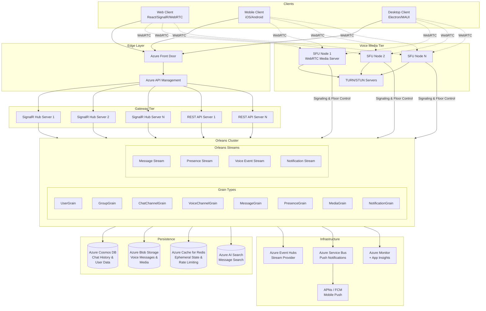

### Design Principles

| Principle | Approach |
|---|---|
| **One grain per entity** | Users, groups, channels, messages each have a dedicated grain |
| **Single-writer** | Each grain handles its own state — no distributed locks |
| **Streams for fan-out** | Orleans Streams deliver events to all interested parties |
| **SignalR for push** | Orleans → SignalR backplane → clients (real-time delivery) |
| **WebRTC for voice** | SFU media servers handle audio relay; Orleans handles signaling and floor control |
| **Eventual consistency** | Presence and typing indicators are best-effort; chat history is durable |
| **Separation of concerns** | Voice media plane is decoupled from control/signaling plane |

### Key Architectural Decisions

- **Orleans as control plane** — all business logic (floor control, permissions, message routing) runs in grains
- **SFU as media plane** — audio packets flow through dedicated Selective Forwarding Units, not through Orleans grains
- **SignalR.Orleans backplane** — eliminates Redis dependency for SignalR scale-out; grains and observers handle cross-silo message routing
- **Opus codec** — mandatory WebRTC audio codec; 6–510 kbps, optimized for speech at 16–24 kbps
- **Half-duplex floor control** — `VoiceChannelGrain` acts as authoritative arbiter of who holds the floor

---

## 2. Grain Design

### Grain Relationship Diagram

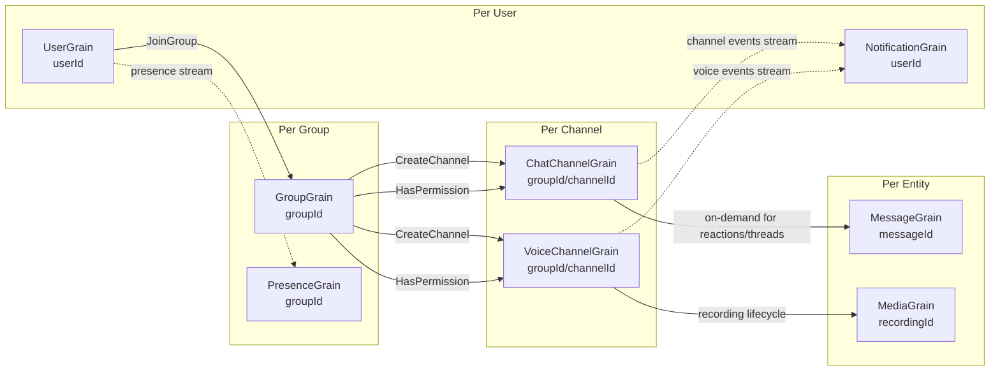

### 2.1 UserGrain

**Key:** userId (string)
**Purpose:** Identity anchor — maintains profile, contacts, settings, and active session references.

| State Property | Type | Description |
|---|---|---|
| UserId | string | Unique user identifier |
| DisplayName | string | Display name |
| AvatarUrl | string? | Profile image URL |
| StatusMessage | string? | Custom status |
| Status | enum | Offline, Online, Away, DoNotDisturb |
| LastSeen | DateTimeOffset | Last activity timestamp |
| Sessions | List\<ActiveSession\> | Active connections (connectionId, device, connectedAt) |
| Groups | List\<string\> | Group IDs the user belongs to |
| Contacts | List\<ContactInfo\> | Contact list |
| Settings | UserSettings | Push notifications, sound, language, voice settings |

| Operation | Behavior |
|---|---|
| `GetProfile()` | Return profile from in-memory state |
| `UpdateProfile(update)` | Update display name, avatar, status |
| `Connect(connectionId, device)` | Add session, set status to Online, publish presence event |
| `Disconnect(connectionId)` | Remove session, set Offline if no sessions remain, publish presence event |
| `JoinGroup(groupId)` | Add group to list |
| `LeaveGroup(groupId)` | Remove group from list |
| `AddContact(userId)` / `RemoveContact(userId)` | Manage contact list |
| `UpdateSettings(settings)` | Update notification and voice preferences |
| `GetUnreadCounts()` | Return per-channel unread message counts |
| `MarkRead(channelId, messageId)` | Update last-read pointer for a channel |

**Streams produced:** Publishes `PresenceEvent` on `Presence/{userId}` stream.

### 2.2 GroupGrain

**Key:** groupId (string)
**Purpose:** Manages group membership, roles, and permissions. Authority for who can do what within a group.

| State Property | Type | Description |
|---|---|---|
| GroupId | string | Unique group identifier |
| Name | string | Group display name |
| Description | string? | Group description |
| AvatarUrl | string? | Group image |
| IsPublic | bool | Public vs private |
| Members | Dictionary\<string, GroupMember\> | userId → role, display name, joined date |
| Channels | List\<ChannelInfo\> | Text and voice channels |
| Invitations | List\<GroupInvitation\> | Pending invite codes with expiry |

| Operation | Behavior |
|---|---|
| `Create(request)` | Initialize group with creator as Owner |
| `AddMember(userId, role)` | Add member with default Member role |
| `RemoveMember(userId, requestingUserId)` | Remove member (requires ManageMembers permission) |
| `SetMemberRole(userId, role, requestingUserId)` | Change role (requires ManageMembers) |
| `HasPermission(userId, permission)` | Check role → permission mapping |
| `CreateInvitation(inviterId, expiry)` | Generate invite code |
| `AcceptInvitation(userId, inviteCode)` | Validate and add member |
| `CreateChannel(request)` | Add text or voice channel |

**Roles & Permissions:**

| Role | Permissions |
|---|---|
| **Owner** | All permissions |
| **Admin** | Send, ManageMessages, ManageMembers, ManageChannels, Speak, PrioritySpeech, Invite |
| **Moderator** | Send, ManageMessages, Speak, PrioritySpeech, Invite |
| **Member** | Send, Speak, Invite |

### 2.3 ChatChannelGrain

**Key:** `{groupId}/{channelId}` (string)
**Purpose:** Hot path for text messaging. Maintains a sliding window of recent messages in memory and coordinates real-time delivery via streams.

| State Property | Type | Description |
|---|---|---|
| RecentMessages | List\<ChatMessage\> | Ring buffer of last 200 messages (in-memory) |
| MessageCount | long | Total messages ever sent |
| LastActivity | DateTimeOffset | Last message timestamp |
| TypingUsers | Dictionary\<string, DateTimeOffset\> | Currently typing users (ephemeral) |
| ReadReceipts | Dictionary\<string, string\> | userId → lastReadMessageId |
| PinnedMessageIds | HashSet\<string\> | Pinned message IDs |

| Operation | Behavior |
|---|---|
| `SendMessage(request)` | 1) Check permission via GroupGrain 2) Create message 3) Add to ring buffer 4) Persist 5) Publish to stream 6) Clear typing indicator |
| `EditMessage(messageId, newContent, editorUserId)` | Update content, set editedAt |
| `DeleteMessage(messageId, requestingUserId)` | Remove from buffer and publish deletion event |
| `GetMessages(beforeMessageId, limit)` | Return from in-memory buffer; overflow queries Cosmos DB |
| `SetTyping(userId, isTyping)` | Update typing map, publish event (no persistence — ephemeral) |
| `AddReaction(messageId, userId, emoji)` | Add reaction to message |
| `MarkRead(userId, messageId)` | Update read receipt |
| `PinMessage(messageId, userId)` / `UnpinMessage` | Pin/unpin messages |
| `CreateThread(parentMessageId, creatorUserId)` | Start threaded conversation |

**Message model:**

| Field | Type | Description |
|---|---|---|
| MessageId | string | GUID-based, sortable |
| ChannelId | string | Parent channel |
| SenderUserId | string | Author |
| Content | string | Message text |
| Type | enum | Text, VoiceMessage, System, Image, File |
| Timestamp | DateTimeOffset | When sent |
| EditedAt | DateTimeOffset? | When last edited |
| ThreadId | string? | Thread parent (if threaded reply) |
| Reactions | List\<Reaction\> | Emoji reactions with user lists |
| Attachments | List\<Attachment\> | File/image attachments |
| ReplyToMessageId | string? | Quote-reply reference |
| IsPinned | bool | Pinned status |

**Streams produced:** Publishes `ChannelEvent` variants (MessageSent, MessageEdited, MessageDeleted, TypingChanged, ReactionAdded, ReadReceiptUpdated) on `Channel/{channelId}` stream.

### 2.4 VoiceChannelGrain

**Key:** `{groupId}/{channelId}` (string)
**Purpose:** Floor control authority for push-to-talk. Manages who is currently speaking, queues requests, and coordinates with SFU media servers.

| State Property | Type | Description |
|---|---|---|
| Participants | Dictionary\<string, VoiceParticipant\> | Active voice participants |
| CurrentSpeakerUserId | string? | Who currently holds the floor |
| FloorGrantedAt | DateTimeOffset? | When floor was granted |
| WaitQueue | List\<string\> | Users waiting for the floor |
| FloorMode | enum | PushToTalk or PriorityOverride |
| SfuEndpoint | SfuEndpoint | URL, token, room ID for the SFU |
| Region | string | Preferred SFU region |

| Operation | Behavior |
|---|---|
| `Join(userId, sfuSessionId)` | Add participant, allocate SFU room if first join |
| `Leave(userId)` | Remove participant, auto-release floor if speaker |
| `RequestFloor(userId)` | If free → grant immediately + start 30s timer. If occupied → check priority override → queue |
| `ReleaseFloor(userId)` | Cancel timer, grant to next in queue |
| `ForceReleaseFloor(requestingUserId)` | Admin/mod override |
| `GetSfuEndpoint()` | Return SFU connection details |
| `SetMuted(userId, muted)` | Toggle listener mute state |
| `StartRecording(userId)` | Create MediaGrain for recording |
| `StopRecording(userId, recordingId)` | Finalize recording |

**Floor control rules:**
- If no one is speaking → grant immediately
- Priority speakers (admins/mods with PrioritySpeech permission) can override current speaker
- Auto-release after 30 seconds (configurable)
- Queue is FIFO, next user auto-granted on release

**VoiceParticipant model:**

| Field | Type | Description |
|---|---|---|
| UserId | string | Participant identifier |
| DisplayName | string | Display name |
| IsSpeaking | bool | Currently holding floor |
| IsMuted | bool | Self-muted as listener |
| JoinedAt | DateTimeOffset | When joined voice channel |
| SfuSessionId | string | SFU session reference |

### 2.5 MessageGrain

**Key:** messageId (string)
**Purpose:** Activated on-demand for heavy operations (reactions, threading) on a specific message. Not activated for every message — `ChatChannelGrain` handles bulk operations.

| Operation | Behavior |
|---|---|
| `GetMessage()` | Return full message details |
| `Edit(newContent, editorUserId)` | Update content, set editedAt |
| `Delete(requestingUserId)` | Soft-delete, publish event |
| `AddReaction(userId, emoji)` | Add/update reaction list |
| `RemoveReaction(userId, emoji)` | Remove reaction |
| `GetThreadReplies(beforeId, limit)` | Paginated thread replies |
| `AddThreadReply(request)` | Add reply to thread |

### 2.6 PresenceGrain

**Key:** groupId (string)
**Purpose:** Singleton per group — aggregates presence state for all members. Uses the Satellite pattern — subscribes to individual user presence streams and maintains a projection.

| Operation | Behavior |
|---|---|
| `GetOnlineMembers()` | Return all members with non-Offline status |
| `GetOnlineCount()` | Count of online members |
| `GetMemberPresence(userId)` | Single member's status |
| `GetTypingInChannel(channelId)` | Who's typing in a channel |
| `GetSpeakingInChannel(channelId)` | Who's speaking in a voice channel |

**Implementation:** Uses `[ImplicitStreamSubscription("Presence")]` to automatically receive presence events from all UserGrains. Maintains an in-memory dictionary of member statuses. No persistence — rebuilt on activation.

### 2.7 MediaGrain

**Key:** recordingId (string)
**Purpose:** Manages voice message recording lifecycle and transcoding. One grain per voice message recording.

| State Property | Type | Description |
|---|---|---|
| ChannelId | string | Source voice channel |
| SenderUserId | string | Who recorded |
| AudioCodec | string | Codec used (Opus) |
| DurationMs | long | Duration in milliseconds |
| IsFinalized | bool | Recording complete |
| Info | VoiceMessageInfo? | Finalized recording metadata |

| Operation | Behavior |
|---|---|
| `InitiateRecording(request)` | Set up recording state |
| `AppendChunk(audioData, sequenceNumber)` | Buffer audio chunk in memory |
| `FinalizeRecording()` | Concatenate chunks → upload to Azure Blob as OGG → return metadata |
| `GetPlaybackUrl()` | Return Blob Storage URL |
| `RequestTranscription()` | Trigger speech-to-text via Azure AI Speech |

### 2.8 NotificationGrain

**Key:** userId (string)
**Purpose:** Handles push notification delivery and badge counts. Activated on demand.

| State Property | Type | Description |
|---|---|---|
| PendingNotifications | List\<PushNotification\> | Queued notifications |
| BadgeCount | int | Unread badge count |
| DeviceRegistrations | List\<DeviceRegistration\> | APNs/FCM/WNS tokens |

| Operation | Behavior |
|---|---|
| `SendPush(notification)` | Queue notification, batch within 3-second window |
| `GetPendingNotifications(limit)` | Return pending queue |
| `MarkDelivered(notificationIds)` | Remove from queue |
| `GetBadgeCount()` | Return current badge |
| `RegisterDevice(device)` | Add push token |
| `UnregisterDevice(deviceToken)` | Remove push token |

**Batching:** If multiple messages arrive within a 3-second window for an offline user, batch them into one push: "5 new messages in #general".

---

## 3. Real-Time Messaging

### Message Flow: Sender → All Recipients

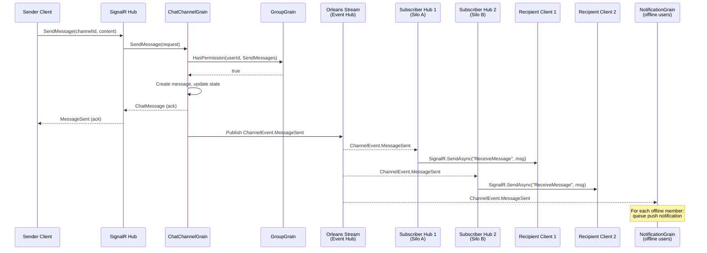

### Key Design Decisions

| Decision | Rationale |
|---|---|
| **Orleans Streams (Event Hub provider)** for fan-out | At-least-once delivery; survives silo restarts; scales with partitions |
| **Grain → Stream → SignalR Hub** (not grain → SignalR directly) | Decouples message production from delivery; allows multiple SignalR hub instances |
| **In-memory message window in ChatChannelGrain** | Sub-millisecond reads for recent history; avoids DB round-trip |
| **Acknowledgement back to sender immediately** | Don't wait for fan-out to complete; UX requires instant feedback |
| **NotificationGrain subscribes to same stream** | Offline delivery handled by the same event pipeline |

### Typing Indicator Flow

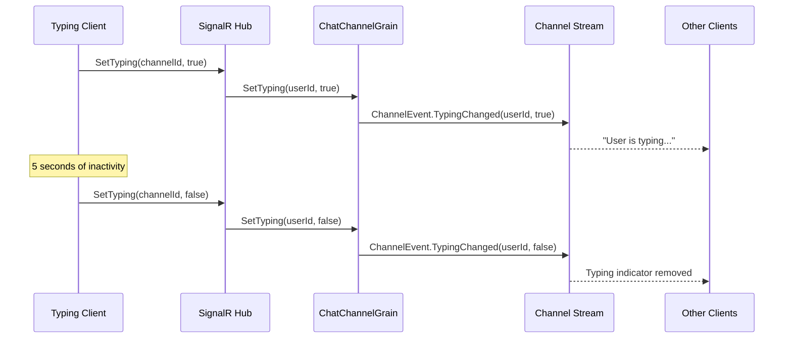

Typing indicators are **fire-and-forget** — no persistence, no retry. If a message is lost, the typing indicator will timeout on the client side anyway.

### Message Search

Message search is handled outside the grain system:

1. `ChatChannelGrain.SendMessage()` produces a `ChannelEvent.MessageSent` event
2. An `[ImplicitStreamSubscription]` grain (`SearchIndexerGrain`) consumes these events
3. `SearchIndexerGrain` batches messages (up to 100) and writes them to Azure AI Search index
4. Client search queries go through a REST API → Azure AI Search (bypassing Orleans grains)

---

## 4. Voice Architecture

### 4.1 Architecture Overview

Audio data **never flows through Orleans grains**. Orleans handles the control plane (signaling, floor control, participant management); dedicated SFU servers handle the media plane.

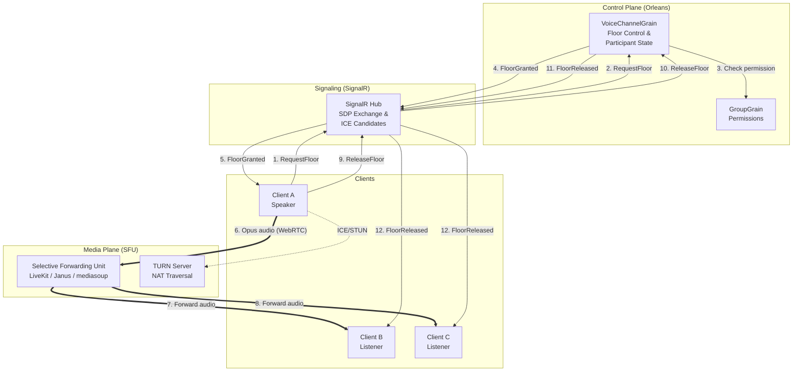

### 4.2 Why SFU Over Orleans for Audio Relay

| Approach | Pros | Cons |
|---|---|---|
| **Audio through Orleans grains** | Unified architecture | Unacceptable latency (grain queuing adds 5–50ms per hop); not designed for binary streaming |
| **WebRTC peer-to-peer mesh** | No server needed | Doesn't scale beyond ~5 participants; N² connections |
| **SFU (Selective Forwarding Unit)** ✓ | Low latency (<50ms); scales to 50+ participants; bandwidth efficient | Separate infrastructure to operate |

### 4.3 Push-to-Talk Flow (Floor Control Protocol)

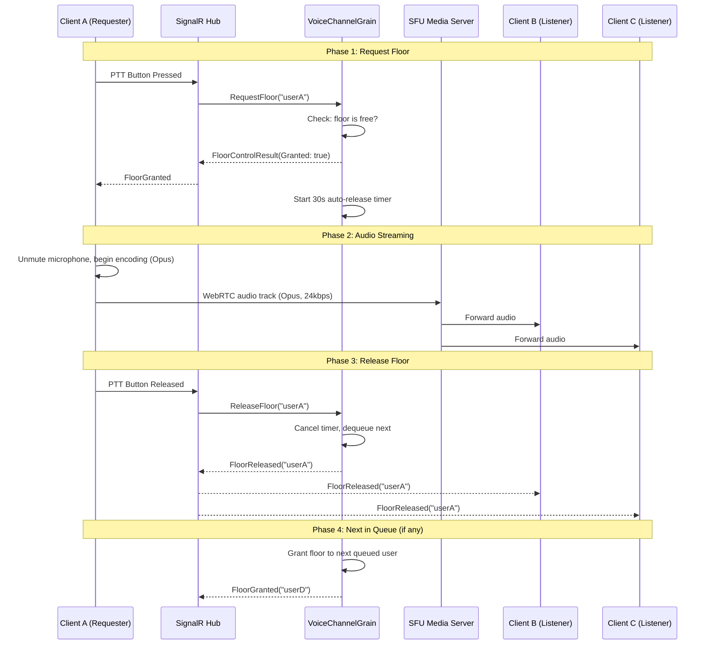

### 4.4 Audio Encoding

| Parameter | Value | Rationale |
|---|---|---|
| **Codec** | Opus (RFC 6716) | Mandatory WebRTC codec; best quality/bitrate ratio for speech |
| **Bitrate** | 24 kbps (speech) | Good quality PTT speech; low bandwidth |
| **Sample rate** | 48 kHz | Opus native rate |
| **Frame size** | 20ms | Standard WebRTC frame; good latency/efficiency balance |
| **Channels** | Mono | PTT is single-speaker; stereo unnecessary |
| **DTX** | Enabled | Discontinuous Transmission — saves bandwidth during silence |
| **FEC** | Enabled | Forward Error Correction — resilience to packet loss |

### 4.5 WebRTC vs WebSocket for Audio Transport

| Transport | Latency | NAT Traversal | Packet Loss Handling | Use Case |
|---|---|---|---|---|
| **WebRTC** ✓ | <50ms | STUN/TURN built-in | NACK, FEC, PLI | Live PTT audio |
| **WebSocket** | 100–300ms | Requires proxy | TCP retransmission (head-of-line blocking) | Voice message upload/download |

**Decision:**
- **Live PTT audio** → WebRTC via SFU (UDP-based, lowest latency)
- **Voice message upload** → WebSocket or HTTP chunked upload
- **Voice message playback** → HTTPS from Blob Storage CDN

### 4.6 Voice Message Recording Modes

| Mode | Flow | When |
|---|---|---|
| **Client-side** (preferred) | Client records locally → uploads OGG via HTTP → MediaGrain stores in Blob → ChatChannelGrain posts as VoiceMessage | Default path, best quality |
| **Server-side** | SFU captures stream → sends chunks to MediaGrain.AppendChunk() → FinalizeRecording() assembles and stores | When client can't record locally |

### 4.7 SFU Integration

- **SfuRegistryGrain** (singleton, integer key 0) — tracks available SFU nodes, load per node, region
- `VoiceChannelGrain` calls `SfuRegistryGrain.GetBestSfu(region)` to get optimal SFU node
- SFU room created via REST API with per-room config (max 50 participants, Opus codec, 5-min empty timeout)
- Room token returned to client for WebRTC connection

---

## 5. Streaming Architecture

### Stream Topology

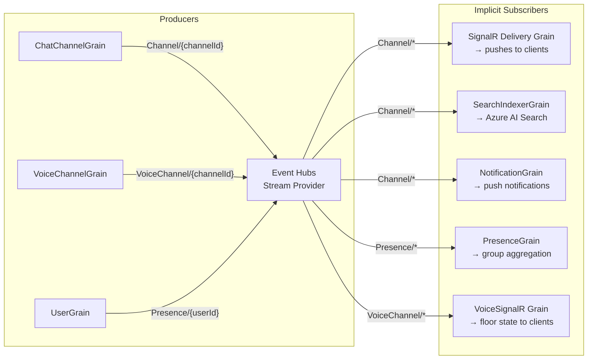

### Stream Namespaces

| Namespace | Producer | Consumer(s) | Content |
|---|---|---|---|
| `Channel/{channelId}` | ChatChannelGrain | SignalR delivery, SearchIndexer, NotificationGrain | Messages, typing, reactions, edits, deletes |
| `VoiceChannel/{channelId}` | VoiceChannelGrain | VoiceSignalR delivery grain | Floor granted/released, participant join/leave |
| `Presence/{userId}` | UserGrain | PresenceGrain (per group) | Online/offline/away status changes |
| `Notification/{userId}` | NotificationGrain | Client delivery grain | Push notification payloads |

### Event Types

**ChannelEvent variants:**

| Event | Fields |
|---|---|
| MessageSent | ChatMessage |
| MessageEdited | messageId, newContent, editedAt |
| MessageDeleted | messageId |
| TypingChanged | userId, isTyping |
| ReactionAdded | messageId, userId, emoji |
| ReactionRemoved | messageId, userId, emoji |
| ReadReceiptUpdated | userId, messageId |

**VoiceChannelEvent variants:**

| Event | Fields |
|---|---|
| ParticipantJoined | VoiceParticipant |
| ParticipantLeft | userId |
| FloorGranted | userId |
| FloorReleased | userId |
| FloorOverridden | previousSpeaker, newSpeaker |
| VoiceMessageRecorded | VoiceMessageInfo |

### Stream-to-SignalR Bridge

A `[StatelessWorker]` grain with `[ImplicitStreamSubscription("Channel")]` consumes channel events and maps them to SignalR group sends:

| Event | SignalR Call |
|---|---|
| MessageSent | `Clients.Group(groupId).SendAsync("ReceiveMessage", msg)` |
| TypingChanged | `Clients.Group(groupId).SendAsync("TypingChanged", channelId, userId, isTyping)` |
| ReactionAdded | `Clients.Group(groupId).SendAsync("ReactionAdded", channelId, messageId, userId, emoji)` |
| MessageEdited | `Clients.Group(groupId).SendAsync("MessageEdited", channelId, messageId, newContent, editedAt)` |
| MessageDeleted | `Clients.Group(groupId).SendAsync("MessageDeleted", channelId, messageId)` |

---

## 6. Client Connectivity

### Connection Architecture

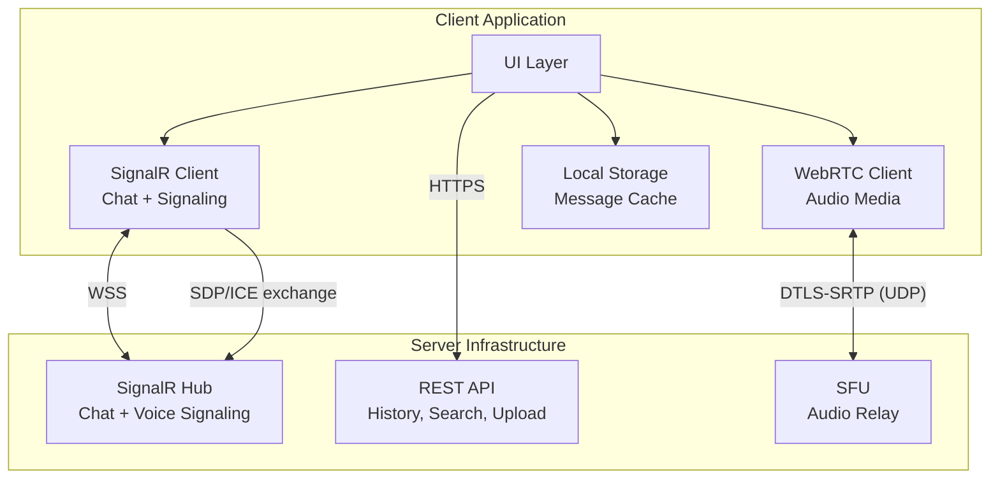

### SignalR Hub Operations

**ChatHub:**

| Client Method | Description | Grain Call |
|---|---|---|
| `SendMessage(channelId, content)` | Send text message | `ChatChannelGrain.SendMessage()` |
| `StartTyping(channelId)` | Begin typing indicator | `ChatChannelGrain.SetTyping(userId, true)` |
| `StopTyping(channelId)` | End typing indicator | `ChatChannelGrain.SetTyping(userId, false)` |
| `AddReaction(channelId, messageId, emoji)` | React to message | `ChatChannelGrain.AddReaction()` |
| `MarkRead(channelId, messageId)` | Mark as read | `ChatChannelGrain.MarkRead()` + `UserGrain.MarkRead()` |

**VoiceHub:**

| Client Method | Description | Grain Call |
|---|---|---|
| `JoinVoiceChannel(channelId)` | Join voice | `VoiceChannelGrain.Join()` → return SFU endpoint |
| `RequestFloor(channelId)` | PTT press | `VoiceChannelGrain.RequestFloor()` |
| `ReleaseFloor(channelId)` | PTT release | `VoiceChannelGrain.ReleaseFloor()` |
| `LeaveVoiceChannel(channelId)` | Leave voice | `VoiceChannelGrain.Leave()` |
| `SendOffer/Answer/IceCandidate` | WebRTC signaling | Relay to target user via SignalR |

### Connection Lifecycle

| Event | Actions |
|---|---|
| **OnConnected** | `UserGrain.Connect(connectionId, device)` → add to SignalR groups for all user's groups |
| **OnDisconnected** | `UserGrain.Disconnect(connectionId)` → presence updated |

---

## 7. Persistence Strategy

### Storage Mapping

| Data | Storage | Rationale |
|---|---|---|
| User profiles & settings | Cosmos DB | Global distribution, fast reads, per-user partition |
| Group membership & config | Cosmos DB | Transactional reads, group-level partition |
| Chat messages (recent 200) | Orleans grain state → Cosmos DB | In-memory for speed, persisted for durability |
| Chat messages (full history) | Cosmos DB (separate container) | Time-series partition (channelId + month), TTL for archival |
| Voice messages (audio) | Azure Blob Storage | Cheap, CDN-enabled, large binary objects |
| Voice message metadata | Cosmos DB | Unified message timeline |
| Presence state | In-memory only | Ephemeral; reconstructed on activation |
| Typing indicators | In-memory only | Ephemeral; 5-second TTL |
| Read receipts | Cosmos DB | Per-user, per-channel last-read pointer |
| Search index | Azure AI Search | Full-text and vector search on message content |
| Push notification tokens | Cosmos DB | Per-user device list |
| Orleans cluster membership | Azure Table Storage | Standard Orleans clustering |
| Stream checkpoints | Azure Table Storage | Event Hub provider checkpoints |

### Cosmos DB Container Design

| Container | Partition Key | Content |
|---|---|---|
| `users` | `/userId` | User profiles, settings, contacts, read receipts |
| `groups` | `/groupId` | Group info, members, channels, invitations |
| `messages` | `/channelId` | Chat messages, voice message metadata, reactions |
| `orleans` | `/grainId` | Grain state snapshots (generic Orleans persistence) |
| `notifications` | `/userId` | Pending notifications, device registrations |

---

## 8. Scaling Strategy

### Grain-Level Scaling

| Grain Type | Cardinality | Hot Grain Mitigation |
|---|---|---|
| `UserGrain` | 1 per user (~millions) | Natural distribution by userId hash |
| `GroupGrain` | 1 per group (~100K) | Large groups fine — membership is read-heavy |
| `ChatChannelGrain` | 1 per channel (~1M) — **hot path** | In-memory window; no DB read on send; async stream fan-out |
| `VoiceChannelGrain` | 1 per active voice channel | Activated only when joins; auto-deactivate when empty |
| `PresenceGrain` | 1 per group | Best-effort broadcast; no persistence |
| `SearchIndexerGrain` | StatelessWorker | Multiple activations per silo; batched writes |
| `NotificationGrain` | 1 per user | Activated on demand; reminder-based batch delivery |

### Scale Targets

| Metric | Target | Approach |
|---|---|---|
| Concurrent users | 10M+ | ~100K active grains per silo × 100 silos |
| Messages/second | 1M+ | ~1K msg/sec per ChatChannelGrain × 1K active channels |
| Voice channels | 50K concurrent | SFU pool; 500 participants per node × 100 nodes |
| Message history | Petabytes | Cosmos DB with time-based partition key; automatic tiering |
| Silo cluster | 100+ silos | Azure Table Storage membership; gossip protocol |

### Horizontal Scaling Triggers

| Component | Scale Metric | Threshold |
|---|---|---|
| Orleans silos | CPU utilization | >70% → add silo |
| Orleans silos | Grain activation count | >500K per silo → add silo |
| SignalR gateways | WebSocket connections | >50K per pod → add pod |
| SFU nodes | Participant count | >400 per node → add node |
| Event Hub | Throughput units | Auto-inflate enabled |
| Cosmos DB | RU consumption | Autoscale (400–40,000 RU/s per container) |

---

## 9. Offline Support

### Offline Message Delivery

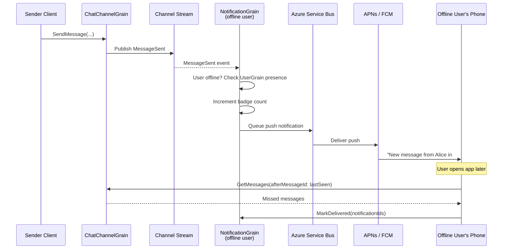

### Sync-on-Reconnect Protocol

1. Client stores `lastMessageId` per channel in local storage
2. On reconnect, sends `SyncRequest { channelId, lastSeenMessageId }` per channel
3. If gap is small (<200 messages), return inline from grain's in-memory buffer
4. If gap is large, return `{ tooManyMessages: true, totalMissed: N }` → client fetches pages via REST API

---

## 10. Security

### Authentication & Authorization

| Layer | Mechanism |
|---|---|
| **Client → Gateway** | Microsoft Entra ID (OAuth 2.0 / OIDC); JWT bearer tokens |
| **SignalR authentication** | `[Authorize]` attribute on hubs; userId from JWT `sub` claim |
| **WebRTC SFU** | Short-lived room tokens generated by VoiceChannelGrain |
| **Orleans grain-level** | `GroupGrain.HasPermission()` checked on every mutable operation |
| **Blob Storage** | SAS tokens for voice message upload/download (time-limited, scoped to blob) |

### Authorization Flow

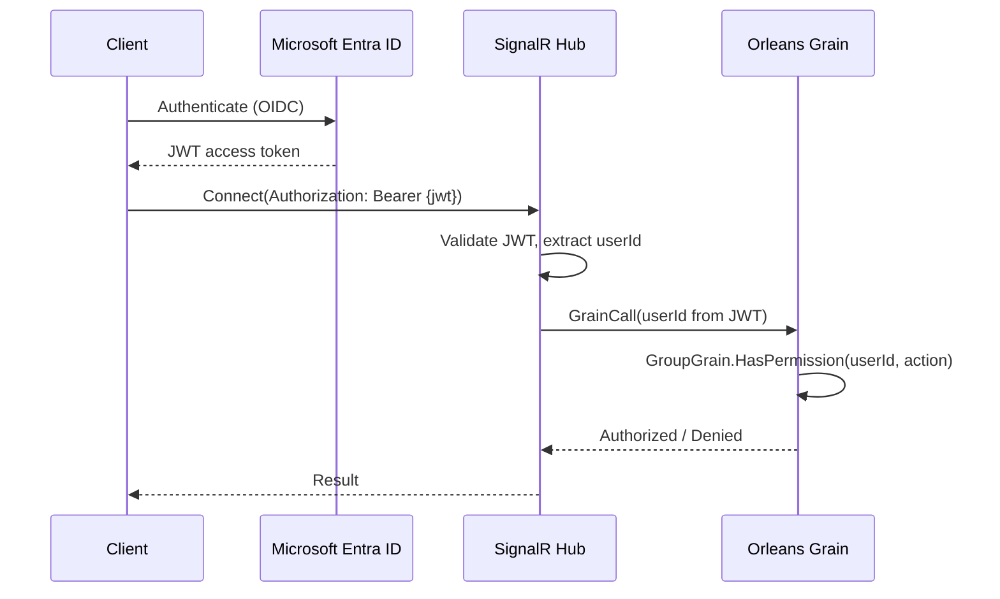

### Security Controls

| Concern | Approach |
|---|---|
| **Message content encryption** | TLS in transit; at-rest via Cosmos DB and Blob Storage SSE. E2E encryption optional (Signal Protocol). |
| **Voice stream encryption** | DTLS-SRTP (built into WebRTC); SFU decrypts/re-encrypts (standard SFU limitation) |
| **Rate limiting** | Per-user limits at API Management and in ChatChannelGrain (max 30 messages/minute) |
| **Input validation** | Content sanitized at SignalR Hub layer; max length enforced; attachment types whitelisted |
| **DoS protection** | Azure Front Door WAF; API Management throttling; grain activation limits |
| **Audit logging** | Permission changes, group deletions, moderation actions → Azure Monitor |

---

## 11. Global Deployment Architecture

> For detailed multi-region hosting guidance, see [Orleans Global Hosting on Azure](orleans/05-global-hosting-on-azure.md).

### Azure Resource Topology

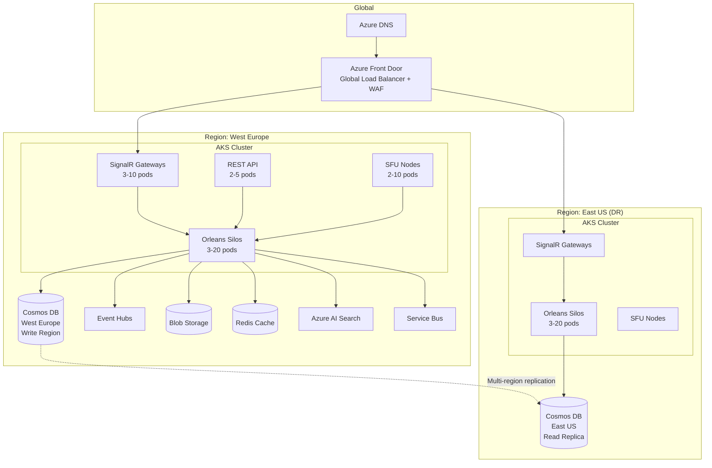

### Multi-Region Strategy

| Aspect | Design |
|---|---|
| **Cluster topology** | Independent Orleans cluster per region (not one global cluster) |
| **User routing** | Azure Front Door routes user to nearest healthy region |
| **Data replication** | Cosmos DB multi-region replication (eventual consistency cross-region) |
| **Chat consistency** | Same channel grain active in each region; convergence via Cosmos DB LWW |
| **Voice routing** | User connects to SFU in nearest region; floor control grain per region |
| **Adding regions** | Deploy AKS + add Cosmos replica + add Front Door origin |
| **Removing regions** | Remove Front Door origin → drain → tear down |

### Cost Estimation (100K concurrent users, 1 region)

| Resource | SKU | Monthly Cost |
|---|---|---|
| AKS (5 silos × D16s v5) | 16 vCPU, 64 GiB | ~$2,500 |
| AKS (3 gateways × D4s v5) | 4 vCPU, 16 GiB | ~$450 |
| AKS (2 SFU × D8s v5) | 8 vCPU, 32 GiB | ~$600 |
| Cosmos DB | Autoscale 4,000 RU/s | ~$600 |
| Event Hubs | Standard, 4 TUs | ~$300 |
| Azure Blob Storage | 1 TB, Hot tier | ~$20 |
| Azure AI Search | Basic tier | ~$75 |
| Azure Front Door | Standard | ~$35 |
| Azure Cache for Redis | C2 Standard | ~$150 |
| Service Bus | Standard | ~$10 |
| App Insights | 50 GB/month | ~$120 |
| **Total** | | **~$4,860/month** |

---

## References

### Orleans
- [Orleans Documentation — Streaming](https://learn.microsoft.com/dotnet/orleans/streaming/)
- [Orleans Sample Projects — Presence Service](https://learn.microsoft.com/dotnet/orleans/tutorials-and-samples/)
- [SignalR.Orleans — OrleansContrib](https://github.com/OrleansContrib/SignalR.Orleans)
- [Building a realtime server backend using Orleans — Maarten Sikkema](https://medium.com/@MaartenSikkema/using-dotnet-core-orleans-redux-and-websockets-to-build-a-scalable-realtime-back-end-cd0b65ec6b4d)

### Voice & WebRTC
- [How Discord Handles 2.5M Concurrent Voice Users Using WebRTC](https://discord.com/blog/how-discord-handles-two-and-half-million-concurrent-voice-users-using-webrtc)
- [LiveKit — Globally Distributed WebRTC Mesh](https://blog.livekit.io/scaling-webrtc-with-distributed-mesh/)
- [Opus Codec — RFC 6716](https://datatracker.ietf.org/doc/html/rfc6716)

### Architecture Patterns
- [OrleansContrib Design Patterns](https://github.com/OrleansContrib/DesignPatterns)
- [Satellite Pattern for Orleans — John Sedlak](https://johnsedlak.com/blog/2024/10/introducing-the-satellite-pattern-for-orleans)
