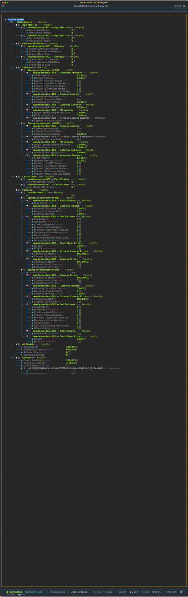
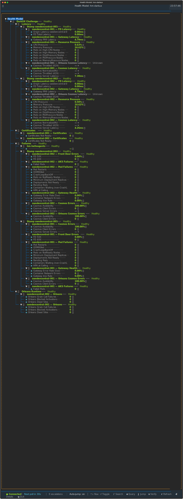
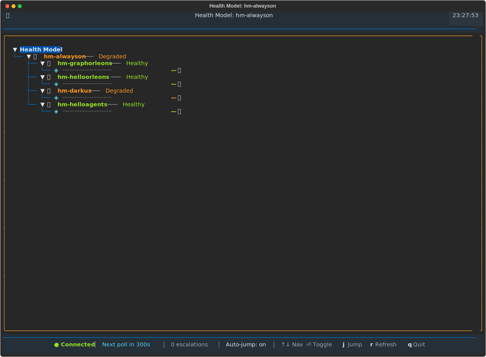
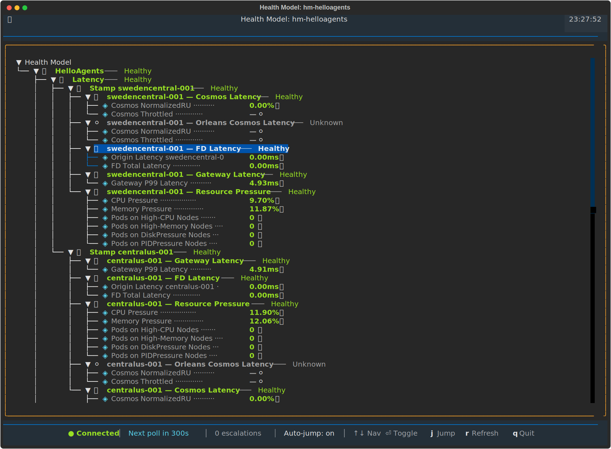

# `az healthmodel` — Azure CLI Extension for Health Models


Manages Azure Monitor Health Models (`Microsoft.CloudHealth`, public preview).
Provides CRUD operations for health models, entities, signals, relationships, and auth configs — plus a **live interactive TUI watch mode** that visualises health state in real time.

## Watch Mode in Action

### hm-helloagents — 31 entities, all healthy



Full tree with real-time signal values: Gateway P99 Latency, Cosmos NormalizedRU, Pod Restarts, Memory Pressure, and more across two stamps (centralus-001, swedencentral-001).

### hm-darkux — 29 entities, degraded root



Shows a **Degraded** root entity rolling up from downstream signals. Memory Pressure at 32.29%, Gateway P99 at 4.90ms. Unknown cosmos entries rendered with `— ⚪`.

### hm-alwayson — meta health model (5 entities)



A meta health model that monitors other health models. Root is **Degraded** because `hm-darkux` is degraded, while `hm-graphorleons`, `hm-helloorleons`, and `hm-helloagents` are all Healthy.

### Keyboard navigation



Arrow keys navigate the tree. The cursor highlight (blue row) shows the selected entity. Mouse scrolling also works.

## Installation

```bash
# Build from source
cd src/az-healthmodel
python setup.py bdist_wheel

# Install the extension
az extension add --source dist/az_healthmodel-0.1.0-py3-none-any.whl
```

## Quick Start

```bash
# Create a health model
az healthmodel create -g myRG -n MyApp --body @healthmodel.json

# Add an entity
az healthmodel entity create -g myRG --model-name MyApp -n WebTier --body @entity.json

# Launch the live watch TUI
az healthmodel watch -g myRG --model-name MyApp

# Plain-text mode (for piping / non-TTY)
az healthmodel watch -g myRG --model-name MyApp --plain
```

## Commands Reference

| Command | Description |
| --- | --- |
| `az healthmodel create` | Create a health model |
| `az healthmodel show` | Get a health model |
| `az healthmodel list` | List health models |
| `az healthmodel update` | Update a health model |
| `az healthmodel delete` | Delete a health model |
| `az healthmodel entity create` | Create an entity |
| `az healthmodel entity show` | Get an entity |
| `az healthmodel entity list` | List entities |
| `az healthmodel entity delete` | Delete an entity |
| `az healthmodel signal create` | Create a signal definition |
| `az healthmodel signal show` | Get a signal definition |
| `az healthmodel signal list` | List signal definitions |
| `az healthmodel signal delete` | Delete a signal definition |
| `az healthmodel signal-definition execute` | Execute a signal query and evaluate health |
| `az healthmodel relationship create` | Create a relationship |
| `az healthmodel relationship list` | List relationships |
| `az healthmodel relationship delete` | Delete a relationship |
| `az healthmodel auth create` | Create an auth config |
| `az healthmodel auth list` | List auth configs |
| `az healthmodel auth delete` | Delete an auth config |
| `az healthmodel watch` | Live watch mode (TUI or plain-text) |
| `az healthmodel export` | Export full model tree as SVG screenshot |
| `az healthmodel mcp` | Start MCP server (stdio) for AI agents |

## Signal Execution

Test and verify signal queries by executing them against the real data sources:

```bash
az healthmodel signal-definition execute \
  -g rg-alwayson-global --model hm-darkux \
  --entity 0897f794-d571-5cf5-a2d8-59320a84d8a4 \
  --signal 640bb6df-d8a4-5004-afd0-b3bab2783502
```

Returns full execution metadata:

```json
{
  "signalDefinitionName": "CPU Pressure",
  "signalKind": "PrometheusMetricsQuery",
  "query": "sum(rate(container_cpu_usage_seconds_total{...}[5m])) / ...",
  "rawValue": 32.29,
  "healthState": "Healthy",
  "evaluationRules": {
    "degradedRule": { "operator": "GreaterThan", "threshold": 90.0 },
    "unhealthyRule": { "operator": "GreaterThan", "threshold": 98.0 }
  },
  "dataSource": "/subscriptions/.../accounts/amw-...",
  "durationMs": 1912,
  "rawOutput": { "...full API response..." },
  "error": null
}
```

Supports **PromQL** and **Azure Resource Metrics** signal kinds. On failure, `error` is populated with the full error message and `healthState` is `"Error"`.

## Watch Mode

Watch mode polls the health model and renders a live tree of entities, signals, and their health states.

### TUI mode (default)

Launches automatically when a TTY is detected and `textual` is installed.

| Key | Action |
| --- | --- |
| **↑ / ↓** | Navigate the tree |
| **j** | Toggle auto-jump to escalations |
| **r** | Force immediate refresh |
| **+ / −** | Adjust poll interval (±10s) |
| **q** | Quit |

Features:
- Polls every **30s** (configurable with `--poll-interval`)
- Diffs snapshots between polls — detects escalations, recoveries, new/removed entities
- **Auto-jumps** to the first escalation (toggle with **j**)
- Highlights changed nodes with ⚡ markers (e.g., `⚡ was 🟢`)
- Mouse scrolling supported

### Plain-text fallback

Used with `--plain` flag, non-TTY output, or when `textual` is unavailable:

```
└── 🟢 GraphOrleans ─── Healthy
    ├── 🟢 Event Hubs ─── Healthy
    │   ├── ◈ Event Hub Throttled ── 0 🟢
    │   ├── ◈ Event Hub Server Errors ── 0 🟢
    │   └── ◈ Event Hub Geo-Replication Lag ── 0 🟢
    ├── 🟢 Latency ─── Healthy
    │   ├── 🟢 Stamp centralus-001 ─── Healthy
    │   │   ├── 🟢 centralus-001 — Gateway Latency ─── Healthy
    │   │   │   └── ◈ Gateway P99 Latency ── 248.50ms 🟢
    │   │   └── ⚪ centralus-001 — Orleans Cosmos Latency ─── Unknown
    │   │       ├── ◈ Cosmos NormalizedRU ── — ⚪
    │   │       └── ◈ Cosmos Throttled ── — ⚪
    └── 🟢 Failures ─── Healthy
        └── 🟢 Stamp centralus-001 ─── Healthy
            └── 🟢 centralus-001 — Pod Failures ─── Healthy
                ├── ◈ Pod Restarts ── 0 🟢
                └── ◈ OOMKilled Containers ── 0 🟢
```

## Export

Export the full health model tree as an SVG file — useful for documentation, dashboards, and sharing:

```bash
# Export to SVG (auto-named {model}.svg)
az healthmodel export -g rg-alwayson-global --model-name hm-helloagents

# Export with custom output path
az healthmodel export -g rg-alwayson-global --model-name hm-darkux --file darkux-health.svg
```

The exported SVG renders the complete tree with all entities expanded and signal values shown, sized to fit the full model.

## MCP Server (AI Agent Integration)

Start a [Model Context Protocol](https://modelcontextprotocol.io) server on stdin/stdout, exposing all healthmodel operations as tools for AI agents (VS Code Copilot, Claude, etc.):

```bash
az healthmodel mcp
```

Every tool supports **bulk calls** — pass `items` (a list of parameter dicts) to batch operations:

```json
// Single call
{"name": "entity_show", "arguments": {"resource_group": "rg", "model_name": "hm", "name": "e1"}}

// Bulk call
{"name": "entity_show", "arguments": {"items": [
  {"resource_group": "rg", "model_name": "hm", "name": "e1"},
  {"resource_group": "rg", "model_name": "hm", "name": "e2"}
]}}
// → {"results": [{"ok": true, "data": {...}}, {"ok": true, "data": {...}}]}
```

### VS Code Copilot Configuration

Add to `.vscode/mcp.json`:

```json
{
  "servers": {
    "healthmodel": {
      "type": "stdio",
      "command": "az",
      "args": ["healthmodel", "mcp"]
    }
  }
}
```

### Available MCP Tools

| Tool | Description |
| --- | --- |
| `healthmodel_list` | List health models |
| `healthmodel_show` | Get health model(s) |
| `healthmodel_create` | Create/update health model(s) |
| `healthmodel_delete` | Delete health model(s) |
| `entity_list` | List entities |
| `entity_show` | Get entity/entities |
| `entity_create` | Create/update entity/entities |
| `entity_delete` | Delete entity/entities |
| `entity_signal_list` | List signals on entity/entities |
| `entity_signal_add` | Add signal to entity/entities |
| `entity_signal_remove` | Remove signal from entity/entities |
| `entity_signal_history` | Query signal history |
| `entity_signal_ingest` | Submit external health report(s) |
| `signal_definition_list` | List signal definitions |
| `signal_definition_show` | Get signal definition(s) |
| `signal_definition_create` | Create/update signal definition(s) |
| `signal_definition_delete` | Delete signal definition(s) |
| `signal_definition_execute` | Execute signal query and evaluate health |
| `relationship_list` | List relationships |
| `relationship_create` | Create relationship(s) |
| `relationship_delete` | Delete relationship(s) |
| `auth_list` | List auth settings |
| `auth_create` | Create/update auth setting(s) |
| `auth_delete` | Delete auth setting(s) |

## Debug / Verbose Mode

Add `--debug-poll` to `watch` or `export` to see API calls, timing, and parse details on stderr:

```bash
az healthmodel watch -g myRG --model-name myModel --plain --debug-poll
az healthmodel export -g myRG --model-name myModel --debug-poll
```

Example output:
```
23:52:18 [azext_healthmodel.watch.poller] Fetching signal definitions from rg/model
23:52:18 [azext_healthmodel.client.rest_client] GET /subscriptions/.../signaldefinitions?api-version=...
23:52:19 [azext_healthmodel.client.rest_client]   → 200 (934ms)
23:52:20 [azext_healthmodel.watch.poller] Parsed 5 entities, 4 relationships, 13 signal defs
23:52:20 [azext_healthmodel.watch.poller] Forest: 1 roots, 0 unlinked
23:52:20 [azext_healthmodel.watch.poller] Poll complete in 1808ms: 5 changes (0 escalations)
```

## Architecture

Follows **Grokking Simplicity** — strict separation of data, calculations, and actions:

```
models/          ← Data: frozen dataclasses, enums, TypedDicts
domain/          ← Calculations: parse, graph builder, snapshot diff, formatters
client/          ← Actions: REST client (retry, pagination)
watch/           ← Actions: Textual TUI, poller, plain-text fallback
actions/         ← Actions: CRUD command handlers
```

- **Transport models** (TypedDicts) isolate from preview API wire format changes
- **Domain models** (frozen dataclasses) are the stable internal types
- **Graph builder** handles DAGs with cycle detection
- **Snapshot diff** detects escalations, recoveries, value changes between polls

## Development

```bash
cd src/az-healthmodel
pip install -e ".[dev]"
python -m pytest azext_healthmodel/tests/ -v   # 116 tests
```

## API Version

`2026-01-01-preview` — Microsoft.CloudHealth is in **public preview**.
