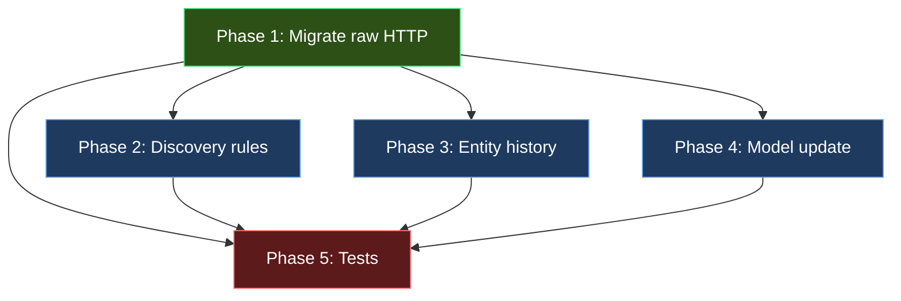

# SDK Integration Plan: `azure-mgmt-cloudhealth` → `az-healthmodel`

> **Status**: ✅ Phase 1-4 implemented. 34 new tests passing. 258 total tests pass (22 pre-existing e2e errors from live Azure timeouts unchanged).

> **Goal**: Migrate `az-healthmodel` from implicit SDK dependency + raw HTTP fallbacks
> to the official `azure-mgmt-cloudhealth` v1.0.0b2 SDK, and expose new capabilities.

## Current State

### What works today

| Layer | File | Role |
|-------|------|------|
| CLI commands | `commands.py`, `_params.py`, `_help.py` | `az healthmodel` command tree |
| CLI actions | `actions/crud.py` | Thin CLI bindings → delegate to operations |
| Business logic | `actions/operations.py` | Pure business logic shared by CLI + MCP |
| **I/O boundary** | `client/rest_client.py` | `CloudHealthClient` — single Azure API client |
| Query executor | `client/query_executor.py` | Signal value resolution (Prometheus, ARM metrics) |
| Transport types | `models/transport.py` | `TypedDict`s matching REST wire format |
| Domain types | `models/domain.py` | Frozen dataclasses (stable public API) |
| Conversion | `domain/parse.py` | transport → domain conversion |
| MCP server | `mcp/server.py` | FastMCP server exposing same operations |
| TUI | `watch/` | Textual live-watch dashboard |

### How the SDK is used today

```
CloudHealthClient.__init__
├── get_mgmt_service_client(cli_ctx, CloudHealthMgmtClient)  ← implicit dep from CLI host
├── SDK calls via _call/_call_lro/_call_list bridges:
│   ├── health_models.get / list / begin_create / begin_delete
│   ├── entities.get / list / begin_create_or_update / begin_delete
│   ├── signal_definitions.get / list / begin_create_or_update / begin_delete
│   ├── authentication_settings.get / list / begin_create_or_update / begin_delete
│   └── relationships.get / list / begin_create_or_update / begin_delete
└── Raw HTTP (send_raw_request) for:
    ├── get_signal_history    ← NOW IN SDK ✅
    ├── ingest_health_report  ← NOW IN SDK ✅
    ├── query_prometheus      ← Different service, stays raw
    └── query_azure_metric    ← Different service, stays raw
```

### SDK dependency status

- **Not declared** in `setup.py` — implicit from Azure CLI host environment
- **No vendored_sdks/** directory exists
- `API_VERSION = "2026-01-01-preview"` hardcoded in `rest_client.py`
- SDK v1.0.0b2 default API version: `"2026-01-01-preview"` ✅ matches

---

## New SDK Capabilities (v1.0.0b2)

### New operations available

| Operation | SDK Method | Status in extension |
|-----------|-----------|---------------------|
| Entity signal history | `entities.get_signal_history()` | Currently raw HTTP → **migrate** |
| Ingest health report | `entities.ingest_health_report()` | Currently raw HTTP → **migrate** |
| Entity health history | `entities.get_history()` | **NEW** — not exposed yet |
| Health model update | `health_models.begin_update()` | **NEW** — only create/delete exist |
| Discovery rules CRUD | `discovery_rules.*` | **NEW** — entirely new resource |

### New model types

- `DiscoveryRule`, `DiscoveryRuleProperties`, `DiscoveryRuleSpecification`
  - Subtypes: `ResourceGraphQuerySpecification`, `ApplicationInsightsTopologySpecification`
- `EntityHistoryRequest`, `EntityHistoryResponse`, `HealthStateTransition`
- `SignalHistoryRequest`, `SignalHistoryResponse`, `SignalHistoryDataPoint`
- `HealthReportRequest`, `HealthReportEvaluationRule`
- `HealthModelUpdate` (PATCH body)
- Enhanced `EntityProperties`: `canvas_position`, `health_objective`, `alerts`, `discovered_by`, `tags`

### New enums

- `DiscoveryRuleKind` (`ResourceGraphQuery`, `ApplicationInsightsTopology`)
- `DiscoveryRuleRecommendedSignalsBehavior` (`Enabled`, `Disabled`)
- `DiscoveryRuleRelationshipDiscoveryBehavior` (`Enabled`, `Disabled`)
- `DependenciesAggregationType` (`WorstOf`, `MinHealthy`, `MaxNotHealthy`)
- `DependenciesAggregationUnit` (`Absolute`, `Percentage`)

---

## Integration Strategy

### ⚠️ Key Decision: SDK Dependency Management

**Option A — Vendor the SDK** (recommended for preview/beta SDKs)

```
azext_healthmodel/
└── vendored_sdks/
    └── cloudhealth/           ← copy of azure.mgmt.cloudhealth
        ├── __init__.py
        ├── _client.py
        ├── models/
        └── operations/
```

- **Pro**: Isolated from CLI host version; reproducible; standard for Azure CLI extensions
- **Pro**: Safe with beta SDKs — no surprise upgrades
- **Con**: Manual update process when SDK releases new versions
- **How**: Copy SDK source, update imports from `azure.mgmt.cloudhealth` →
  `azext_healthmodel.vendored_sdks.cloudhealth`

**Option B — Declare explicit dependency with tight pin**

```python
# setup.py
DEPENDENCIES = [
    "azure-mgmt-cloudhealth>=1.0.0b2,<1.0.0b3",
    ...
]
```

- **Pro**: Simpler, no vendoring maintenance
- **Con**: May conflict with CLI host's pinned versions or fail `azdev linter`
- **Con**: Beta SDK breakage risk on version bumps

**Option C — Rely on CLI host providing it** (current approach)

- **Pro**: Zero maintenance
- **Con**: Users must have compatible SDK installed; version not guaranteed
- **Con**: Breaking when CLI ships a different version

**Recommendation**: Start with **Option C** (status quo) since the SDK is already
available in the CLI host environment and API versions match. Upgrade to **Option A** (vendoring) when
the SDK reaches GA or if beta incompatibilities arise. Document the minimum SDK version
requirement in `README.md`.

---

## Implementation Plan

### Phase 1: Migrate raw HTTP → SDK methods

**Files changed**: `client/rest_client.py`

#### 1a. Migrate `get_signal_history`

```
BEFORE: send_raw_request(POST, .../getSignalHistory, body=json.dumps(body))
AFTER:  self._sdk.entities.get_signal_history(rg, hm, entity, body=body)
```

- SDK method signature: `get_signal_history(rg, hm, entity_name, body: SignalHistoryRequest | dict | IO) -> SignalHistoryResponse`
- Returns typed model → use `_call()` bridge with `.as_dict()` conversion
- **Risk**: SDK may validate body more strictly than raw HTTP; test with current fixtures

#### 1b. Migrate `ingest_health_report`

```
BEFORE: send_raw_request(POST, .../ingestHealthReport, body=json.dumps(body))
AFTER:  self._sdk.entities.ingest_health_report(rg, hm, entity, body=body)
```

- SDK method signature: `ingest_health_report(rg, hm, entity_name, body: HealthReportRequest | dict | IO) -> None`
- Returns `None` (204 No Content) — align with current `return {}` behavior
- Use a `_call_void` bridge or handle `None` in `_call`

#### 1c. Keep raw HTTP for Prometheus & Azure Metrics

These endpoints talk to **different Azure services** (Monitor, Insights), not CloudHealth:
- `query_prometheus`: resolves Monitor workspace → hits Prometheus query endpoint
- `query_azure_metric`: hits `Microsoft.Insights/metrics` API

Add a docstring comment explaining why these stay raw:
```python
# These query external Azure services (Monitor/Insights), not CloudHealth.
# The CloudHealth SDK does not cover cross-service queries.
```

### Phase 2: Add discovery rules support

**Files changed**: `client/rest_client.py`, `models/transport.py`, `models/domain.py`,
`domain/parse.py`, `actions/operations.py`, `actions/crud.py`, `commands.py`, `_params.py`, `_help.py`

#### 2a. Client layer

- Add `"discoveryrules"` to `_resource_type_to_ops` dispatch table:
  ```python
  "discoveryrules": lambda sdk: sdk.discovery_rules,
  ```
- Existing generic `get_sub_resource`, `list_sub_resources`, `create_or_update_sub_resource`,
  `delete_sub_resource` should work for discovery rules via the dispatch table

#### 2b. Transport types

Add to `models/transport.py`:
```python
class TransportDiscoveryRuleSpecification(TypedDict, total=False):
    kind: str  # "ResourceGraphQuery" | "ApplicationInsightsTopology"
    resourceGraphQuery: str
    applicationInsightsResourceId: str

class TransportDiscoveryRuleProperties(TypedDict, total=False):
    provisioningState: str
    displayName: str
    authenticationSetting: str
    discoverRelationships: str
    addRecommendedSignals: str
    specification: TransportDiscoveryRuleSpecification
    error: dict[str, Any]
    entityName: str

class TransportDiscoveryRule(TypedDict, total=False):
    id: str
    name: str
    type: str
    properties: TransportDiscoveryRuleProperties
```

#### 2c. Domain types

Add to `models/domain.py`:
```python
@dataclass(frozen=True)
class DiscoveryRule:
    rule_id: str
    name: str
    display_name: str
    authentication_setting: str
    discover_relationships: bool
    add_recommended_signals: bool
    specification_kind: str
    specification_query: str  # KQL or App Insights resource ID
    entity_name: str | None
    provisioning_state: str
    error: str | None
```

#### 2d. Parse layer, CLI commands, MCP tools

- Add `parse_discovery_rule()` and `parse_discovery_rules()` to `domain/parse.py`
- Add `list-discovery-rules`, `show-discovery-rule`, `create-discovery-rule`,
  `delete-discovery-rule` commands
- Add corresponding MCP tools

### Phase 3: Add entity history support

**Files changed**: `client/rest_client.py`, `models/domain.py`, `domain/parse.py`,
`actions/operations.py`, `actions/crud.py`, `commands.py`, `_params.py`, `_help.py`

#### 3a. Client layer

New method in `CloudHealthClient`:
```python
def get_entity_history(self, rg, model_name, entity_name, body):
    return self._call(lambda: self._sdk.entities.get_history(rg, model_name, entity_name, body=body))
```

#### 3b. Domain types

```python
@dataclass(frozen=True)
class HealthStateTransition:
    previous_state: HealthState
    new_state: HealthState
    occurred_at: str  # ISO 8601
    reason: str | None

@dataclass(frozen=True)
class EntityHistory:
    entity_name: str
    transitions: tuple[HealthStateTransition, ...]
```

#### 3c. CLI command

`az healthmodel entity show-history --resource-group --model-name --entity-name [--start-at] [--end-at]`

### Phase 4: Add health model update (PATCH)

**Files changed**: `client/rest_client.py`, `actions/crud.py`, `commands.py`, `_params.py`

- New client method using `self._sdk.health_models.begin_update()`
- New CLI command: `az healthmodel update --resource-group --model-name [--tags] [--identity]`
- Uses `_call_lro` bridge

### Phase 5: Tests & validation

- Update JSON fixtures to match SDK response shapes (verify `as_dict()` output format)
- Add test cases for:
  - `get_signal_history` via SDK (mock `self._sdk.entities.get_signal_history`)
  - `ingest_health_report` via SDK (mock `self._sdk.entities.ingest_health_report`)
  - Discovery rule CRUD
  - Entity history
  - Health model update
  - Unknown discriminator handling (future-proofing)
- Run existing test suite to verify no regressions:
  ```bash
  cd src/az-healthmodel && python3 -m pytest azext_healthmodel/tests/ -v
  ```

---

## Risk Register

| Risk | Severity | Mitigation |
|------|----------|------------|
| SDK beta breaking changes between b2→b3 | High | Document pinned version; test on upgrade |
| `as_dict()` output format differs from current `send_raw_request` JSON | Medium | Compare shapes in tests before migrating |
| SDK body validation stricter than raw HTTP | Medium | Test with existing payloads first |
| `_call_lro` bridge assumes `.result()` returns model | Low | Verify `begin_update` poller type matches `begin_create` |
| Unknown signal discriminators in future | Low | Handle unknown kinds gracefully in `parse.py` |
| CLI host ships incompatible SDK version | Medium | Fall back to vendoring (Option A) if this occurs |

---

## File Change Summary

```
client/rest_client.py        ← Migrate 2 raw calls, add entity_history, update, discovery_rules dispatch
models/transport.py           ← Add DiscoveryRule transport types
models/domain.py              ← Add DiscoveryRule, EntityHistory, HealthStateTransition
models/enums.py               ← Add DiscoveryRuleKind (if needed beyond string)
domain/parse.py               ← Add parse_discovery_rule, parse_entity_history
actions/operations.py         ← Add discovery_rules ops, entity_history op
actions/crud.py               ← Add CLI action functions
commands.py                   ← Register new commands
_params.py                    ← Parameter definitions
_help.py                      ← Help text
mcp/server.py                 ← Add MCP tools for new operations
tests/                        ← New fixtures + test cases
```

## Dependencies


