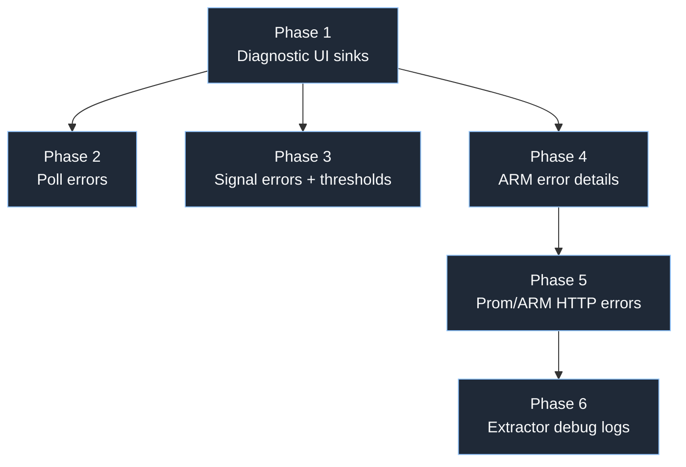
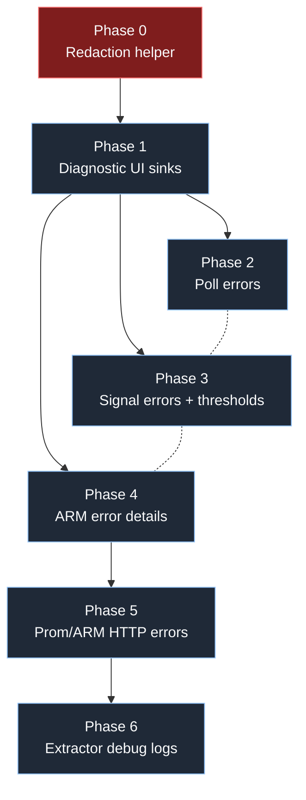

# Signal Debugging Implementation Plan

## Goal

Fix the six validated signal-debugging gaps by first adding reusable diagnostic display surfaces, then plumbing richer error and threshold data from transport/client layers into the TUI.

## Phase dependency summary

1. **Diagnostic UI sinks** — add a status-bar error row and entity-drawer diagnostic/threshold rendering targets.
2. **Poll error plumbing** — preserve poll exceptions and feed the status-bar sink.
3. **Signal runtime diagnostics and thresholds** — parse `SignalStatus.error` and signal definition thresholds into `SignalValue`, then render them in the drawer.
4. **ARM error preservation** — retain `code` and `details` on all health-model exceptions and display them through existing error surfaces.
5. **Cross-service query diagnostics** — preserve error type/status/body metadata for Prometheus and Azure Monitor metric verification.
6. **Extractor debug logging** — log defensive parser failures without changing return contracts.

---

## Phase 1 — Build reusable diagnostic UI sinks

### Gaps covered

- Enables Gap 1, Gap 2, Gap 3, Gap 4, and Gap 6 to surface freeform diagnostics consistently.
- Implements the rubber-duck insight: one TUI destination for freeform errors, multiple data feeds later.

### Files to modify

| File | Current relevant lines | Changes |
|---|---:|---|
| `azext_healthmodel/watch/status_bar.py` | 22-81 | Add `error_text` reactive and render a truncated error segment when disconnected or when error text is present. |
| `azext_healthmodel/watch/entity_drawer.py` | 101-132 | Add helper rendering hooks for signal diagnostics and real thresholds. |
| `azext_healthmodel/watch/signal_panel.py` | 116-140, 270-317 | Extend existing verification error display to consume richer error metadata once Phase 5 adds it. |

### Exact changes

#### `status_bar.py`

- At lines 22-27, add:
  - `error_text: reactive[str] = reactive("")`
- Add a small pure helper near line 9 or before `StatusBar`:
  - `_truncate_status_error(message: str, limit: int = 80) -> str`
  - Behavior: single-line whitespace normalization, return unchanged if `len <= 80`, else first 79 chars plus `…`.
- In `render()` after lines 31-35 connection indicator:
  - If `self.error_text` is non-empty, append `" — "` dim plus truncated error in red/dim red.
  - Keep full text in the reactive property so tests/callers can inspect it; only render is truncated.
- Do not make the status bar taller; keep `height: 1` at line 15.

#### `entity_drawer.py`

- Add helper near line 101:
  - `_append_diagnostic_block(text: Text, sig: SignalValue) -> None`
  - No-op when `sig.error` is empty.
  - Render label `error:` and the full, untruncated diagnostic string in red.
- Replace threshold placeholder lines 120-124 with helper:
  - `_append_thresholds(text: Text, sig: SignalValue) -> None`
  - Render degraded and unhealthy rules when available.
  - Render `—` only when both rules are absent.
- Keep drawer full-message behavior: unlike the status bar, do not truncate signal error text in the drawer.

#### `signal_panel.py`

- Do not redesign the panel in this phase.
- Reserve the existing surfaces:
  - status line at lines 121-124 for a concise summary.
  - result block at lines 270-317 for detailed metadata after Phase 5.
- Add helper names in the plan for later use:
  - `_format_error_block(result: dict[str, Any]) -> Text`
  - `_format_response_excerpt(result: dict[str, Any]) -> Text`

### What the user sees

- **Before:** A poll failure only changes `● Connected` to `○ Disconnected`; signal drawer shows a threshold placeholder.
- **After:** The status bar can show `○ Disconnected — RuntimeError: API down` truncated to one line; the drawer has defined places for full signal errors and thresholds.

### TDD test strategy

1. `azext_healthmodel/tests/test_data_flow_e2e.py` lines 102-132:
   - Extend `test_sdk_error_surfaces_in_status_bar` expectations to include a specific error substring after Phase 2.
2. `azext_healthmodel/tests/test_watch_lifecycle_e2e.py` lines 72-106:
   - Add assertion that rendered status includes a truncated error when first poll fails.
3. `azext_healthmodel/tests/test_tui_features.py` lines 490-548:
   - Add parametrized pure-render tests for drawer diagnostic and threshold rows.
4. New pure unit tests in `test_tui_features.py`:
   - `_truncate_status_error` returns unchanged at 80 chars.
   - `_truncate_status_error` appends ellipsis above 80 chars.
   - Multiline error is normalized to a single line.

### Risks

- `StatusBar` is one line tall; too much text can push key hints off-screen. Mitigate with 80-character truncation.
- Rich `Text` styles can make substring tests brittle. Assert on `.plain`, not style spans.
- Adding visible error text may require updating e2e expectations that currently only look for `Disconnected`.

---

## Phase 2 — Preserve and display poll failures

### Gap covered

- **Gap 2: Poll error hidden**

### Files to modify

| File | Current relevant lines | Changes |
|---|---:|---|
| `azext_healthmodel/watch/poller.py` | 100-115 | Bind exception, format actual error, return it in `PollResult.error`. |
| `azext_healthmodel/watch/app.py` | 87-103 | Copy `PollResult.error` into `StatusBar.error_text`; clear on success. |
| `azext_healthmodel/watch/status_bar.py` | 22-81 | Use Phase 1 `error_text` reactive. |
| `azext_healthmodel/tests/test_watch.py` | 131-203 | Update poller tests to assert actual exception type/message. |
| `azext_healthmodel/tests/test_watch_lifecycle_e2e.py` | 72-132 | Assert status-bar error text appears and clears after recovery. |

### Exact changes

#### `poller.py`

- Change line 100 from `except Exception:` to `except Exception as e:`.
- Keep `_log.exception("Poll cycle failed after %.0fms", elapsed)` at line 102.
- Before returning, compute:
  - `error = f"{type(e).__name__}: {e}"`
- Change line 113 to:
  - `error=f"{error} — showing stale data"`
- Keep fallback forest/snapshot behavior at lines 103-109 unchanged.

#### `app.py`

- Lines 94-97:
  - On `result.error`: set `status.connected = False` and `status.error_text = result.error`.
  - On success: set `status.connected = True` and `status.error_text = ""` before applying forest.
- Do not update `self._forest` on error; current stale/empty behavior remains.

### What the user sees

- **Before:** `○ Disconnected` with no clue why.
- **After:** `○ Disconnected — RuntimeError: API down — showing stale data` in the status bar, truncated if necessary. On the next successful poll, the error disappears.

### TDD test strategy

1. Update `TestPollerErrorRecovery.test_error_on_first_poll` at lines 134-142:
   - Assert `"RuntimeError: API down" in result.error`.
   - Assert `"stale" in result.error.lower()`.
2. Update `TestPollerErrorAfterSuccess.test_error_set_on_second_poll` at lines 183-188:
   - Assert `"RuntimeError: Transient error" in result2.error`.
3. Add e2e test in `test_watch_lifecycle_e2e.py` after line 108:
   - First poll fails with `AuthenticationError("denied")`; `status.error_text` contains `AuthenticationError` and `denied`.
   - Second poll succeeds; `status.error_text == ""`.
4. Update `test_sdk_error_surfaces_in_status_bar` at lines 102-132:
   - Parametrize expected substrings such as `AuthenticationError`, `ThrottledError`, `HealthModelNotFoundError`, `ArmError`.

### Risks

- Existing tests may assert generic `fail`/`stale`; update them to accept richer messages.
- Some Azure exceptions have very long `str(e)`. Phase 1 truncation prevents status-bar overflow.
- Exception messages may include sensitive URLs or IDs; Phase 4/5 should add redaction before display.

---

## Phase 3 — Parse and render signal errors plus thresholds

### Gaps covered

- **Gap 1: `SignalStatus.error` not parsed**
- **Gap 6: Thresholds fetched but discarded**

### Files to modify

| File | Current relevant lines | Changes |
|---|---:|---|
| `azext_healthmodel/models/transport.py` | 15-18 | Add `error: str` to `TransportSignalStatus`. |
| `azext_healthmodel/models/domain.py` | 91-107 | Add defaulted `error`, `degraded_rule`, `unhealthy_rule` fields to `SignalValue`. |
| `azext_healthmodel/domain/parse.py` | 138-165 | Read `status.error`; copy `sig_def` threshold rules into `SignalValue`. |
| `azext_healthmodel/watch/entity_drawer.py` | 101-132 | Render full signal error and real threshold rules. |
| `azext_healthmodel/tests/test_tui_features.py` | 55-71, 490-548 | Update signal helper and drawer render tests. |
| `azext_healthmodel/tests/conftest.py` | 176-185, 449-458 | No required fixture edits if fields are defaulted; optionally add one richer fixture for thresholds/errors. |

### Exact changes

#### `transport.py`

- At line 18, add `error: str` to `TransportSignalStatus`.
- Keep `total=False`, so existing fixtures without `error` remain valid.

#### `domain.py`

- At the end of `SignalValue` fields after line 107, add defaulted fields:
  - `error: str | None = None`
  - `degraded_rule: EvaluationRule | None = None`
  - `unhealthy_rule: EvaluationRule | None = None`
- Add fields only at the end because `SignalValue` is a frozen dataclass and many tests instantiate it positionally or with existing keyword sets.
- Update the docstring invariants at lines 95-98:
  - `error` is optional service-side diagnostic text.
  - threshold rules are copied from the resolved definition for display only.

#### `parse.py`

- Lines 153-165:
  - Read `status_error = status.get("error")`.
  - Pass `error=str(status_error) if status_error else None`.
  - Pass `degraded_rule=sig_def.degraded_rule if sig_def else None`.
  - Pass `unhealthy_rule=sig_def.unhealthy_rule if sig_def else None`.
- Keep `display_name` and `data_unit` fallbacks unchanged.
- Keep `value=float(raw_value) if raw_value is not None else None`; invalid numeric values remain a parsing failure as today.

#### `entity_drawer.py`

- In `_append_signal_block` lines 101-132:
  - After state lines 117-118, render diagnostics if `sig.error` exists.
  - Replace threshold placeholder lines 120-124 with real rule formatting.
- Rule display format:
  - `degraded:  GreaterThan 50`
  - `unhealthy: GreaterThan 80`
  - Use `rule.operator.value` and `rule.threshold` for `EvaluationRule`.

### What the user sees

- **Before:** A signal can be Unknown/Error with no service-side reason, and thresholds always show `— (see signal-definition)`.
- **After:** Opening entity details shows the full service diagnostic, for example `error: Metric namespace not found`, and the exact degraded/unhealthy thresholds that explain why a value becomes unhealthy.

### TDD test strategy

1. Add pure parse test near existing parser tests or create `azext_healthmodel/tests/test_parse_signal_diagnostics.py`:
   - Given one signal definition with degraded/unhealthy rules and one entity signal status with `error`, `parse_entities` returns a `SignalValue` carrying all three values.
2. Update `test_render_entity_details_variants` around lines 493-537:
   - Add a case with a signal containing `error="service says no data"`, `degraded_rule`, and `unhealthy_rule`.
   - Assert the drawer includes `error:`, the full message, `degraded`, `unhealthy`, and thresholds.
3. Fixture compatibility test:
   - Existing tests that call `_make_signal()` at lines 55-71 should pass without providing new fields because defaults are added.

### Risks

- `SignalValue` is frozen: defaulted additions are safe, but non-default additions before existing fields would break construction.
- Rendering threshold objects in the drawer introduces a dependency on `EvaluationRule`; use existing domain type, not transport dicts.
- Service-side `error` strings can contain IDs; pass through a shared redaction helper if sensitive patterns are observed.

---

## Phase 4 — Preserve ARM error code/details end-to-end

### Gap covered

- **Gap 3: ARM error details lost**

### Files to modify

| File | Current relevant lines | Changes |
|---|---:|---|
| `azext_healthmodel/client/errors.py` | 6-69 | Move `code` and `details` storage to `HealthModelError`; pass through subclasses. |
| `azext_healthmodel/client/errors.py` | 75-109 | Preserve code/details when constructing `HealthModelNotFoundError`, `AuthenticationError`, and `ThrottledError`. |
| `azext_healthmodel/client/rest_client.py` | 118-141 | Preserve details in `_raise_translated` fallback when SDK `model` is absent. |
| `azext_healthmodel/watch/status_bar.py` | 28-81 | Status can display formatted base error message from Phase 2. |
| `azext_healthmodel/watch/signal_panel.py` | 142-150 | `show_exception` can include `code`/first detail if exception is a `HealthModelError`. |
| `azext_healthmodel/tests/test_data_flow_e2e.py` | 102-132 | Add assertions for ARM code/detail presence in surfaced error text where practical. |

### Exact changes

#### `errors.py`

- Change `HealthModelError.__init__` lines 9-12 to accept:
  - `message: str`
  - `status_code: int | None = None`
  - `code: str = ""`
  - `details: list[dict[str, str]] | None = None`
- Store:
  - `self.code = code`
  - `self.details = details or []`
- Add a method or property:
  - `diagnostic_text(self) -> str`
  - Include message, `HTTP <status>`, `code`, and concise details.
- Update subclass constructors:
  - `HealthModelNotFoundError` lines 18-23 accepts `code`/`details` and passes them to base after appending hint.
  - `AuthenticationError` lines 33-39 accepts `code`/`details`.
  - `ThrottledError` lines 45-54 accepts `code`/`details` plus retry_after.
- Simplify `ArmError` lines 57-69 so it either inherits without override or just forwards all parameters to base. Avoid duplicate `code`/`details` storage.

#### `parse_arm_error`

- Lines 100-107:
  - For not found: `HealthModelNotFoundError(message, status_code=status_code, code=code, details=details)`.
  - For auth: `AuthenticationError(message, status_code=status_code, code=code, details=details)`.
  - For throttle: `ThrottledError(message, status_code=status_code, code=code, details=details)`.
- Line 109 remains `ArmError(message, status_code=status_code, code=code, details=details)`.

#### `rest_client.py`

- Lines 133-141 fallback path:
  - If `e.model` exists, keep `as_dict()` behavior.
  - Else build body from available SDK fields:
    - `code = getattr(e.error, "code", "")` when present.
    - `message = getattr(e, "message", None) or str(e)`.
    - `details = getattr(e.error, "details", None)` if available and serializable.
    - If `e.response` has text/body, include a short sanitized detail such as `{"message": <first 500 chars>}`.
- Never discard details simply because `e.model is None`.

#### UI formatting

- Poll path already returns `type(e).__name__: {e}` from Phase 2. Prefer adding a helper in `poller.py` or `errors.py`:
  - If `isinstance(e, HealthModelError)`, use `e.diagnostic_text()`.
  - Else use current `type(e).__name__: {e}`.
- `SignalPanel.show_exception` lines 142-150 can use the same helper for direct verification failures.

### What the user sees

- **Before:** `AuthenticationError: denied` or generic `ArmError: boom`.
- **After:** `AuthenticationError: denied (HTTP 403, code AuthorizationFailed) detail: The client does not have authorization...` in status/panel contexts, with full details available in the relevant detailed surface.

### TDD test strategy

1. Add unit tests for `parse_arm_error`:
   - NotFound preserves `code` and `details` on `HealthModelNotFoundError`.
   - Auth preserves `code` and `details` on `AuthenticationError`.
   - Throttle preserves `code`, `details`, and `retry_after` behavior.
   - Generic `ArmError` behavior remains unchanged.
2. Add a `_raise_translated` test with fake `HttpResponseError` lacking `.model` but carrying `.error.code` and response text.
3. Update poll e2e tests to verify at least one ARM code appears in the rendered status when the fake client raises a detailed `ArmError`.

### Risks

- Subclass constructors append hints to messages; ensure details are not appended twice.
- Existing tests compare `str(exc)` to the original message. Keep `super().__init__(message)` behavior so `str(exc)` remains message+hint as currently expected.
- Details can be large or sensitive. Apply redaction and length limits before rendering.

---

## Phase 5 — Preserve Prometheus/Azure Monitor HTTP query diagnostics

### Gap covered

- **Gap 4: Prom/ARM HTTP errors str-ified**

### Files to modify

| File | Current relevant lines | Changes |
|---|---:|---|
| `azext_healthmodel/client/rest_client.py` | 318-351, 353-374 | Translate/raise richer HTTP errors for cross-service raw requests. |
| `azext_healthmodel/client/query_executor.py` | 11-18 | Add logging import and optional `HealthModelError` import/formatter. |
| `azext_healthmodel/client/query_executor.py` | 60-126 | Replace catch-all `str(exc)` with structured error fields. |
| `azext_healthmodel/watch/signal_panel.py` | 121-140, 270-317 | Render error type/status/body excerpt in verification panel. |
| `azext_healthmodel/tests/test_tui_features.py` | 228-255 | Extend result rendering tests for structured errors. |

### Exact changes

#### `rest_client.py`

- Wrap `send_raw_request` calls in `query_prometheus` lines 331 and 345, and `query_azure_metric` line 373 with existing `_raise_translated` logic where possible.
- For `send_raw_request` responses that do not raise but return error JSON:
  - Prometheus convention: response may be `{ "status": "error", "errorType": "bad_data", "error": "parse error" }`.
  - Raise or return a structured error? Preferred: raise a typed `HealthModelError` or new `QueryExecutionError` consumed by `execute_signal`.
- Preserve response body excerpt:
  - `responseBodyExcerpt` limited to 500-1000 chars after redaction.
  - Include `httpStatusCode` if response exposes `status_code`.

#### `query_executor.py`

- Lines 60-63 currently define `raw_output`, `raw_value`, `error`. Add:
  - `error_type: str | None = None`
  - `error_status_code: int | None = None`
  - `error_body_excerpt: str | None = None`
- Lines 90-91 catch block:
  - Set `error_type = type(exc).__name__`.
  - If `exc` has `status_code`, set `error_status_code`.
  - If `exc` is `HealthModelError`, include `code` and first detail in error text.
  - Set `error = _format_query_error(exc)` instead of `str(exc)`.
- Return dict lines 106-126: add keys:
  - `errorType`
  - `errorStatusCode`
  - `errorBodyExcerpt`
  - possibly `errorCode` for ARM/Prometheus code.
- Keep the existing `error` key for backward compatibility with `SignalPanel.show_result` at lines 121-124.

#### `signal_panel.py`

- Lines 121-124:
  - Status line stays concise: `✖ Error: <error>`.
- Lines 270-317:
  - If `result.get("error")` is present, render an error block before computed health:
    - Type
    - Status code
    - Error code
    - Body excerpt
  - Preserve existing raw output display at lines 138-140 and 320-335.

### What the user sees

- **Before:** Verification panel says `Error: Bad Request` or a flattened string.
- **After:** Verification panel shows `Error type: HttpResponseError`, `HTTP: 400`, `Prometheus: bad_data`, and a redacted body excerpt with the parse error or ARM response content.

### TDD test strategy

1. Unit tests for `execute_signal`:
   - Fake `client.query_prometheus` raises an exception with `status_code=400` and response text; result contains `error`, `errorType`, `errorStatusCode`, `errorBodyExcerpt`.
   - Fake `client.query_azure_metric` raises `ArmError(code="BadRequest", details=[...])`; result contains code/details.
   - Existing success path still returns current keys.
2. Widget tests in `test_tui_features.py` around lines 228-255:
   - Error result with structured fields renders `Error`, type, status, and excerpt.
3. Optional raw client tests:
   - Fake `send_raw_request` returning Prometheus `{status: "error"}` is translated into a structured query error.

### Risks

- Introducing a new exception type can ripple through callers. Keep `execute_signal` return contract stable: query failures remain returned in dict, not raised.
- Cross-service response objects from Azure CLI may differ from `requests.Response`. Use `getattr` defensively.
- Response bodies can include tenant IDs, subscription IDs, or bearer-token-adjacent data. Redact before storing/rendering.

---

## Phase 6 — Log extractor parser failures

### Gap covered

- **Gap 5: Extractor failures silenced**

### Files to modify

| File | Current relevant lines | Changes |
|---|---:|---|
| `azext_healthmodel/client/query_executor.py` | 11-18 | Add `import logging` and `_log = logging.getLogger(__name__)`. |
| `azext_healthmodel/client/query_executor.py` | 154-189 | Add `_log.debug(...)` in extractor exception handlers. |

### Exact changes

#### `query_executor.py`

- Add near imports:
  - `import logging`
  - `_log = logging.getLogger(__name__)`
- Lines 164-165:
  - Change `except (TypeError, ValueError, IndexError): pass` to bind `as exc` and log debug.
  - Include response shape summary, not full payload: e.g. top-level keys and exception type.
- Lines 187-188:
  - Same for Azure metric extractor.
- Do not change return value: both helpers still return `None` after malformed data.

### What the user sees

- **Before:** Malformed API responses look identical to genuine no-data responses.
- **After:** UI behavior stays the same, but debug logs identify parser failures for developers/operators running with debug logging.

### TDD test strategy

1. Add parametrized tests for both extractors:
   - malformed payload triggers no exception and returns `None`.
   - with `caplog.at_level(logging.DEBUG)`, a debug record names the extractor and exception type.
2. Existing no-data tests should continue to return `None` without requiring a log assertion.

### Risks

- Logging full raw payloads may leak IDs or large response bodies. Log only key names and exception summary.
- Debug logs should not be emitted for normal empty-result responses, only malformed shapes that throw.

---

## Phase 0 — SKIPPED

Redaction helper removed — Azure APIs do not leak secrets in error messages. Error text is displayed as-is.

---

## Rubber-duck review amendments

The following issues were identified by Opus 4.7 code review and incorporated:

1. **Phase 0 added** — redaction helper must exist before any error text reaches UI
2. **ThrottledError signature** — all new params (`code`, `details`, `retry_after`) must be keyword-only via `*` separator
3. **`parse_arm_error` early-return** — the `not isinstance(error_obj, dict)` path at errors.py:86-89 must also pass `code`/`details`
4. **Phase 3 parallelizable** — P3 is independent of P2/P4, can run in parallel after P1
5. **Status bar truncation** — always normalize whitespace FIRST, then length-check (a 60-char `\n`-containing message would break `height: 1`)
6. **No new exception type in P5** — use structured fields on result dict, not `QueryExecutionError`
7. **Test fixture updates** — P4 e2e parametrize tuples must add `code=...`, `details=[...]`
8. **Logging redaction** — `poller.py`'s `_log.exception` should use redacted error text

### Updated dependency graph

Note: P2, P3, P4 can run in parallel after P1. Dashed lines indicate independence.

---

## Cross-cutting concerns

### Frozen dataclass field additions

- `SignalValue` is `@dataclass(frozen=True)` in `models/domain.py` lines 91-107.
- Add all new fields with defaults at the end of the field list:
  - `error: str | None = None`
  - `degraded_rule: EvaluationRule | None = None`
  - `unhealthy_rule: EvaluationRule | None = None`
- This preserves existing keyword construction and any positional construction using the original eight fields.
- Do not mutate `SignalValue` after creation; all enrichment must happen in `domain/parse.py` at construction time.

### Test fixture compatibility

- Existing helpers create `SignalValue` in:
  - `test_tui_features.py` lines 55-71
  - `tests/conftest.py` lines 176-185
  - `tests/conftest.py` lines 449-458
- Defaulted fields mean these fixtures do not require edits.
- Add new targeted fixtures only where diagnostics/thresholds are under test.
- `TransportSignalStatus` remains `total=False`, so fixture JSON files do not need immediate updates.

### Error truncation rules

- Status bar:
  - Max rendered diagnostic: **80 characters**.
  - Normalize whitespace to one line.
  - Preserve full value in `StatusBar.error_text` for tests and future detail panels.
- Entity drawer:
  - Render full signal `error` because drawer is scrollable.
- Signal verification panel:
  - Render concise summary in status line.
  - Render response body excerpt with explicit cap, recommended 500-1000 characters.

### Security and redaction

- Do not display secrets, bearer tokens, API keys, or SAS tokens.
- Apply a shared redaction helper before any error text reaches UI or result dicts.
- Minimum redaction patterns:
  - `Authorization: Bearer ...`
  - `access_token=...`
  - `sig=...`
  - `client_secret=...`
  - GUID-like tenant/subscription IDs if policy requires masking.
- Prefer body excerpts over full response bodies for cross-service errors.
- Debug logs must summarize malformed payload shape instead of dumping raw payload.

### Backward-compatible result contracts

- Keep `PollResult.error: str | None` unchanged.
- Keep `execute_signal(...)["error"]` unchanged for existing callers.
- Add structured query error keys alongside the existing string:
  - `errorType`
  - `errorStatusCode`
  - `errorCode`
  - `errorBodyExcerpt`

### Recommended validation commands

Run from `/Users/abossard/Desktop/projects/always_on_v2/src/az-healthmodel`:

- Focused first:
  - `python -m pytest azext_healthmodel/tests/test_watch.py azext_healthmodel/tests/test_tui_features.py azext_healthmodel/tests/test_data_flow_e2e.py azext_healthmodel/tests/test_watch_lifecycle_e2e.py`
- Then full extension tests:
  - `python -m pytest azext_healthmodel/tests`

---

## File change matrix

| File | Phase 0 Redaction | Phase 1 UI sinks | Phase 2 Poll errors | Phase 3 Signal diagnostics | Phase 4 ARM details | Phase 5 Query diagnostics | Phase 6 Extractor logs |
|---|:---:|:---:|:---:|:---:|:---:|:---:|:---:|
| `azext_healthmodel/client/redact.py` | new |  |  |  |  |  |  |
| `azext_healthmodel/models/transport.py` |  |  |  | ✓ |  |  |  |
| `azext_healthmodel/models/domain.py` |  |  |  | ✓ |  |  |  |
| `azext_healthmodel/domain/parse.py` |  |  |  | ✓ |  |  |  |
| `azext_healthmodel/watch/entity_drawer.py` |  | ✓ |  | ✓ |  |  |  |
| `azext_healthmodel/watch/status_bar.py` |  | ✓ | ✓ |  | ✓ |  |  |
| `azext_healthmodel/watch/poller.py` |  |  | ✓ |  | ✓ |  |  |
| `azext_healthmodel/watch/app.py` |  |  | ✓ |  |  |  |  |
| `azext_healthmodel/client/errors.py` |  |  |  |  | ✓ |  |  |
| `azext_healthmodel/client/rest_client.py` |  |  |  |  | ✓ | ✓ |  |
| `azext_healthmodel/client/query_executor.py` |  |  |  |  |  | ✓ | ✓ |
| `azext_healthmodel/watch/signal_panel.py` |  | ✓ |  |  | ✓ | ✓ |  |
| `azext_healthmodel/tests/test_redaction.py` | new |  |  |  |  |  |  |
| `azext_healthmodel/tests/test_watch.py` |  |  | ✓ |  |  |  |  |
| `azext_healthmodel/tests/test_watch_lifecycle_e2e.py` |  | ✓ | ✓ |  |  |  |  |
| `azext_healthmodel/tests/test_data_flow_e2e.py` |  | ✓ | ✓ |  | ✓ |  |  |
| `azext_healthmodel/tests/test_tui_features.py` |  | ✓ |  | ✓ |  | ✓ |  |
| `azext_healthmodel/tests/conftest.py` |  |  |  | optional |  |  |  |
| `azext_healthmodel/tests/test_parse_signal_diagnostics.py` |  |  |  | new |  |  |  |
| `azext_healthmodel/tests/test_query_executor.py` |  |  |  |  |  | new | ✓ |
| `azext_healthmodel/tests/test_errors.py` |  |  |  |  | new |  |  |

---

## Suggested implementation order inside each phase

1. Write failing focused tests for the phase.
2. Make the smallest code change to pass those tests.
3. Run the focused test command.
4. Run full `azext_healthmodel/tests` after Phase 3 and again after Phase 6.
5. Manually smoke-test the TUI against a fixture/fake client if practical:
   - First-poll failure
   - Recovery after failure
   - Signal with service-side status error
   - Signal verification HTTP failure
